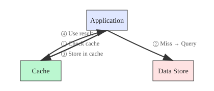
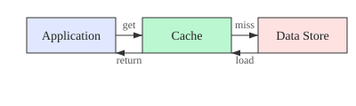

# Basic Concepts

## Cache Aside vs Read Through

Cache Thing supports two primary caching patterns, each with its own advantages and use cases.

### Cache Aside

Cache Aside is a caching pattern where the application explicitly manages the cache. In this pattern:

- The application is responsible for loading data into the cache
- Cache consistency is maintained by the application code
- Developers have full control over when and how data is cached
- This pattern is available in ThingWorx 10.0.0 and above

This approach provides maximum flexibility but requires more development effort to implement correctly.

### Read Through

Read Through is a more automated caching pattern where:

- The cache automatically loads data from the source when needed
- Cache misses trigger automatic data loading
- The application code is simpler and more focused
- This pattern is introduced in ThingWorx 10.0.1

The key difference of Read Through is its handling of concurrent requests: when multiple requests using the same key arrive simulta

neously and the key has no corresponding value in the cache, Cache Thing ensures that only one query is executed. Other concurrent requests will wait until the query completes, then directly use the retrieved result without executing additional queries.

While this pattern reduces development effort, it may be more challenging to debug and optimize.

## Cache Hit vs Cache Miss

Understanding cache hits and misses is crucial for optimizing cache performance.

### Cache Hit

A cache hit occurs when requested data is found in the cache. This is the ideal scenario because:

- Data is retrieved directly from memory
- Response times are significantly faster
- No additional database or external calls are needed

### Cache Miss

A cache miss occurs when requested data is not found in the cache. In this case:

- The system must retrieve data from the original source
- Response times are slower
- The data is typically loaded into the cache for future requests

## Expiration Policies

Cache Thing provides five expiration policies to manage cache entry lifecycle:

### Never

- Cache entries never expire based on time
- Entries remain until explicitly removed or evicted
- Useful for static or rarely changing data
- Manual management required for updates

### Expiration Time Since Last Accessed

- Entries expire if not accessed within the TTL period
- Ideal for frequently accessed data
- Automatically removes unused entries
- Helps manage memory usage

### Expiration Time Since Created

- Entries expire based on their creation time
- Ensures data freshness
- Useful for time-sensitive data
- Predictable expiration behavior

### Expiration Time Since Last Modified

- Entries expire if not modified within the TTL period
- Suitable for data that changes periodically
- Maintains data currency
- Automatically refreshes stale data

### Expiration Time Since Last Touched

- Entries expire if neither accessed nor modified within the TTL period
- Most comprehensive expiration policy
- Balances data freshness and memory usage
- Suitable for most use cases

## Cache Size and Eviction

### Cache Maximum Size

The Cache Maximum Size setting controls memory usage for each cache instance:

- Configured in megabytes
- Limits memory consumption per cache
- Prevents individual caches from consuming too much memory
- Triggers eviction when exceeded

### Eviction Process

When a cache reaches its maximum size, the eviction process:

- Removes least frequently used entries first
- May evict multiple smaller entries to make room for larger ones
- Operates independently of expiration policies
- Can be monitored and tuned using metrics

The EstimateEntrySize API helps developers:

- Predict memory usage before caching
- Optimize cache configuration
- Prevent unexpected evictions
- Fine-tune cache performance

## Global Maximum Size

The Global Maximum Size is a critical system-wide setting that:

- Limits total memory usage across all caches
- Prevents memory exhaustion
- Is configured in the PlatformSubsystem
- Applies to all cache instances on a node

### Actions Affected by Global Maximum Size

The following operations are restricted when they would exceed the global limit:

1. Creating new CacheThings
2. Updating cache size configurations
3. Importing cache configurations
4. Modifying existing cache sizes
5. Activating cache instances

This global limit ensures system stability and prevents memory-related issues.
