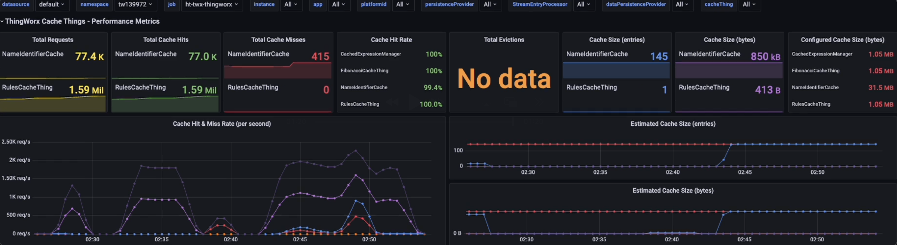
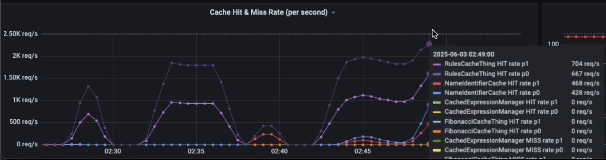
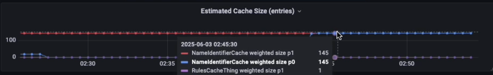
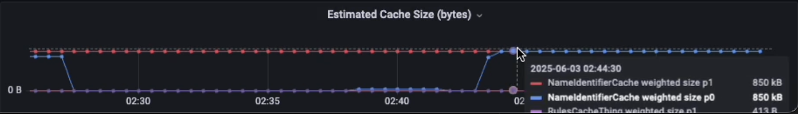
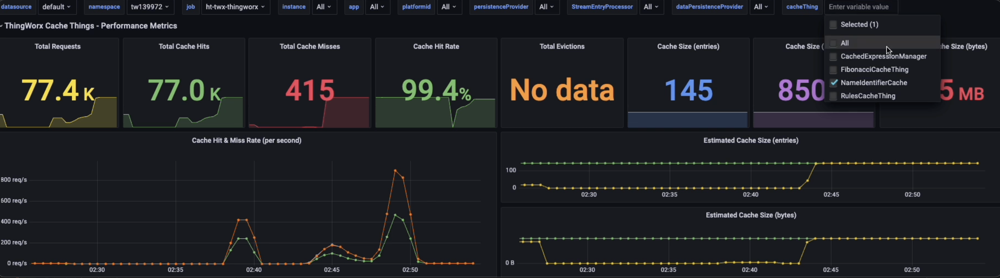

# Observability

This section describes how to measure, monitor, and analyze the performance of Cache Things in development, test and real-world deployments.

## Logs

The logs provided as a part of the Cache Thing implementation can be integral to informing developers and support engineers as to specific behavioral details and their timings.

Before developers add implementation specific loggers, they should explore the platform provided loggers located in the following Application Log sub-loggers:

  - _com.thingworx.things.cache.custom.CacheThing_
  - _com.thingworx.things.cache.custom.provider.caffeine.CaffeineCustomCache_
  - _com.thingworx.things.cache.custom.provider.caffeine.CaffeineCustomCacheProvider_

Key log messages are highlighted in each section, and can easily be activated using ``LoggingSubsystem``s ``SetSubLoggerLevel`` API.

### com.thingworx.things.cache.custom.CacheThing

| Level  | Message | Description |
|--------|---------|-------------|
| ERROR  | **Unable to create or update CacheThing [`cacheName`] : PlatformSubsystem’s [`maxCacheSizePerNode`] setting has been exceeded.** Either decrease this CacheThing’s [`maxSize`] configuration or increase PlatformSubsystem's [`maxCacheSizePerNode`] configuration. | The Cache Thing cannot be created, configured, or imported if the total configured cache sizes of all Cache Things would exceed the maximum size shared between all **enabled** Cache Things (default 50MB).  This platform configuration should be adapted to each environment depending on provisionned resources and cache use.  Cache Things should also be exported with smaller max. sizes to avoid import issues on smaller environments. |
| ERROR  | **LoadEntry must be overridden when cache is configured as a loading-cache** | The read-through cache access method has been enabled, but the cache loading service has not been overridden to wire up the loading. |
| ERROR  | **Usage Error: Supplied DataShape does not match supplied DataShape name** | The Data Shape provided in the API call does not match the Cache Things configured Data Shape. |
| ERROR  | The *ByKey Services can only be used if configured DataShape only has one PrimaryKey | The *ByKey services can not be used with compound primary keys. |
| WARN   | Reconfigured CacheThing:`cacheName`, DataShape:`dataShapeName`, ExpiryType:{}, MaxSize:{} | The Cache Thing has been reconfigured, potentially getting recreated or having the cache purged. |
| INFO   | ensureCache() CacheThing:`cacheName` Deleting backing cache because CacheThing was disabled | The backing cache was deleted as the Cache Thing was disabled. |
| INFO   | ensureCache() CacheThing:`cacheName` : Recreating cache | The backing cache was recreated. |
| INFO   | ensureCache() CacheThing:`cacheName` : Adopting existing cache | The backing cache was existing and reattached. |
| DEBUG  | ensureCache() CacheThing:`cacheName` : configMayHaveChanged? {}, recreateNeeded? {}; existingCache==null? {}, expiryChanged? {}, maxSizeChanged? {}, dataShapeFieldsChanged? {}, loadingChanged? {} | Cache validation printing debug details of configuration and status. |

### com.thingworx.things.cache.custom.provider.caffeine.CaffeineCustomCache

| Level  | Message | Description |
|--------|---------|-------------|
| ERROR  | Loading function was called from itself (tried to read same key) | The cache read-through LoadEntry service called itself recursively. |
| ERROR  | Loading function returned different values for primary-key fields | The cache read-through LoadEntry service returned different values for primary key fields than were passed in (indicating an anomaly). |
| TRACE  | **PutEntry Cache:`cacheName`, Key:`primaryKey`** | A cache entry was  written to the cache, with cache name and key (combined primary key fields). |
| TRACE  | **GetEntry Cache:`cacheName`, Key:`primaryKey`** | A cache entry was retreived from the cache, with cache name and key (combined primary key fields). |
| TRACE  | DeleteEntry Cache:`cacheName`, Key:`primaryKey` | A cache entry was deleted from the cache, with cache name and key (combined primary key fields). |
| TRACE  | DeleteAllEntries Cache:`cacheName` | All cache entries were deleted from the cache. |
| TRACE  | GetEstimatedEntryCount Cache:`cacheName`, Size:{} | The estimated entry count for the specified cache was retreived. |

### com.thingworx.things.cache.custom.provider.caffeine.CaffeineCustomCacheProvider

| Level  | Message | Description |
|--------|---------|-------------|
| INFO   | Created Caffeine Cache Name:[`cacheName`], DataShape:[`dataShapeName`] | A custom Caffeine cache has been created for the associated Cache Thing. |
| INFO   | Deleted Caffeine Cache Name:[`cacheName`] | A custom Caffeine cache has been deleted for the associated Cache Thing. |

## Metrics

Metrics provide quantitative insights into cache behavior, resource usage, and effectiveness, helping you tune Cache Thing for your workload.

Performance metrics for each Cache Thing are available from the standard ThingWorx metrics endpoint (/Thingworx/Metrics) including a label which indicates the source platform node for active-active cluster setups.

The list of avilable metrics and their descriptions are provided in the [documentation in Metrics section of Cache Thing](https://support.ptc.com/help/thingworx/platform/r10.0/en/ThingWorx/Help/ModelandDataBestPractices/CacheThing.html)  In this document, we'll focus on the use of these metrics rather than their explanation.

NOTE: When analyzing Cache Thing performance, keep in mind that cache loading will happen on the node executing the code which can change depending on the code paths use of Timers, Schedulers, Distributed & Multi-event Subscriptions, and Data Ordering.

## Performance Analysis Example

As an example of performance analysis of the Cache Thing and associated use cases, we will use the Cache Thing monitoring section of the [ThingWorx Foundation Grafana dashboard #19533](https://grafana.com/grafana/dashboards/19533-thingworx-foundation/) version 2.8 (2025/06/02) to explore the cache performance for the two examples from this document.

The **top row of panels** show actual value based metric views from the last metric **in the display period**.  These are intended to provide a quick view of actual usage, performance, and configuration without the over-time analyis.

| Panel Name | Description |
|------------|-------------|
| **Total Requests** | Total number of requests to the Cache Thing |
| **Total Cache Hits** | Total number of requests resulting in a cache hit |
| **Total Cache Misses** | Total number of requests resulting in a cache miss |
| **Cache Hit Rate** | The ratio of cache hits to overall cache requests.  The inverse is the cache miss ratio and is ommitted for space reasons. |
| **Total Evictions** | Total number of cache entries which were evicted |
| **Cache Size (entries)** | The estimated number of cache entries in each Cache Thing |
| **Cache Size (bytes)** | The estimated size in bytes of each Cache Thing |
| **Configured Cache Size (bytes)** | The configured maximum cache size for the Cache Thing |

The **bottom row of panels** show relevant performance metrics over time to support fine-grained analysis and understanding of use and loading patterns across the systems carious Cache Things and cluster nodes.

| Panel Name | Description |
|-------|-------------|
| **Cache Hit & Miss Rate** | Whereas the ratio gives a general udnerstanding, here the actual rate in requests per second is used to provide understanding on incoming request volumes which are hitting and missing the cache. |
| **Estimated Cache Size (entries)** | Similar to the above, but with a time-based view allowing to determine when entries are loaded into the cache and on which node. |
| **Estiamted Cache Size (bytes)** | Similar to the above, but with a time-based view allowing to determine the size of entries contained within and being added to the cache. |

### Requests, Hits, Misses, Evictions

These activities values are intended to provide an actual count of requests, hits, misses, and evictions.  This supports the development process as developers can test and observe the cache management code and behavior live.  It also provides a total number so that different time ranges can be selected to provide tallies over time.

### Cache Hit Rate

Hit rate percentage is provided as a benchmarking metric measuring cache performance between environments and over time.  This gives developers the possibility to provide the target hit rate for the various implementations which can be provided to delivery and operations teams teams.

Be aware when observing the hit rate that factors such as eviction policy, cache size, and request rate will heavily influence the result as cached entries expire or are evicted without being re-used.

### Cache Size

The top right panels display the last values of cache size details and configuration in order to give a clear at-a-glance view between the maximum estimated size (largest from all nodes) compared to the configured maximum cache size.  This gives and immediate view comparing configuration to actual use to support configuration tuning.

### Cache Thing Hit & Miss Rate

The Cache Thing Hit & Miss Rate graph has been designed with multiple use cases in mind.

- Understand the ratio of cache hits and misses over time across the various Cache Things
- Observe the overall load on the services leveraging the cache in requests per second
- Provide real-time Cache tuning feedback for developers as they tweak the implementation and configuration

**NOTE:** The MISS rate in requests per second is displayed in the negative Y-axis to make large and growing missed requests stand out very clearly as they go lower and lower.  Adding HIT and MISS rates together provides REQUEST rate; which has been omitted to provide focus on cache performance.

Let's look at the performance of the two Cache Things ``NameIdentifierCache`` and ``RuleCacheThing``.  The displayed values are stacked, so across the two node cluster we are processing a total number of cache hits of about 2.25k/second; where 468+428=896 HITS/second for ``NameIdentifierCache`` and 704+667=1371 HITS/second for ``RulesCacheThing``.

### Estimated Cache Size

The Cache size metrics are estimated as the cache provider does not provide any means to get the exact size.

Here you can see that there are 145 entries for the ``NameIdentifierCache`` Thing, and that this number of loaded entries is balanced across both platform nodes.

The panel below shows that the estimated used space in the ``NameIdentifierCache`` is approximately 850 kB for those 145 entries.  This then provides the assurance needed to downsize the amount of provisioned memory which is about 30MB when it could be 1 MB (seen in the first dashboard screenshot above).

### Selecting Relevant Cache Things

Analysis requires filtering to a specific context in order to focus on a Cache Thing.  The provided Grafana dashboard includes a variable with drop-down selector allowing to drill into one or many specific caches at a time.

The above view shows the selection of the ``NameIdentifierCache`` Thing, which then makes the displayed values and metrics easier to visualize and interpret.

### Summary

Two Cache Things are observed here taking approximately 1.5 MB of memory per platform node and supporting caching of data with a >99% hit rate at a maximum total of 2250 requests per second.

The example provided shows us the overall Cache Thing performance monitoring, request load, and configuration validation & sizing.  From here, deeper observation should be done once the cache is implemented and used in production code to validate the intended benefits and determine if tuning is required.

### Automated Alerting

Aligned with monitoring and analysis of the cache performance, automated alerts can be setup in monitoring platforms to ensure that responsible parties are informed of unexpected behavior in order to take corrective action.

PTC Cloud hosted environments have the following automated alerts enabled by default:

 - **Cache Miss Rate** — Alerts when a cache's **miss rate exceeds 80% for 1 hour**

 - **Cache Evictions** — Alerts when a cache's **eviction rate exceeds 80% for 30 minutes**

#### General Considerations

 - Cache evictions indicate that memory may not be sufficient, as certain entries are evicted to make room for newer ones
 - Depeding on the cache implementation, aspects like a high miss rate may be not be relevant (i.e.: backend protection)
 - Application developers should take care to document, test, and configure each of the application caches as well as defining alert conditions which would indicate sub-optimal performance
 - Performance of the caches can be **leading indicators** of performance degradation and resource contention (i.e. number of cache loads, average time taken to load cache entry)
