# Practical Examples

## Prerequisites

Before running the test scripts in this chapter, you need to install k6, a modern load testing tool. Here are the installation instructions for different operating systems:

### macOS

```bash
brew install k6
```

### Windows

```powershell
# Using Chocolatey
choco install k6

# Or using Scoop
scoop install k6
```

### Linux

```bash
# Debian/Ubuntu
sudo gpg -k
sudo gpg --no-default-keyring --keyring /usr/share/keyrings/k6-archive-keyring.gpg --keyserver hkp://keyserver.ubuntu.com:80 --recv-keys C5AD17C747E3415A3642D57D77C6C491D6AC1D69
echo "deb [signed-by=/usr/share/keyrings/k6-archive-keyring.gpg] https://dl.k6.io/deb stable main" | sudo tee /etc/apt/sources.list.d/k6.list
sudo apt-get update
sudo apt-get install k6

# RHEL/CentOS/Fedora
sudo dnf install https://dl.k6.io/rpm/repo.rpm
sudo dnf install k6
```

### Docker

```bash
docker pull grafana/k6
```

To verify the installation, run:

```bash
k6 version
```

For more information about k6, visit the [official documentation](https://k6.io/docs/).

## Example 1: Fibonacci Sequence

In this example, I will use the Fibonacci problem to simulate a type of CPU-intensive computation, and then utilize the "Cache Thing" to store the computed results in order to improve API response time by avoiding future recalculations.

Choosing the Fibonacci problem does not imply that such cases are common in ThingWorx applications, nor is this the place to discuss the complexity of Fibonacci algorithms. For demonstration purposes, we will use the *naive recursive* method, which has a time complexity of O(2ⁿ) — one of the slowest algorithms. We intentionally choose this method solely for the sake of demonstration.

### Step 1: Design the "DataShape"

Each "Cache Thing" requires a "DataShape" to define both the input format and the final cache format. Among these definitions, the most important part is specifying the **key** used by the cache. In the case of the Fibonacci problem, the input number is unique and thus perfectly suited as a cache key.

The output of the Fibonacci function is also an integer. Therefore, the "DataShape" for this Cache Thing consists of two fields: the first is `"position"`, an integer and the unique key; the second is the cached output, also an integer, which we call `"fibonacci_sum"`.

Below is a screenshot of the "FibonacciDataShape".

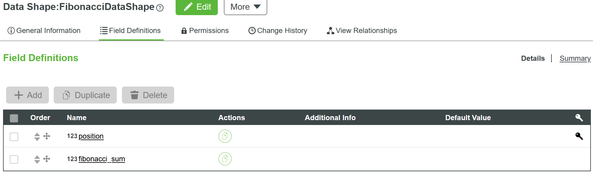

### Step 2: Create the Cache Thing Entity

The second step is to create an entity named **"FibonacciCacheThing"** based on the **"CacheThing"** Template. In the **"Configuration"** section, select the **"FibonacciDataShape"** we just created.

For this test, we will temporarily ignore the settings for **"Expiration Policy"**, **"Expiration Time"**, **"Cache Maximum Size"**, and **"Cache Performs Loading of Missing Entries"**.

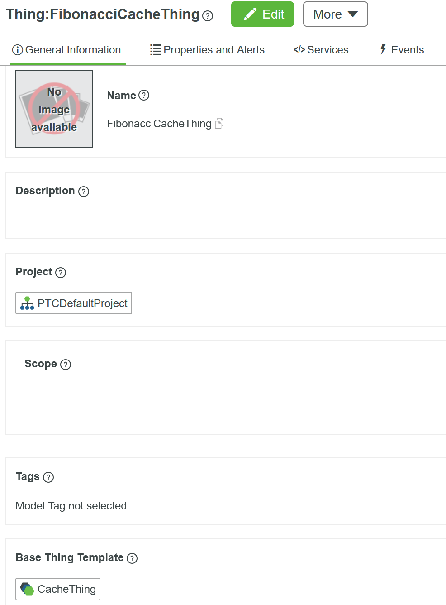

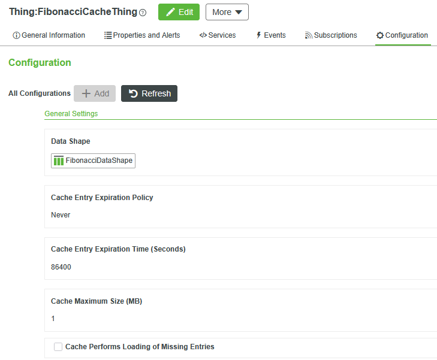

### Step 3: Create a Service "SumNaive"

The third step is to create a **Service** that implements the **naive recursive** algorithm for the Fibonacci problem. The input parameter is `"position"`, which is of type **INTEGER**, and the output is also of type **INTEGER**.

The service name is: `SumNaive`

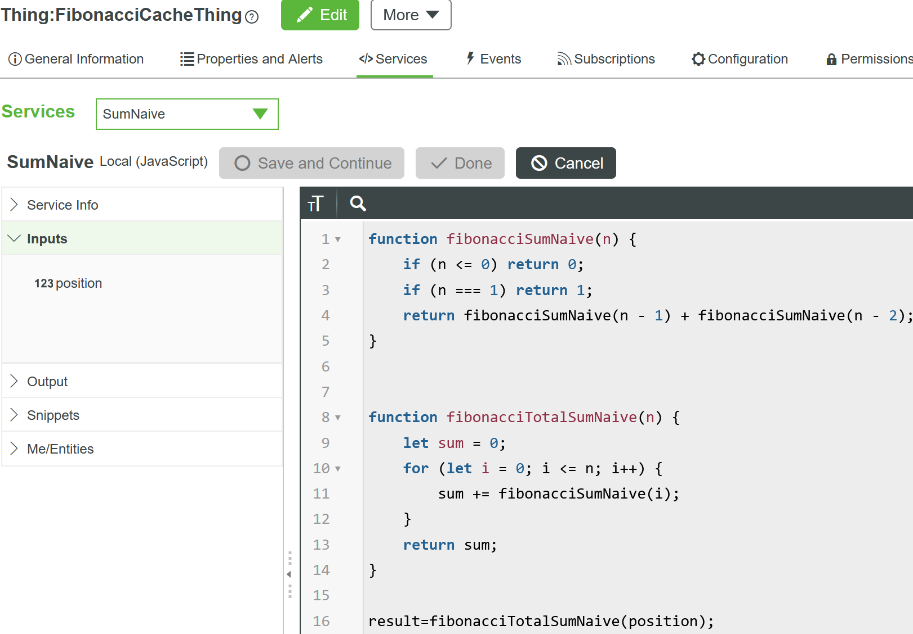

The code:

```javascript
function fibonacciSumNaive(n) {
    if (n <= 0) return 0;
    if (n === 1) return 1;
    return fibonacciSumNaive(n - 1) + fibonacciSumNaive(n - 2);
}


function fibonacciTotalSumNaive(n) {
    let sum = 0;
    for (let i = 0; i <= n; i++) {
        sum += fibonacciSumNaive(i);
    }
    return sum;
}

result=fibonacciTotalSumNaive(position);
```

### Step 4: Create a Service: "CachedSumNaive"

In the fourth step, we create a service called **"CachedSumNaive"**, which serves as a simple wrapper around the previously defined **"SumNaive"** service.

This type of service typically follows a common pattern:

1. Use the **`GetEntryByKey`** function to check whether a value corresponding to the current key already exists in the cache. In this example, the `"position"` value serves as the **key**, which needs to be converted from **INTEGER** to **STRING** format.
2. If the result exists, extract the **first row** from the result, and use the corresponding field as the return value.
3. If the result is not found in the cache, invoke the `"SumNaive"` service to compute the value. Before returning, store the result into the cache.

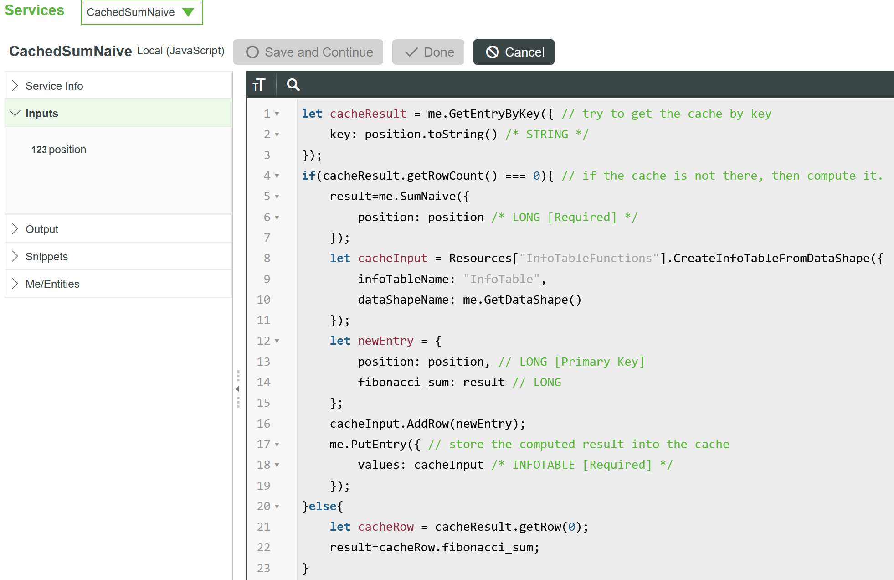

The code:

```javascript
let cacheResult = me.GetEntryByKey({ // try to get the cache by key
	key: position.toString() /* STRING */
});
if(cacheResult.getRowCount() === 0){ // if the cache is not there, then compute it.
    result=me.SumNaive({
        position: position /* LONG [Required] */
    });
    let cacheInput = Resources["InfoTableFunctions"].CreateInfoTableFromDataShape({
        infoTableName: "InfoTable",
        dataShapeName: me.GetDataShape()
    });
    let newEntry = {
        position: position, // LONG [Primary Key]
        fibonacci_sum: result // LONG
    };
    cacheInput.AddRow(newEntry);
    me.PutEntry({ // store the computed result into the cache
        values: cacheInput /* INFOTABLE [Required] */
    });
}else{
    let cacheRow = cacheResult.getRow(0);
    result=cacheRow.fibonacci_sum;
}
```

### Step 5: Benchmark

In the final step, let's compare the performance differences. We've prepared a k6 test script named **`test-fibonacci-api.js`**. This script reads the following environment variables:

- `THINGWORX_URL`
- `APP_KEY`
- `THING`
- `SERVICE`
- `ITERATIONS`
- `VU`
- `POSITION`

For convenience, we create a **`.env`** file in the current directory and fill in the required values. We also create a **`reports`** folder to store the test results.

Below is a sample `.env` file:

```shell
THINGWORX_URL=https://ht-thingworx-tw139972.dxudemo-aks.demo.dxu.edc.devops.ptc.io/Thingworx
APP_KEY=9a610dcf-f568-4342-8a3d-c835e11dba88
THING=FibonacciCacheThing
SERVICE=SumNaive
ITERATIONS=10
VU=20
POSITION=25
```

Please replace the `THINGWORX_URL` and `APP_KEY` with the value from your test environment.

We can use the same test script to evaluate different parameter sets — all that's needed is to provide the parameters via the command line.

To compare performance, we will test both **"SumNaive"** and **"CachedSumNaive"** services with the `position` values set to **10** and **35**, respectively. For each test, we will measure the **average response time**.

After each run, an HTML report will be generated in the **`reports`** directory. We can extract key metrics from these reports and compile them side by side for comparison.

```Powershell
$env:POSITION=10; $env:SERVICE="CachedSumNaive"; k6 run test-fibonacci-api.js
$env:POSITION=35; $env:SERVICE="CachedSumNaive"; k6 run test-fibonacci-api.js
$env:POSITION=10; $env:SERVICE="SumNaive"; k6 run test-fibonacci-api.js
$env:POSITION=35; $env:SERVICE="SumNaive"; k6 run test-fibonacci-api.js
```

or:

```shell
POSITION=10 SERVICE="CachedSumNaive" k6 run test-fibonacci-api.js
POSITION=35 SERVICE="CachedSumNaive" k6 run test-fibonacci-api.js
POSITION=10 SERVICE="SumNaive" k6 run test-fibonacci-api.js
POSITION=35 SERVICE="SumNaive" k6 run test-fibonacci-api.js
```

### Benchmark Results

You can use the above method to test different combinations. Here, I'll briefly list the **mean response time** comparison under the following four combinations:

1. `SumNaive` with `position = 10`
2. `CachedSumNaive` with `position = 10`
3. `SumNaive` with `position = 35`
4. `CachedSumNaive` with `position = 35`

The results below, with for each service the response time given a position, illustrate the performance differences across these scenarios:

|      | SumNaive | CachedSumNaive |
| ---- | -------- | -------------- |
| 10   | 37.75ms  | 30.66ms        |
| 35   | 1.90s    | 30.40ms        |

From the simple comparison above, we can see that due to the **O(2ⁿ)** time complexity of the *naive recursive* algorithm, the required computation time increases rapidly as the `position` value grows. However, after wrapping it with a **Cache Thing**, the access time — except for the initial cache population — becomes **O(1)**, effectively a constant.

### Sample Entities

You can import the following entities, and you can find all above reference design: `DataShapes_FibonacciDataShape.xml` and `Things_FibonacciCacheThing.xml`

### Summary

This example demonstrated how you could leverage the `Cache Thing` by wrapping a legacy query. It is very straightforward and you only need very little effort to migrate your code.

However, this example has two shortcomings:

1. When there are multiple requests to query the cache for the same key before the cache is loaded, the current implementation will execute the "legacy query" many times.
2. In some cases, there may be too many keys if you simply wrap up the original query.

We will use next example to demonstrate how to address the above two challenges.

## Example 2: Device Name/Identity Caching

In the previous example, we identified two areas for improvement. One of them is: when multiple requests simultaneously try to access the same cache key that doesn't exist yet, each request will execute the "legacy query" to populate the cache, but ultimately only one cache value will be used. While this doesn't cause any direct issues, it represents a level of waste, and is suceptible to variable backend reponse times due to excessive concurrency.

This problem becomes more pronounced when accessing "scarce" resources, such as database connections. In Example 2, we'll explain this issue and demonstrate how to resolve it.

In the previous example, we simply wrapped the original query with caching functionality. While this approach is straightforward and requires minimal code changes, it may not be optimal for all scenarios. Sometimes, we need to restructure the data layout to better utilize the cache's capabilities.

### Issue Statement

In a scenario where a large number of Axeda Devices connect to the ThingWorx platform through the eMessage Connector (eMC), whenever the eMC restarts, the database CPU utilization often spikes to nearly 100%. This process typically lasts 15-30 minutes, depending on the total number of devices and the number of CPU cores in the database. Since the database CPU is almost completely exhausted, the ThingWorx Platform struggles to respond promptly to other requests.

The root cause of this issue is that when the eMC restarts, all remote devices attempt to register as quickly as possible. During registration, the first step involves the eMC querying the ThingWorx Platform using the Model Number and Serial Number provided by each device to check if corresponding Name and Identifier exist. As long as either Name or Identifier exists, the device can successfully register and proceed with subsequent data transmission and file transfer operations. If neither exists, depending on the version and settings, the device may continuously retry registration.

The following code shows how to query Name and Identifier based on Model Number and Serial Number, let's call it "legacy query" from now on. You can imagine that in a system with over 10K devices, when the eMC restarts, nearly 10K requests trigger the core query almost entirely in parallel. The actual concurrency is limited by various network settings between devices and the eMC, but a high number of concurrent requests is undeniable.

```javascript
let things = ThingTemplates["AxedaBaseModel"].QueryImplementingThingsOptimized({
    maxItems: 1,
    query: {
      filters: {
        type: "And",
        filters: [{
          type: "EQ",
          fieldName: "modelNumber",
          value: modelNumber
        }, {
          type: "EQ",
          fieldName: "serialNumber",
          value: serialNumber
        }]
      }
    }
  });

  var name;
  if (things != null && things.length > 0) {
    name = things[0].getStringValue("name");
  }

  var identifier;
  if (name != null) {
    identifier = Things[name].GetIdentifier();
  }

  params = {
    infoTableName: "ThingNameAndIdentifier", /* STRING */
    dataShapeName: "ThingNameAndIdentifier" /* DATASHAPENAME */
  };

  var result = Resources["InfoTableFunctions"].CreateInfoTableFromDataShape(params);

  var thingData = new Object();
  thingData.name = name;
  thingData.identifier = identifier;

  result.AddRow(thingData);
```

### Design

The diagram below illustrates the root cause of the current problem: whenever a Device attempts to register, the eMC sends a query to the Thingworx Platform using Model Number and Serial Number as parameters. This query reaches the database level, searching for the corresponding Thing Name in the `"property_vtq"` table based on those Indexed properties.

Without considering duplicate registrations, each registration request contains a unique combination of Model Number and Serial Number. Therefore, each combination corresponds to a database query request.

If we continue to use the simple Wrap Up approach from the previous example, we can imagine that before the cache is established, there will still be a massive number of requests reaching the database level. Therefore, using the implementation method from the previous example cannot solve the challenges faced in this case.

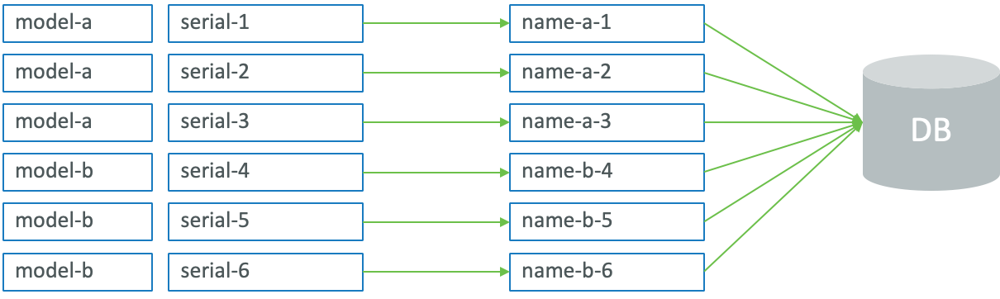

#### Reducing Database Queries

To reduce the number of database queries, there are several approaches we can consider. The simplest but most brute-force method would be to use a single key to cache all combinations through one query. While this approach is feasible, it would result in a single extremely large cache entry (not intended use). Every time we need to refresh the key-value pairs, it would cause significant memory changes, leading to longer garbage collection (GC) events.  Similarly, updating a single device would require updating the entire cached device list.

In this example, by carefully observing the Model Number and Serial Number, we can choose Model Number as the key, with its corresponding Cache Value being an InfoTable containing Serial Number and Name pairs.

Using this data structure, the possible key space is a very limited range, and each key's corresponding Serial Number and Name value combinations are also within a limited range. This provides an excellent balance.

The key advantages of this approach are:

1. **Limited Key Space**: Model Numbers typically come from a predefined set of values, making the key space manageable and predictable.

2. **Efficient Lookups**: When a device registers, we first check if the Model Number exists in cache. If it does, we only need to search through a small InfoTable of Serial Numbers rather than querying the database.

3. **Memory Efficiency**: Each cache entry contains only the relevant Serial Number-Name pairs for a specific Model Number, keeping memory usage reasonable.

4. **Reduced Database Load**: Once a Model Number is cached, subsequent lookups for devices with the same Model Number can be served from cache, significantly reducing database queries.

5. **Scalable Solution**: As new devices register, the cache naturally grows only for the Model Numbers that are actually in use, maintaining good performance characteristics.

This approach effectively balances memory usage, query performance, and database load reduction, making it an ideal solution for this use case.

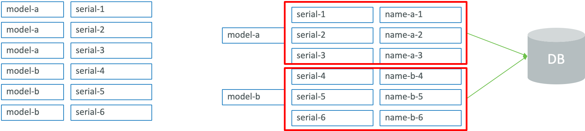

#### Blocking Concurrent Updates

In the previous example, we also mentioned another area for improvement: when multiple requests using the same key arrive simultaneously, the implementation method from the previous example would cause multiple requests to be executed concurrently, leading to multiple database accesses.

As shown in the diagram below, when three requests with Model Number "model-a" arrive simultaneously, the previous implementation method would cause these three requests to be executed concurrently, resulting in three database queries; this makes it difficult to achieve our original goal of reducing database access frequency.

When originally querying the database using Model Number and Serial Number, the result would contain at most one row - the queried Name. However, after restructuring the Cache Value in memory, the returned result contains all Serial Numbers and their corresponding Names for that Model Number. If a Model Number corresponds to 1000 Serial Numbers, the memory occupied by the returned result would be approximately: 1000 * 2 times. Such an increase in memory usage in a system with more than 10K total Devices, trying to register at the same time, could easily lead to memory overflow. This is clearly unacceptable.

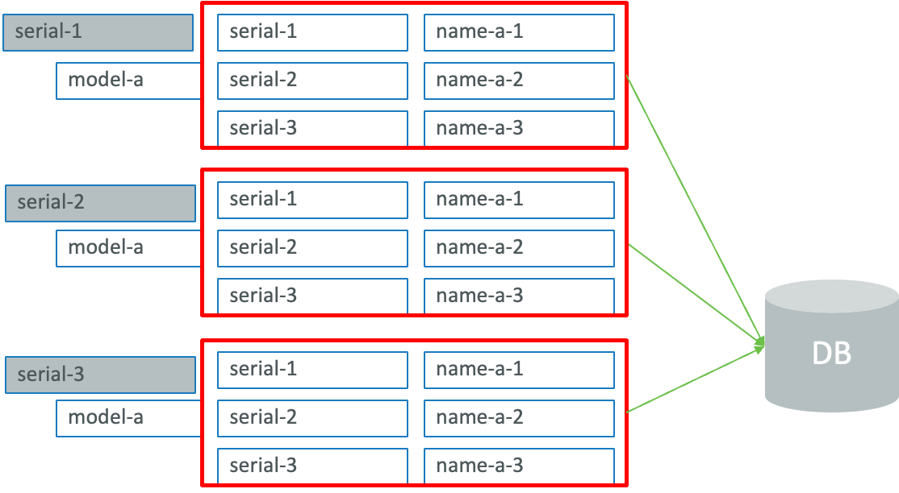

Starting from ThingWorx version 10.0.1, the Cache Thing provides a "Read Through" mode, also known as "loading" mode. In this mode, when multiple requests attempt to update the cache with the same key at the same time, only one request will be executed while the others wait. Once the execution result is available, it will be directly used by all waiting requests without requiring additional executions. In this example, this means avoiding repeated database queries and ensuring stable query times. The diagram below illustrates this concept.

In "Read Through" mode, the query service pattern will be different, which we will explain in detail in the "implementation" section.

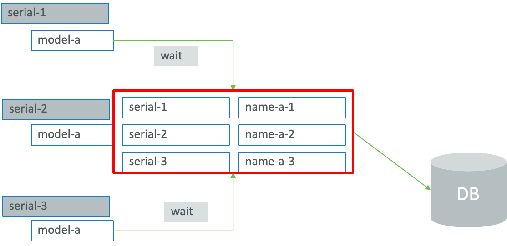

### Implementation

#### Step 1: Reuse the DataShape "ThingNameAndIdentifier"

This is the original DataShape, provided through the OOTB Axeda Compatibility Extension (ACE), of the query result. We should keep using it for the best backward compatability.

#### Step 2: Define the DataShape "ModelResultInfotableDatashape"

This will be the DataShape for the query result based on Model Number.

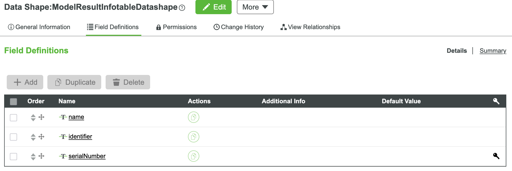

Please be noticed that "serialNumber" is the unique key in this DataShape.

#### Step 3: Define the DataShape "NameIdentifierCacheDatashape" for the Cache Thing

This DataShape will be the one used in the new "Cache Thing" configuration.

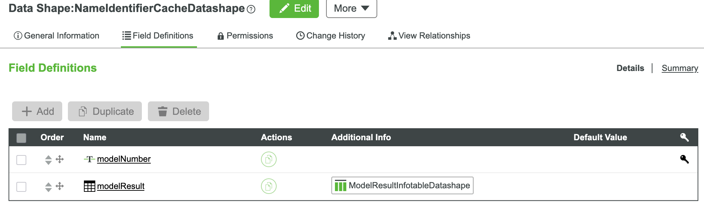

#### Step 4: Create a New "Cache Thing": "NameIdentifierCache"

Let's create a new "Cache Thing" entity with name `NameIdentifierCache` and use the DataShape `NameIdentifierCacheDatashape`.

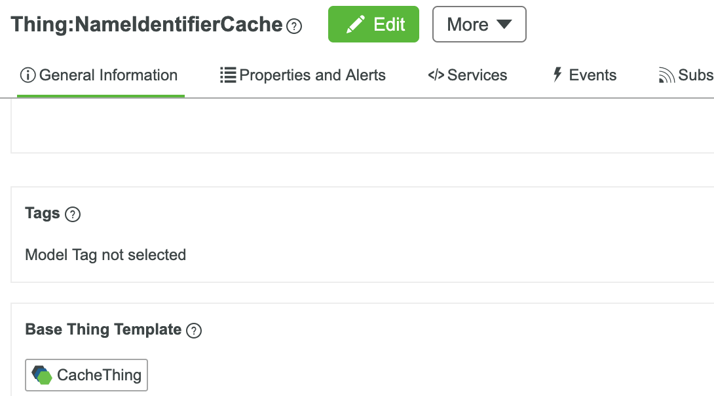

Please make sure the **"Cache Performs Loading of Missing Entries"** option is selected this time. For the **"Cache Maximum Size"**, we can choose a value of 30MB now and will consider what is the best estimated value later.

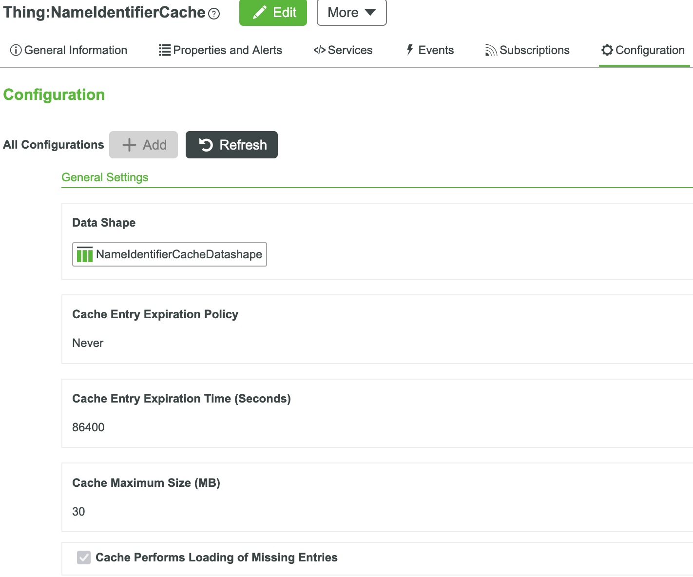

#### Step 5: Define a Service: "GetThingNameAndIdentifierByModelAndSerial"

This service will be as same as the legacy query in the `AxedaProtocolAdapter` entity. The purpose to include it in this cache thing is for benchmarking purposes.

The spec of inputs and output will be the same.

#### Step 6: Define a Service: "GetThingNameAndIdentifierByModel"

As we have talked in the `Design` section, we will query the database based on Model Number. This is our approach to reduce the database access.

The code:

```javascript
let propertyNames = Resources["InfoTableFunctions"].CreateInfoTableFromDataShape({
    infoTableName: "InfoTable",
    dataShapeName: "EntityList"
});
let basicPropertyNames = Resources["InfoTableFunctions"].CreateInfoTableFromDataShape({
    infoTableName: "InfoTable",
    dataShapeName: "EntityList"
});
// EntityList entry object
let serialNumber = {
    name: 'serialNumber', // STRING [Primary Key]
    description: undefined // STRING
};
let name={
    name: 'name', // STRING [Primary Key]
    description: undefined // STRING
};

propertyNames.AddRow(serialNumber);
basicPropertyNames.AddRow(name);

let thing_result = ThingTemplates["AxedaBaseModel"].QueryImplementingThingsOptimized({
    maxItems: 20000,
    query: {
      filters: {
          type: "EQ",
          fieldName: "modelNumber",
          value: modelNumber
        }
    },
    propertyNames: propertyNames,
    basicPropertyNames:basicPropertyNames
  });

let params = {
    infoTableName: "ModelResultInfotableDatashape", /* STRING */
    dataShapeName: "ModelResultInfotableDatashape" /* DATASHAPENAME */
};

let result = Resources["InfoTableFunctions"].CreateInfoTableFromDataShape(params);

for(let index=0;index<thing_result.rows.length;index++){
    let row = thing_result.rows[index];
    let name = row.getStringValue("name");
    let identifier;
    if(name != null){
        identifier = Things[name].GetIdentifier();
    }
      var thingData = new Object();
    thingData.serialNumber = row.serialNumber;
    thingData.name = name;
    thingData.identifier = identifier;

    result.AddRow(thingData);
}
```

The "inputs" will be "modelNumber" only. The output will be a "InfoTable" with DataShape: **"ModelResultInfotableDatashape"**.

#### Step 7: Define a Service: "FilterBySerial"

This service will take the output from the `GetThingNameAndIdentifierByModel` along with "Serial Number" as the inputs and then filter the result by using "Serial Number".

The output will be a "InfoTable" with DataShape: **"ThingNameAndIdentifier"**.

The code:

```javascript
const paramsForFilteredResult = {
    inclusive: true,  // Include (true) or exclude (false) matched rows in result.
    fieldName: "serialNumber",  // Field name on which to filter
    t: modelResult, // InfoTable to filter
    pattern: serialNumber  // String pattern to match in field above.
};
const DATASHAPE_NAME = 'ThingNameAndIdentifier';
var result = Resources["InfoTableFunctions"].CreateInfoTableFromDataShape({
    infoTableName: DATASHAPE_NAME, /* STRING */
   	dataShapeName: DATASHAPE_NAME /* DATASHAPENAME */
});

try {
    let filtered = Resources["InfoTableFunctions"].LikeFilter(paramsForFilteredResult);
    
    if((filtered != null) && (filtered.rows.length > 0)) {
        let thingData = {};
        thingData.name = filtered.rows[0].name;
        thingData.identifier = filtered.rows[0].identifier;
        result.AddRow(thingData);
    }
} catch(err) {
    logger.error("{} - {}:{} - {}", me.name, err.fileName, err.lineNumber, err);
    throw err;
}
```

#### Step 8: Overwrite the "LoadEntry" Service

This is the key difference of the implementation between this example and the last example. To ensure there is only one request to be executed when there are multiple requests when the same key arrives, you need to have your logic to query the value to be cached in this special service. The "Cache Thing" template backend will ensure that only one execution and update will occur.

The code:

```javascript
var result;

try {
    // Create InfoTable from CacheThing configured DataShape 
    result = Resources["InfoTableFunctions"].CreateInfoTableFromDataShape({
        infoTableName: "InfoTable",
        dataShapeName: me.GetDataShape()
    });
    
    let modelNumber = values.rows[0].modelNumber;
    let modelResult = me.GetThingNameAndIdentifierByModel({
        modelNumber: modelNumber /* STRING [Required] */
    });
    
    result.AddRow({modelNumber: modelNumber, modelResult: modelResult});

} catch(err) {
    logger.error("{} - {}:{} - {}", me.name, err.fileName, err.lineNumber, err);
    throw err;
}
```

Both of the inputs and output are using the same DataShape that is associated with this "Cache Thing" on the Configuration page.

#### Step 9: Define a New Service: "GetThingNameAndIdentifierByCache"

This will be the service to replace the original service: `"GetThingNameAndIdentifierByModelAndSerial"`. It will get the cache value by "Model Number" and then filter it by using "Serial Number".

The code:

```javascript
//new cache mode
let modelCache=me.GetEntryByKey({
	key: modelNumber /* STRING */
});

let modelResult=modelCache.rows[0].modelResult;

let result=me.FilterBySerial({
	modelResult: modelResult /* INFOTABLE [Required] {"dataShape":"ModelResultInfotableDatashape"} */,
	serialNumber: serialNumber /* STRING [Required] */
});
```

The spec of the inputs and the output will be exactly same as the legacy query `"GetThingNameAndIdentifierByModelAndSerial"`. In the real world implementation, you may put the new logic into the service with the legacy name: `"GetThingNameAndIdentifierByModelAndSerial"`. For demostration purposes, both of them are presented here.

#### Step 10: Benchmark

You may not be able to reproduce this benchmark test easily since it involves a lot of data preparation. I already provisioned more than 12K devices in the test environment. The test script `test-identifier-api.js` reads "Model Number" and "Serial Number" from a JSON file and executes both API with different concurrency settings.

The comparison of the "average" response time for both legacy query and cached query can be found in below table:

| Concurrency | Legacy Query | Cached Query |
| ----------- | ------------ | ------------ |
| 5           | 77.98ms      | 24.08ms      |
| 25          | 350.14ms     | 24.72ms      |
| 125         | 2.99s        | 25.38ms      |

### Summary

Reviewing the results, it is so obvious that the cached query is far more scalable than the legacy query. The response time of the legacy query increased rapidly when the concurrency is increasing. You can imagine how bad the siutation will be when then concurrency is up to 10K.

These benchmark results and use case example also expresses a common scenario where application developers do not appropriately design for heavy load/traffic, which then translates into resource *trashing* where multiple processes/threads compete for the same resources, diminshing their performance, increasing overall wait times, and potentially leading to *livelock*.

## Example 3: Historical Data computation and chart display

In this example, we demonstrate how to leverage CacheThing to optimize historical data computations and efficiently display results in a Line Chart. Unlike caching raw historical data, we cache the prepared chart data. This means all computation is done upfront, making chart rendering fast and scalable. As a result, we not only enhance user experience, but also prevent the system from being overwhelmed with frequent computation, saving CPU time and database workload.
> **Author Notes**:
> This example is intended to be used by "beginners", discovering the CacheThing mechanism, and provides a visual way to experiment it.

### Entities design and Prerequistes
The example is organized into two THingworx projects:
- `SSA.CTDemo.Core`: contains the services to get raw data and assets from thing templates
- `SSA.CTDemo.Application`: contains services to be consumed by UI and UI elements (mashup, media entities), but also the CacheThing mechanism to cache the chart data.

The "Application" project is dependent on the "Core" one. Entities in these two projects define the necessary Things, DataShapes, and Services for this example.

Before proceeding, import the following entities from the provided XML files (in this order):

- [Entities_SSA.CTDemo.Core.xml](../project/samples/historicaldatachart/entities/Entities_SSA.CTDemo.Core.xml)
- [Entities_SSA.CTDemo.Application.xml](../project/samples/historicaldatachart/entities/Entities_SSA.CTDemo.Application.xml)

> **IMPORTANT**:
> This use case builds on the entities from [Example 2](#example-2-device-nameidentity-caching) (Axeda devices), which must be imported beforehand: all `sample**_TT` Thing Templates and their implementing Things, where we primarily use the `int_1` property.  
>  
> We will illustrate how to **leverage** the historical data from these devices to prepare and cache results for chart display.

### Implementation description
#### Step 1: Raw data services

The `SSA.CTDemo.Core.Manager_TT` Thing Template (implementation thing: `SSA.CTDemo.Core.Manager`) defines the following services.

##### GetSampleThingTemplates
This service uses a *Spotlight Search* to request all "sample" thing template (like sample_1_TT, sample17_TT, etc...).

*Implementation*:
```javascript
var result = Resources["InfoTableFunctions"].CreateInfoTableFromDataShape({
    infoTableName: "InfoTable",
    dataShapeName: "EntityList"
});// CreateInfoTableFromDataShape(infoTableName:STRING("InfoTable"), dataShapeName:STRING):INFOTABLE(EntityList)

try{
    
    let params = {
        searchExpression: "sample*" /* STRING */,
        types: {"items": ['ThingTemplate']} /* JSON */,
    };

    let searchResultsIT = Resources["SearchFunctions"].SpotlightSearchV2(params);// result: INFOTABLE dataShape: SpotlightSearchV2
    
    searchResultsIT.rows.toArray().forEach(row => {
		result.AddRow({
            name: row.name, // STRING [Primary Key]
            description: undefined // STRING
    	});// EntityList entry object
    });
    
    result.Sort({
        name: "name",
        ascending: true
    });
} catch(err){
	logger.error("{} - {}:{} - {}", me.name, err.fileName, err.lineNumber, err);
    throw err;
}
```
##### GetThingsHistoricalDataForSampleTemplate
Given a thing template (`sampleThingTemplate` parameter), and a number of days to request (`nbOfDaysToRequest` parameter), this service returns the raw historical data of the `int_1` property for all impleting things. This service leverages the *QueryImplementingThingsWithNamedPropertyHistory* OOTB service, that can be quite expansive in terms of ressources consumption.
> **IMPORTANT**:
> Note here, as we know our line chart widget cannot take more than 24 series, we intentionally limit the number of items to 24. For safety, we also set the maxDataItems to 5000.

*Implementation*:
```javascript
const X_DAYS_IN_MILLISECONDS = 1000 * 60 * 60 * 24 * nbOfDaysToRequest;
var result;

try{
    // CreateInfoTableFromDataShape(infoTableName:STRING("InfoTable"), dataShapeName:STRING):INFOTABLE(EntityList)
    let propertyNamesIT = Resources["InfoTableFunctions"].CreateInfoTableFromDataShape({
        infoTableName: "InfoTable",
        dataShapeName: "EntityList"
    });

    propertyNamesIT.AddRow({
        name: 'int_1', // STRING [Primary Key]
        description: undefined // STRING
    });// EntityList entry object

    let endDate = Date.now();
    let startDate = endDate - X_DAYS_IN_MILLISECONDS;

    // result: INFOTABLE dataShape: ""
    result = ThingTemplates[sampleThingTemplate].QueryImplementingThingsWithNamedPropertyHistory({
        oldestFirst: true /* BOOLEAN */,
        maxItems: 24 /* NUMBER {"defaultValue":500} */,
        endDate: endDate /* DATETIME */,
        propertyNames: propertyNamesIT /* INFOTABLE {"dataShape":"EntityList"} */,
        maxDataItems: 5000 /* NUMBER {"defaultValue":500} */,
        startDate: startDate /* DATETIME */
    });
} catch(err){
	logger.error("{} - {}:{} - {}", me.name, err.fileName, err.lineNumber, err);
    throw err;
}
```
The output infotable of the service as 3 columns:
- `int_1`: value of the property
- `name`: thing name
- `timestamp`: timestanp for the property

#### Step 2: Historical Data preparation and Data Shape design for Chart display
We implement a service that queries raw historical data, performs all necessary computation (pivot, formatting), and prepares the chart data structure.
This steps allows having devices/things names appearing as labels columns, while the values are pivoted in a nested "values" infotable with timestamp as the first column and all returned things as other columns, containing property values. Such data transformation ensures easy consumption in the Chart Line widget.
> **IMPORTANT**:
> Note that depending on data amount, this service may consume a lot of Thingworx resources.

##### SSA.CTDemo.App.SampleHistoricalChartData Data Shape
This data shape is the output format of the transformation service.

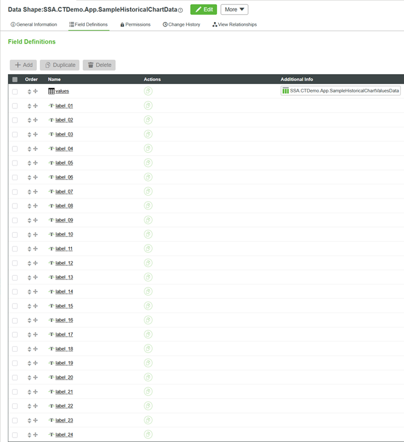

##### SSA.CTDemo.App.SampleHistoricalChartData Data Shape
This data shape represents the values in the result of the transformation service.

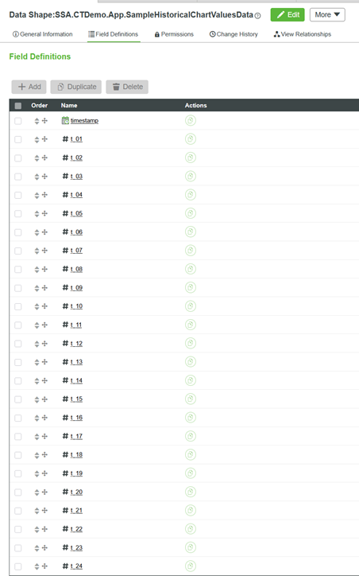


##### GetSampleHistoricalChartDataWithoutCache
This service is host on the `SSA.CTDemo.App.Manager_TT` Thing Template (implementing thing:  `SSA.CTDemo.App.Manager`) and prevare raw historical data as described above. This service accepts parameters such as sample Thing Template (`sampleThingTemplate` parameter) and number of days to request (`nbOfDaysToRequest` parameter).

*Implementation*:
```javascript
const CORE_MANAGER = me.GetConfiguredManagerForCore();//"SSA.CTDemo.Core.Manager"

var result;
var MAX_NUMBER_OF_SERIES = 24;

const formatNumberOn2Digits = function (inputNumber) {
	let dec = inputNumber - Math.floor(inputNumber);
	inputNumber = inputNumber - dec;
	let formattedNumber = ("0" + inputNumber).slice(-2) + dec.toString().substr(1);
    return formattedNumber;
};

try{
    // Initialize Chart Data infotable
    result = Resources["InfoTableFunctions"].CreateInfoTableFromDataShape({
        infoTableName: "InfoTable",
        dataShapeName: "SSA.CTDemo.App.SampleHistoricalChartData"
    });// CreateInfoTableFromDataShape(infoTableName:STRING("InfoTable"), dataShapeName:STRING):INFOTABLE(SSA.CTDemo.App.SampleHistoricalChartData)

    // Initialize Chart Values Data infotable
    let computedChartValuesIT = Resources["InfoTableFunctions"].CreateInfoTableFromDataShape({
        infoTableName: "InfoTable",
        dataShapeName: "SSA.CTDemo.App.SampleHistoricalChartValuesData"
    });// CreateInfoTableFromDataShape(infoTableName:STRING("InfoTable"), dataShapeName:STRING):INFOTABLE(SSA.CTDemo.App.SampleHistoricalChartValuesData)

    // Get raw historical data for a maximum of 24 things with given sample thing template
    let rawDataIT = Things[CORE_MANAGER].GetThingsHistoricalDataForSampleTemplate({
        sampleThingTemplate: sampleThingTemplate /* THINGTEMPLATENAME [Required] {"defaultValue":"sample1_TT"} */,
        nbOfDaysToRequest: nbOfDaysToRequest /* INTEGER [Required] {"minimumValue":1,"maximumValue":100,"defaultValue":20} */
    });// rawDataIT: INFOTABLE dataShape: "" (not specified)

    // Build an array of the thing names, making sure its size does not exceed 24 entries
    let distinctThingNamesIT = Resources["InfoTableFunctions"].Distinct({
        t: rawDataIT /* INFOTABLE */,
        columns: 'name' /* STRING */
    });// distinctThingNamesIT: INFOTABLE
    let distinctThingsCount = distinctThingNamesIT.getRowCount();
    let distinctThingNamesTruncatedArray = [];
    distinctThingNamesIT.rows.toArray().forEach(row => {
        distinctThingNamesTruncatedArray.push(row.name);
    });
    if (distinctThingsCount < MAX_NUMBER_OF_SERIES) {
        MAX_NUMBER_OF_SERIES = distinctThingsCount;
    }
    distinctThingNamesTruncatedArray = distinctThingNamesTruncatedArray.slice(0, MAX_NUMBER_OF_SERIES);
    
    // Main data processing to pivot the raw data infotable, having thing names converted into columns
    computedChartValuesIT = Resources["InfoTableFunctions"].Pivot({
        t: rawDataIT /* INFOTABLE */,
        nameColumn: "name" /* STRING */,
        valueColumn: "int_1" /* STRING */,
        timestampColumn: 'timestamp' /* STRING */
    });// computedChartValuesIT: INFOTABLE

    // Get the pivoted dable fields, and remove columns which are not in the computed truncated array
    let dataShapeFields = computedChartValuesIT.dataShape.fields;
    let dataShapeFieldNames = Object.keys(dataShapeFields);
    dataShapeFieldNames.forEach(fieldName => {
        if ((fieldName !== 'timestamp') && (distinctThingNamesTruncatedArray.includes(fieldName) === false)) {
            computedChartValuesIT.RemoveField(fieldName);
        }
    });
    
    // Build the array of (thing) serie fields, excluding the timestamp column
    dataShapeFields = computedChartValuesIT.dataShape.fields;//.map(field => fiel.name);
    dataShapeFieldNames = Object.keys(dataShapeFields);
    let indexOfTS = dataShapeFieldNames.indexOf('timestamp');
    if (indexOfTS > -1) { // only splice array when item is found
      dataShapeFieldNames.splice(indexOfTS, 1); // 2nd parameter means remove one item only
    }

    // Create a SSA.CTDemo.App.SampleHistoricalChartData entry object
    let newEntry = {};
    
    // Browse fields and rename them so they respect the SSA.CTDemo.App.SampleHistoricalChartValuesData data shape
    // Also, generate corresponding labels with each original thing name
    let intIndex = 0;
    dataShapeFieldNames.forEach(fieldName => {
        intIndex = intIndex + 1;
        let formattedIndex = formatNumberOn2Digits(intIndex);
        let serieFieldName = 't_' + formattedIndex;
        let labelFieldName = 'label_' + formattedIndex;
        newEntry[labelFieldName] = fieldName;

        computedChartValuesIT = Resources["InfoTableFunctions"].RenameField({
            t: computedChartValuesIT /* INFOTABLE */,
            from: fieldName /* STRING */,
            to: serieFieldName /* STRING */
        });// computedChartValuesIT: INFOTABLE
    });
    
    // Initialize Chart Values Data infotable with fields ordered from data shape
    let computedChartValuesWithOrderedFieldsIT = Resources["InfoTableFunctions"].CreateInfoTableFromDataShape({
        infoTableName: "InfoTable",
        dataShapeName: "SSA.CTDemo.App.SampleHistoricalChartValuesData"
    });// CreateInfoTableFromDataShape(infoTableName:STRING("InfoTable"), dataShapeName:STRING):INFOTABLE(SSA.CTDemo.App.SampleHistoricalChartValuesData)
    computedChartValuesIT.rows.toArray().forEach(row => {
        computedChartValuesWithOrderedFieldsIT.AddRow(row);
    });

    // Set the values infotable
    newEntry.values = computedChartValuesWithOrderedFieldsIT;
    
    // Add the entry as single row for chart data
    result.AddRow(newEntry);
    
} catch(err){
	logger.error("{} - {}:{} - {}", me.name, err.fileName, err.lineNumber, err);
    throw err;
}
```


#### Step 3: Create the Cache Thing Entity and Data Shape
We create the CacheThing (`SSA.CTDemo.App.SampleHistoricalChartDataCache`) by defining the `SSA.CTDemo.App.SampleHistoricalChartDataCache_TT` Thing Template, wich inherits from the OOTB **CacheThing** Thing template.
We apply a "default" configuration, with enough cache size to allow storing various amount of results for chart display.
> **IMPORTANT**:
> Note that cache entry expiration time should be increased as we want cache data to be kept enough, taking into account that in such scenario where hsitorical data trend is analyzed, we don't expect to re-compute data often.

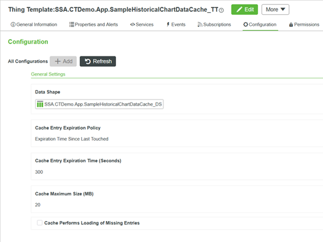

##### SSA.CTDemo.App.SampleHistoricalChartDataCache_DS Data Shape
The configured Data Bhape is built as follows:
- Desired input parameters of the main "without cache" data service:
  - `sampleThingTemplate` (Thing Template name)
  - `nbOfDaysToRequest` (Integer)
- Output of the "without cache" service as the cache storage data format:
  - `SampleHistoricalChartData` (Infotable with `SSA.CTDemo.App.SampleHistoricalChartData` Data Shape, as described in [Step 2](#step-2-historical-data-preparation-and-data-shape-design-for-chart-display))

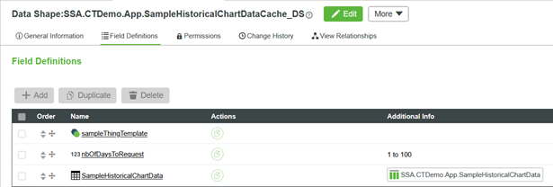

#### Step 4: Cached Chart Data Service
Here we wrap the chart data preparation service with caching. We use the cache keys to store and retrieve prepared chart data, minimizing repeated computation for the same query.
The "algorithm" is very simple here. Given the two keys:
- if the data is already in cache, use it
- if not, compute the data, and **<span style="color:green">add it to the cache!</span>**

##### GetSampleHistoricalChartData service
The service outut Infotable (`SSA.CTDemo.App.SampleHistoricalChartData` data shape) is directly consume from mashup.
This service accepts the following inputs: sample Thing Template (`sampleThingTemplate` parameter) and number of days to request (`nbOfDaysToRequest` parameter).
*Implementation*:
```javascript
const SAMPLE_HISTORICAL_CHART_DATA_CACHE_THING = 'SSA.CTDemo.App.SampleHistoricalChartDataCache';
var result;

const getCacheEntryInfoTable = function() {
    return Resources["InfoTableFunctions"].CreateInfoTableFromDataShape({
                infoTableName: "InfoTable",
                dataShapeName: "SSA.CTDemo.App.SampleHistoricalChartDataCache_DS"
    });
    //MAY DO: replace this by calling GetDataShape on cache thing
};

try{
    
    let cacheEntryInputIT = getCacheEntryInfoTable();
    cacheEntryInputIT.AddRow({"sampleThingTemplate": sampleThingTemplate, "nbOfDaysToRequest": nbOfDaysToRequest});// SSA.CTDemo.App.SampleHistoricalChartDataCache_DS entry object, without SampleHistoricalChartData
	
    let cacheEntryResultIT = Things[SAMPLE_HISTORICAL_CHART_DATA_CACHE_THING].GetEntry({
        values: cacheEntryInputIT /* INFOTABLE */
    });// result: INFOTABLE dataShape: ""
    
    if (cacheEntryResultIT.getRowCount() === 0) {
        // Cache didn't have results, so go to backing DataTable, by calling the GetSampleHistoricalChartDataWithoutCache Service
        logger.info("no cache entry for {} thing template and {} number of days; using backend query", sampleThingTemplate, nbOfDaysToRequest);
        
        result = me.GetSampleHistoricalChartDataWithoutCache({
            sampleThingTemplate: sampleThingTemplate /* THINGTEMPLATENAME [Required] */,
            nbOfDaysToRequest: nbOfDaysToRequest /* INTEGER [Required] {"minimumValue":1,"maximumValue":100,"defaultValue":20} */
        });// result: INFOTABLE dataShape: "SSA.CTDemo.App.SampleHistoricalChartData"
        
        if (!result) {
            throw new Error("GetSampleHistoricalChartDataWithoutCache did not return results");
        }
        
        let newCacheEntryIT = getCacheEntryInfoTable();
        newCacheEntryIT.AddRow({"sampleThingTemplate": sampleThingTemplate, "nbOfDaysToRequest": nbOfDaysToRequest, "SampleHistoricalChartData": result});// SSA.CTDemo.App.SampleHistoricalChartDataCache_DS entry object
        Things[SAMPLE_HISTORICAL_CHART_DATA_CACHE_THING].PutEntry({
            values: newCacheEntryIT /* INFOTABLE [Required] */
        });
        // result is already set
    } else {
        let rowCacheResult = cacheEntryResultIT.getRow(0);
        result = rowCacheResult.SampleHistoricalChartData;
    }
} catch(err){
	logger.error("{} - {}:{} - {}", me.name, err.fileName, err.lineNumber, err);
    throw err;
}
```


#### Step 5: Line Chart Visualization
THe mashup is implemented with two user inputs:
- a combo box listing avaialble *sample" Thing Template to select
- a numeric entry for thenumber of days to request data
Data will be displayed in a Line Chart widget, which *data* property is bound to the output *values* from the `GetSampleHistoricalChartData` service.
All series label (assets/devices' names) are mapped from the `label` parameters of the `SSA.CTDemo.App.SampleHistoricalChartData` data shape:
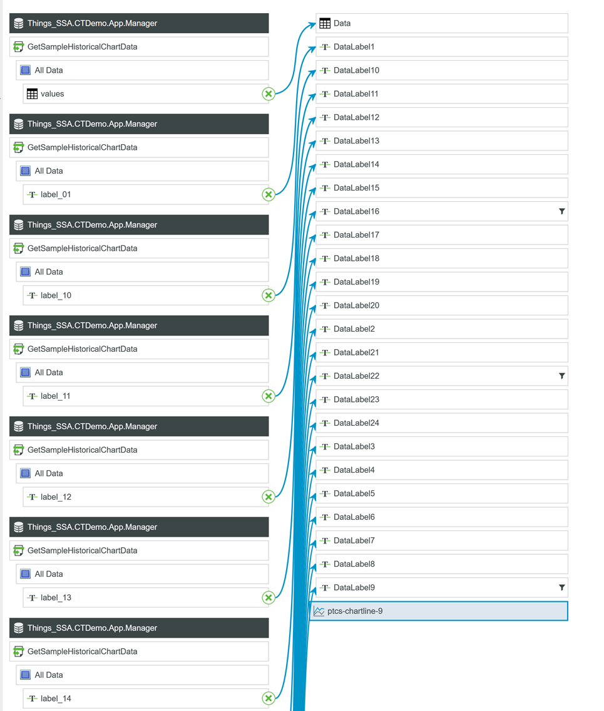

The duration (execution time in seconds) of each service call is also computed and displayed in a text box.
Additional widgets are provided to manipulate the cache, for testing purpose:
- "Purge Cache" button ... purges the cache
- "Get Cache Entries Count" displays the count of cache entries in a textbox

*Screenshot*:
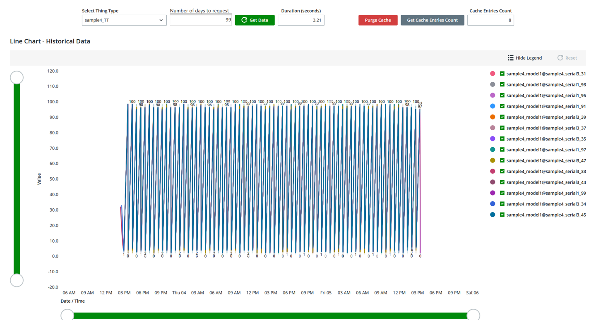


### Benchmark

To assess the impact of caching on historical data computation and chart display, we performed a load test using k6 with the following parameters:

- **Number of Virtual Users (VU):** 6
- **Iterations per VU:** 8
- **Sample Thing Templates:** 9 different templates
- **Number of Days to Request:** 99

Each virtual user, for each iteration, called the chart data service for every template, resulting in a total of 432 requests per test run.

We compared two scenarios:
1. **Without Cache:** Using the `GetSampleHistoricalChartDataWithoutCache` service, which computes and prepares the chart data on every request.
2. **With Cache:** Using the `GetSampleHistoricalChartData` service, which leverages the CacheThing to store and retrieve prepared chart data.

#### Results

| Metric                    | Without Cache               | With Cache                    |
|---------------------------|-----------------------------|-------------------------------|
| **Average Response Time** | 6.17s                       | 1.64s                         |
| **Minimum Response Time** | 402.67ms                    | 107.59ms                      |
| **Median Response Time**  | 2.31s                       | 430.55ms                      |
| **90th Percentile**       | 20.95s                      | 2.72s                         |
| **95th Percentile**       | 22.46s                      | 6.96s                         |
| **Maximum Response Time** | 29.09s                      | 22.86s                        |
| **Requests per Second**   | 0.80/s                      | 2.09/s                        |
| **Total Requests**        | 432                         | 432                           |
| **Success Rate**          | 100%                        | 100%                          |
| **Test Duration**         | 9m09s                       | 3m27s                         |

*See the generated HTML reports for full details:*
- [With Cache ../project/samples/historicaldatachart/reports/summary-GetSampleHistoricalChartData-6-8.html]()
- [Without Cache ../project/samples/historicaldatachart/reports/summary-GetSampleHistoricalChartDataWithoutCache-6-8.html]()

*Note: These files are generated under the `reports` folder when the k6 tests are run, and are not provided here*

**Database Resource Usage:**  
The following screenshot shows the database server's CPU and memory metrics during the tests.  
- The <span style="color:red;font-weight:bold">red</span> **highlighted area** corresponds to the period when the test was executed **without cache**.
- The <span style="color:gold;font-weight:bold">yellow</span> **highlighted area** corresponds to the period when the test was executed **with cache**.

*Screenshot:*
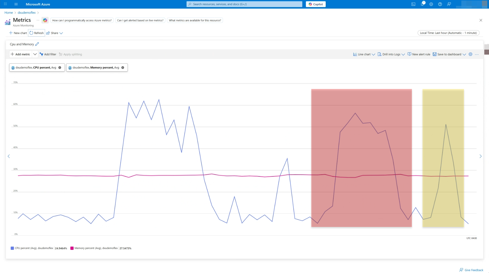

During the red period (no cache), the database CPU usage is significantly higher and sustained for a longer duration, reflecting the heavy load caused by repeated computations and queries. In contrast, during the yellow period (with cache), CPU usage is much lower and the load is shorter, demonstrating the efficiency and resource savings provided by caching.

These results clearly show that caching dramatically reduces average and median response times, increases throughput, and most importantly, leads to a substantial reduction in database CPU consumption during load.

---

### Summary

This example demonstrates the substantial benefits of using CacheThing for historical data computation and chart display in ThingWorx applications:

- **Performance Improvement:**  
  Caching prepared chart data reduces average response times by nearly 75% under load, and greatly improves the user experience for dashboard and analytics scenarios.

- **Scalability:**  
  The system can handle a higher number of concurrent requests, as the cache absorbs repeated queries for the same parameters, reducing pressure on the backend and database.

- **Resource Optimization:**  
  By avoiding redundant computations and database queries, CPU and memory usage on the server are significantly reduced, as confirmed by both response time metrics and server monitoring. The database CPU time is drastically lower when using the cache, as visually highlighted in the monitoring screenshot.

- **User Experience:**  
  End users benefit from faster chart rendering and more responsive dashboards, even under heavy load or when accessing historical data for large time ranges.

- **Infrastructure Cost Reduction:**  
  By lowering the load on the database and application servers, caching helps reduce infrastructure requirements and operational costs. Fewer resources are needed to achieve the same level of performance, and the system can scale more efficiently.

**Conclusion:**  
Leveraging CacheThing for computationally expensive or frequently requested data is a best practice in ThingWorx. It not only improves performance and scalability, but also helps ensure a stable and responsive ThingWorx IoT application, even as data volumes and user concurrency grow. Most importantly, this approach enables significant infrastructure cost savings by reducing the need for oversized servers and minimizing resource consumption during peak usage.


