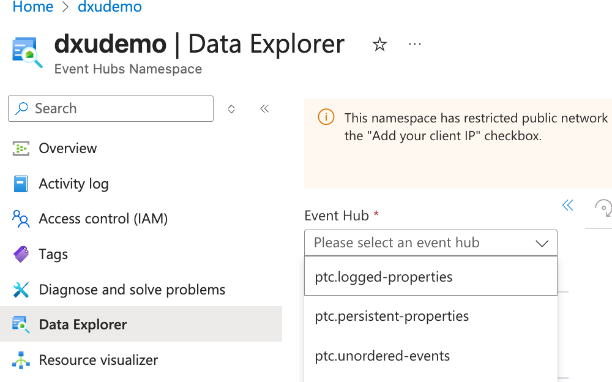
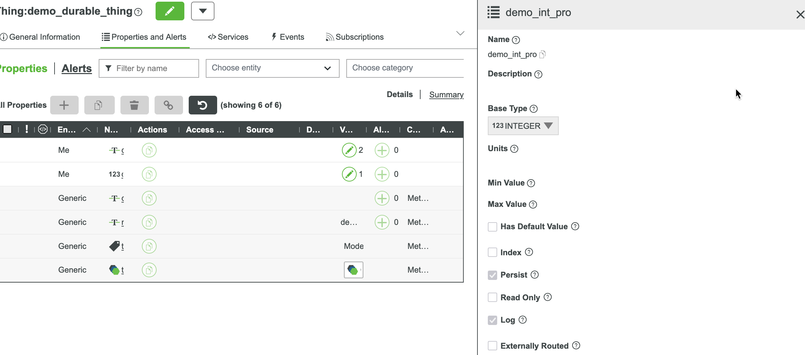
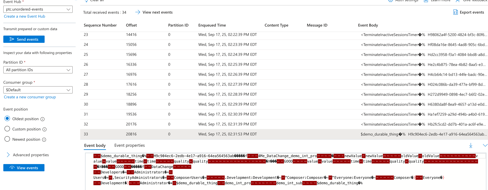
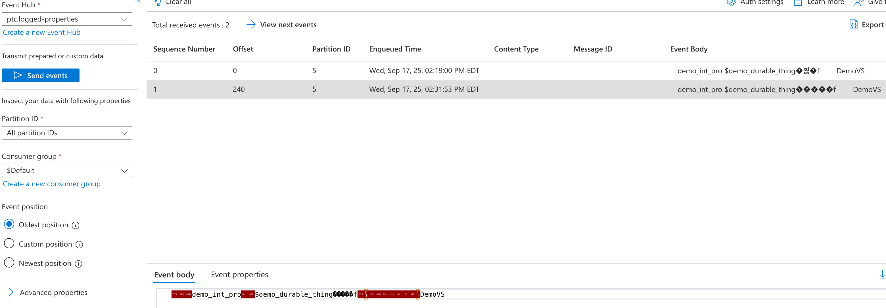
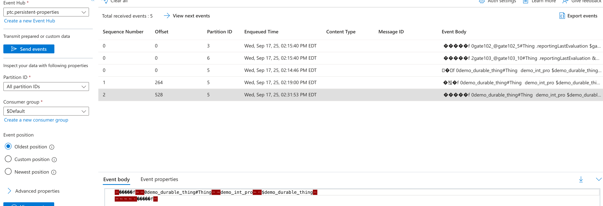

# Understanding Durable Queues

As highlighted in the Chapter 1 introduction, the Durable Queue capability in ThingWorx 10.x supports three queue types:
  - `ptc.unordered-events` for the Event Processing Queue
  - `ptc.persistent-properties` for the Persistent Properties Queue
  - `ptc.logged-properties` for the Logged Properties (Value Streams)

For all three queues, both producers and consumers are ThingWorx services (possibly different ThingWorx nodes inside the same cluster). They share the reserved group name `$Group`. Because the payload format is internal and undocumented, ThingWorx users should not consume those queues directly.

This chapter uses a lightweight tool to reveal the messages flowing through a Durable Queue. To avoid competing with the platform’s own consumers, we create a group separate from the default `$Group`. After the inspection is complete, that temporary group can be removed.

## Configuration

To enable Durable Queue functionality you must configure the queue provider in `platform-settings.json`. A queue provider defined only in Composer supports external routing and API-based messaging but cannot back the Durable Queues. A provider defined in `platform-settings.json` can serve the Durable Queues, external routing, and any API calls simultaneously.

Queue providers that support Durable Queues are often called the `Internal Queue Provider`. For detailed instructions, see [Configuring ThingworxQueueProvider](https://support.ptc.com/help/thingworx/platform/r10.0/en/index.html#page/ThingWorx/Help/Composer/DataStorage/ConfiguringThingworxQueueProvider.html).

The demo environment uses the following configuration:

```json
{
  "PlatformSettingsConfig": {
    "BasicSettings": {
      "EnableDurableEvents": "true",
      "EnableDurablePersistentProperties": "true",
      "EnableDurableLoggedProperties": "true",
      "DeployAzureEventHub": "true",
      "EnableDataOrdering": "false",
      "InternalQueueProviderPackage": "EventHubsQueueProviderPackage"
    },
 },
 "QueueProviderPackageConfigs": {
    "EventHubsQueueProviderPackage": {
      "ConnectionInformation": {
        "namespaceName": "dxudemo",
        "connectionString": "encrypt.event.hub.root.connection.string"
      }
    }
  }
}
```

Azure Event Hub acts as the queue provider in this demo. All three Durable Queues—`Events`, `Persistent Properties`, and `Logged Properties`—are enabled.

After ThingWorx starts with this configuration you can see the three default hubs in the Azure portal (they appear after data starts flowing).



## Demo 

### Prepare an entity with a simple property




We can create a simple "GenericThing" template based Thing, and add an "INTEGER" type property "demo_int_pro" with "Persist" and "Log" options configured.

When we change the value from 14 to 15 (example), we should observe 3 messages:

- "DataChange Event" message
- "Persistent Properties" message
- "Logged Properties" message


### View messages for the "events" durable queue

The Azure portal lets us inspect the messages in the hub. Every message under `ptc.unordered-events` is binary-encoded, so only fragments of human-readable text show up in the portal interface.

Once the event queue uses the queue provider, common events such as DataChange events or Timer events first land in this hub. ThingWorx then consumes them to trigger the subscriptions attached to those events.



The decoded event message below shows the source entity, the subscriber entity, the subscription name, and the payload carried by the event.

```json
[P0|S33|20250917T183153.544Z] Entity: demo_durable_thing (Type: 2401)
Subscriber: demo_durable_thing
Handler: demo_int_sub
Batch ID: 9c904ec6-2edb-4e17-a916-64ea564563ab
Event Count: 1
Dispatch Time: 2025-09-17 18:31:53.487000 UTC
Event: DataChange
Source: demo_durable_thing
Event Time: 2025-09-17 18:31:53.487000 UTC
Event Data: {"datashape":{"field_count":2,"name":null},"row_count":1,"rows":[{"newValue":{"datashape":{"field_count":3,"name":null},"row_count":1,"rows":[{"quality":"GOOD","time":"2025-09-17T18:31:53.482+00:00","value":15}]},"oldValue":{"datashape":{"field_count":3,"name":null},"row_count":1,"rows":[{"quality":"GOOD","time":"2025-09-17T18:19:00.203+00:00","value":14}]}}]}
```

**Caution**: The event data includes a complete "InfoTable" type of data. The detail of the field definitions has been omitted and the output has been simplified.


### View messages from the "logged property" durable queue

Switching to the `ptc.logged-properties` hub exposes the data that will ultimately be written into the value stream tables.




These messages are also binary encoded, so the portal displays only snippets of text. A decoded sample looks like this:

```json
[P5|S1|20250917T183447.293Z] Stream Name: DemoVS
Thing: demo_durable_thing
Property: demo_int_pro
Quality Status: Good
Timestamp: 2025-09-17 18:31:53.482000 UTC
Value (INTEGER): 15
```

The decoded record tells us which Thing produced the logged property value, which value stream captured it, the property name, quality, and timestamp.


### View messages from the persistent properties queue

When a property is marked as persistent, new values update both memory and the database. Selecting `ptc.persistent-properties` in the Azure portal reveals the messages in that hub.



These messages are binary as well. After decoding, a typical entry looks like this:

```JSON
[P5|S2|20250917T183643.698Z] Operation Type: UPDATE
Source (Thing): demo_durable_thing
Property Name: demo_int_pro
Entry ID: demo_durable_thing#Thing
Force Overwrite: False
Quality Status: Good
Entry Time: 2025-09-17 18:31:53.483000 UTC
VTQ Time: 2025-09-17 18:31:53.482000 UTC
Value (INTEGER): 15
```


## Discussion

Durable Queues exist to reduce the chance of losing those three categories of messages under extreme conditions. Reading messages from Kafka or Event Hub is a network-intensive operation, so latency is higher than working with in-memory queues.

In real deployments we usually enable Durable Queues only when requirements explicitly call for that reliability. Among the three options, durability on the event queue often delivers the most practical benefit. One example: every completed file upload in ThingWorx raises a `FileTransfer` event. Axeda solutions typically add context and emit a derived event. If the conversion workflow has not run and the ThingWorx node restarts, that derived event will never fire. Enabling the durable event queue prevents that gap.

## Summary

Key takeaways:

1. Durable Queue messages are binary and intended only for ThingWorx; decoded samples are for illustration.
2. Durable Queues introduce network latency, so evaluate the trade-off against in-memory queues.
3. Start with the events queue when you need durability; extend to persistent or logged queues only if their data truly requires it.
