# IoT Stream Routing and WriteJSONToQueue

This chapter demonstrates how to configure IoT Stream routing (the "Externally Routed" option in Composer) for ThingWorx properties and how to write custom data using the IoT Stream service API. The terminology aligns with the definitions in Chapter 02.

The walkthrough covers:
- Configuring a Queue Provider
- Creating an Azure Event Hub
- Setting up an IoT Stream entity
- Applying IoT Stream to properties
- Writing custom messages via API

## Configure IoT Stream Routing

The "Externally Routed" checkbox on a Thing property enables External Routing for that property. The following walk-through shows the basic configuration.

### Configure Queue Provider

Unlike the durable queues described earlier—which can only use the queue provider defined in `platform-settings.json` (often called the internal queue provider)—external routing can use that internal provider, a provider created in Composer, or even a fully custom provider that targets platforms beyond Kafka or Azure Event Hub.

For this demo we reuse the internal queue provider that is already configured. Refer to the [Queue Provider configuration guide](https://support.ptc.com/help/thingworx/platform/r10.0/en/index.html#page/ThingWorx/Help/Composer/DataStorage/PersistenceProviders/ConfiguringaQueueProviderEntity.html#) if you need to create your own provider. We will cover custom providers beyond Kafka and Azure Event Hub in a later chapter.


### Configure a Hub (Azure Event Hub)

An IoT Stream abstracts an Azure Event Hub (hub) or a Kafka topic. To route data externally through Azure Event Hub you first need to create the hub.

Because this walkthrough uses the internal queue provider, enable **Show System Objects** so that Composer lists it.


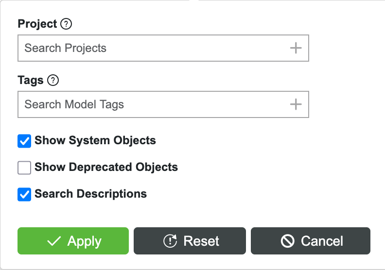

The internal queue provider in this environment is named `ThingworxQueueProvider`. Use its `AddQueue` service.

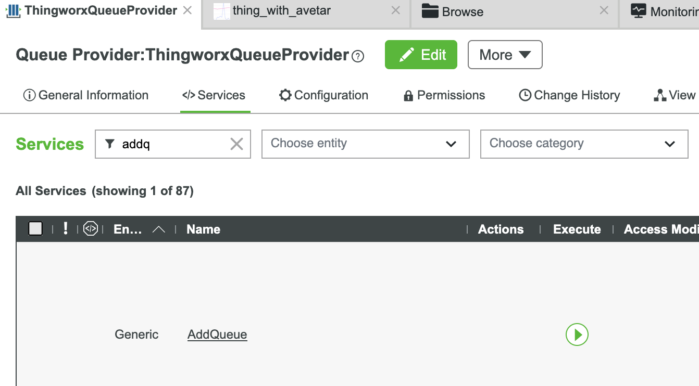

Parameter highlights:
- `eventHubName` defines the Azure Event Hub name. We use `thingworx_dev101` here. This is the actual hub name in Azure.
- `queueName` is the ThingWorx abstraction that ties IoT Streams to back-end hubs. We use `externalRoutedQueue` and will reference it when creating the IoT Stream.
- `partitionKeyStrategy` controls how messages map to partitions. We select `SOURCE_AND_NAME`, which uses both the source entity and the property name as the partition key (explained further in the scaling chapter).
- `createInEventHubsSystem` determines whether ThingWorx should create the hub if it does not already exist. For the demo we enable auto-creation; in production choose based on your Azure permissions.
- `NumberOfPartitions` can be left blank; we specify `4` for now and discuss the implications later.

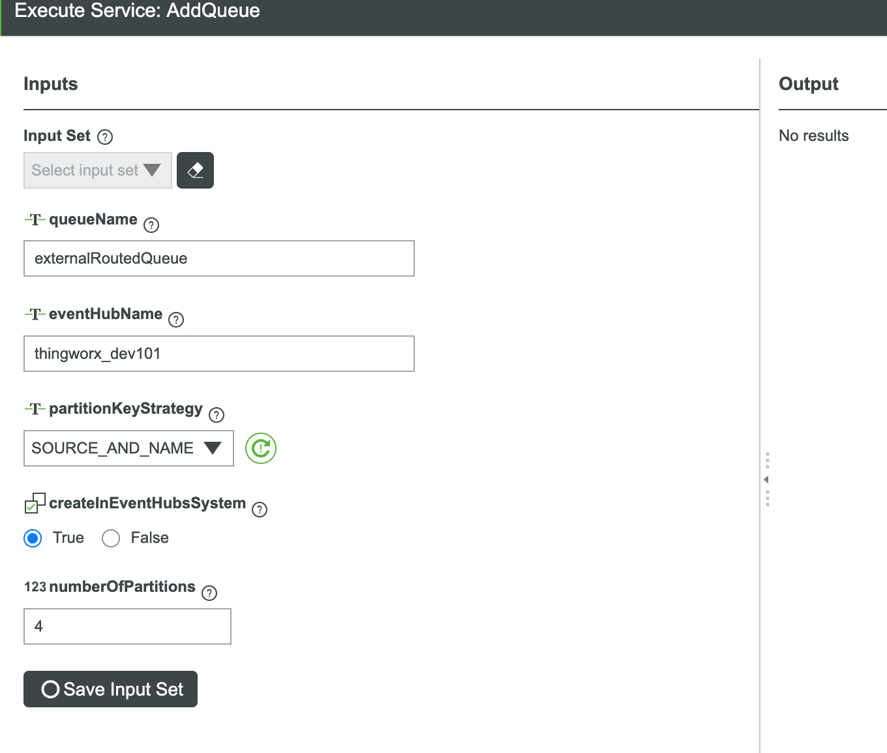

### Configure the IoT Stream entity

Once the hub exists you have a queue name, which is the key input for the IoT Stream entity. Create a new IoT Stream (using the `IotStream` entity template) and provide the usual metadata.

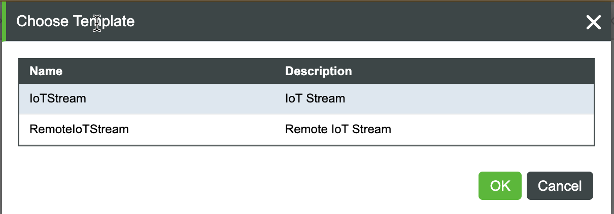

In the entity configuration, set **Queue Name** to the queue you created in the previous step.

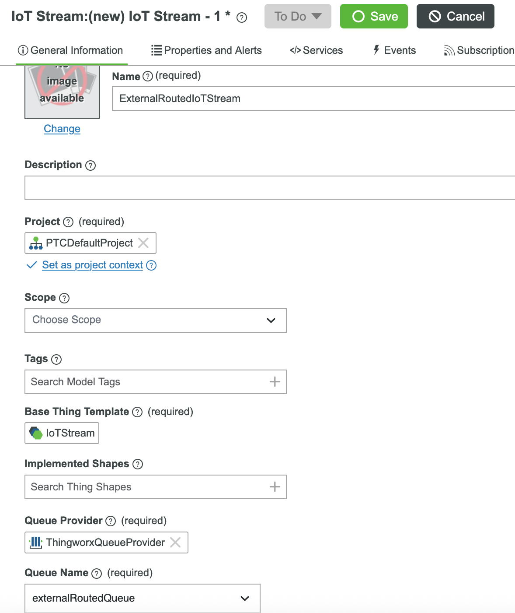

The result is an IoT Stream entity named `ExternalRoutedIoTStream`.


### Apply IoT Stream to the Property

Continuing with the Thing from the previous chapter, open the same property (`demo_int_pro`), enable **Externally Routed**, and select the IoT Stream you just created.

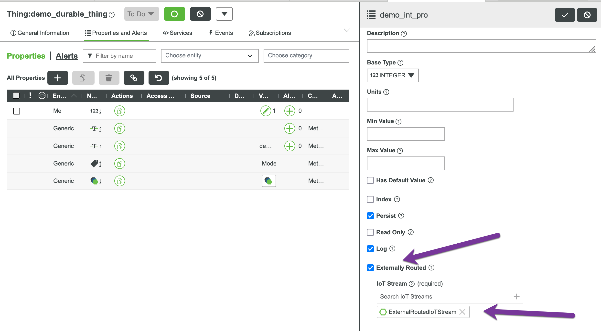

That completes the configuration. In production you would typically apply this through Thing Templates or Thing Shapes, or automate the update through scripts rather than configuring properties one by one.


### Observe IoT Stream outputs

Change the `demo_int_pro` property—for example, set the value to `42`. Then open the Azure portal, locate the `thingworx_dev101` hub, and inspect the queued messages.

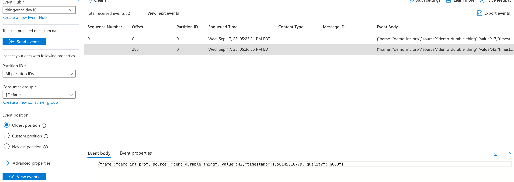

Unlike the three durable queues, IoT Stream messages are JSON payloads, which makes downstream consumption straightforward.

The message format is:
```json
{
  "name": "property_name",
  "source": "thing_name",
  "value": <property_value>,
  "timestamp": <milliseconds_since_epoch>,
  "quality": "GOOD"
}
```

For detailed runtime behavior and how IoT Streams interact with DataChange and HistoricalDataLogged events, see [Chapter 6: DataChange Event vs External Routing](06-datachange-externalrouted.md).


## Writing data via API

ThingWorx offers configuration-driven message queue integration, but many solutions still need to send custom payloads. Starting in ThingWorx 10.0.1 you can publish bespoke messages by calling a service.

Return to the `ExternalRoutedIoTStream` entity and invoke `WriteJSONToQueue`.

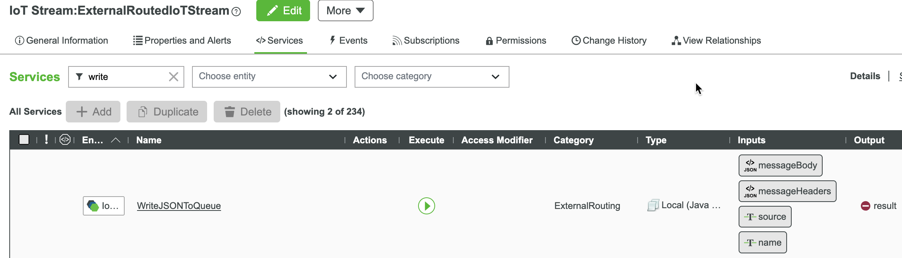


Enter your JSON payload in the **message** field. The body must be valid JSON. Optionally add custom headers and values; most implementations leave headers empty.

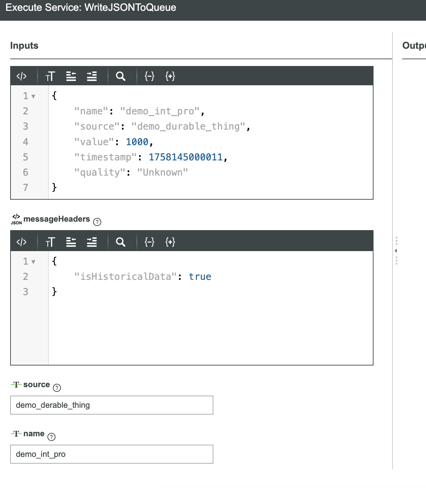

Because the queue uses the `SOURCE_AND_NAME` partition key strategy, you must supply the `source` and `name` parameters even if that information also appears in the payload. We revisit these details in the scaling discussion.

After sending the message, return to the Azure portal and confirm that the hub received the JSON payload.

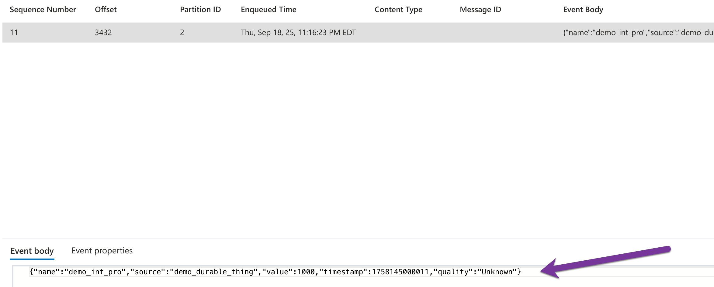


The **Event Properties** view shows any headers that were included. Decoding those values depends on the consumer implementation; later examples demonstrate common approaches.

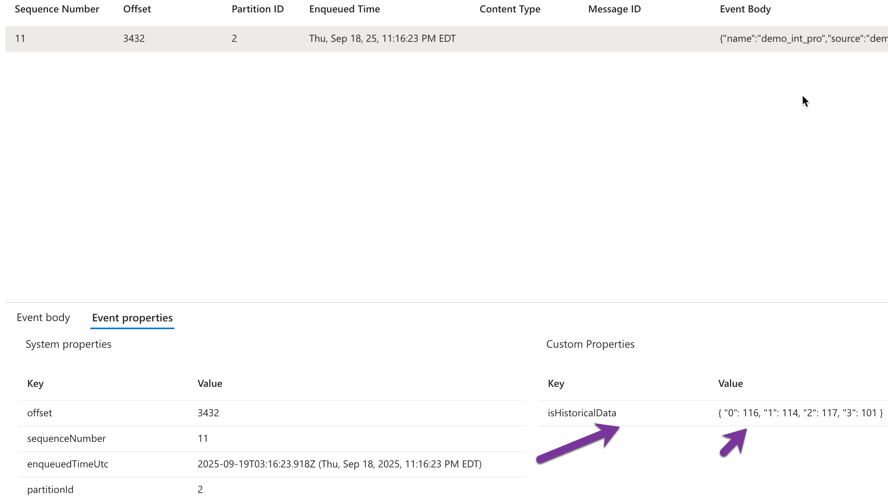

**Note about custom headers**: Custom header keys and values are transmitted in binary format. When consuming messages with custom headers, you need to handle them as bytes. For example, in Python:
```python
# Reading a custom header
header_value = properties.get(b'myCustomHeader')  # Note the b prefix
if header_value == b'true':  # Compare with bytes
    # Process accordingly
```

Custom headers are optional and should only be used when you need to pass metadata that doesn't belong in the message payload itself.
