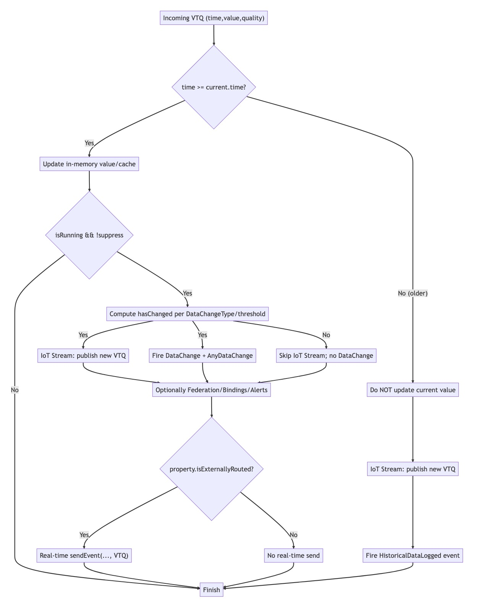
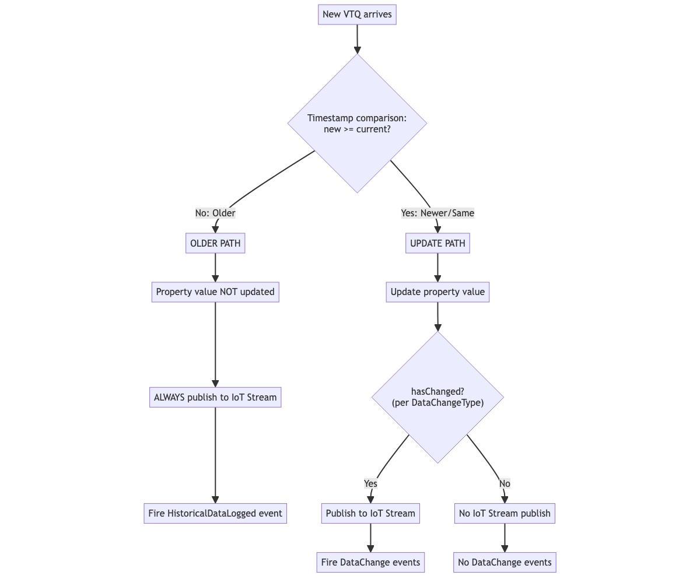

# DataChange Event vs External Routing

Before IoT Streams were available, ThingWorx developers typically pushed data out of the platform by subscribing to a property's DataChange event and then forwarding the payload to an external database or integration layer. In addition to DataChange, ThingWorx also raises a `HistoricalDataLogged` event when an incoming value carries a timestamp that predates the current value.

This chapter clarifies the actual runtime behavior of three mechanisms—**DataChange events**, **HistoricalDataLogged events**, and **IoT Stream External Routing**—based on observed platform behavior. We'll use a single property as reference: `demo_int_pro` currently holds value `42` with timestamp **12:00:00.000 on 2025-09-17**. We evaluate six sample updates combining timestamps (newer, same, or older) with values (same or different).

For clarity we assume:
- `forceOverwriteCurrentValue = false`
- `suppressEventsAndLogging = false`
- The Thing is running
- The data change type is `VALUE`, and the difference between `42` and `71` exceeds the configured threshold

## Runtime Behavior

When a property is updated via REST or server logic, the platform decides what gets stored, what events fire, and which external messages are produced. The behavior focuses on three outputs:

### Key Processing Rules

- **Timestamp gate**: If the new timestamp is older than the current value's timestamp, the property value is NOT updated; the "older" path executes.
- **IoT Stream (update path)**: Publishes only when a change is detected (hasChanged = true), based on the property's Data Change settings and thresholds. Same-value updates are suppressed.
- **IoT Stream (older path)**: Publishes unconditionally for older inputs, even though the property value is not updated.
- **DataChange/AnyDataChange**: Fire only when hasChanged is true (for non-older updates).
- **HistoricalDataLogged**: Fires when the incoming timestamp is older than current.

### DataChangeType Impact

- `ALWAYS`: hasChanged = true for every non-older update
- `NEVER`: hasChanged = false (suppresses both DataChange and IoT Stream in update path)
- `VALUE`: Numeric comparisons with optional thresholds
- `ON/OFF`: Boolean state transitions

## Processing Flow

Each incoming VTQ (Value, Time, Quality) follows this logic:

1. **Timestamp comparison**:
   - If new timestamp is smaller than current timestamp → "older" path
   - If new timestamp is not smaller than current timestamp → "update" path

2. **Update path** (newer or same timestamp):
   - Updates the property's current value
   - Evaluates hasChanged based on DataChangeType
   - If hasChanged=true: Publishes to IoT Stream AND fires DataChange events
   - If hasChanged=false: No IoT Stream message, no DataChange events

3. **Older path** (older timestamp):
   - Does NOT update the property's current value
   - ALWAYS publishes to IoT Stream (unconditionally)
   - Fires HistoricalDataLogged event

## Visual Flow Diagram

Alternative representation:

## Detailed conditions by mechanism

### DataChange and AnyDataChange

- **Current-value requirement**: The incoming timestamp must be newer than or equal to the current timestamp, or the update must be forced.
- **Runtime requirement**: The Thing must be running and events must not be suppressed. Maintenance modes that suspend events will block DataChange.
- **Change requirement**: The value must satisfy the property’s data change type:
  - `ALWAYS` treats every current update as a change.
  - `NEVER` suppresses DataChange entirely.
  - `VALUE` compares the old and new values, optionally applying numeric thresholds or string comparisons.
  - `ON`/`OFF` track transitions between truthy and falsy states.
- **Delivery**: Events are published immediately unless `deferNotifications` is set, in which case they are queued for later processing. AnyDataChange follows the same rule but can be excluded from the queue by configuration.

### HistoricalDataLogged

- **Out-of-order requirement**: Fires only when the new timestamp is older than the current timestamp. These writes leave the current value untouched.
- **Runtime independence**: Historical events do not check the Thing’s running state or the suppression flag in the relevant code path, so they still emit even during maintenance windows.
- **Logging**: Value stream logging (if configured) happens before the event fires, ensuring backfilled data lands in the historian.
- **Delivery**: Immediate publish unless deferred; the deferral flag is honored the same way as DataChange.

### IoT Stream External Routing

- **Update path**: Only publishes when timestamp ≥ current AND hasChanged=true
- **Older path**: ALWAYS publishes for older timestamps, regardless of value
- **Change detection**: Follows DataChangeType settings exactly - same-value updates with `VALUE` type are suppressed
- **Message format**: JSON with schema: `{ "name", "source", "value", "timestamp" (ms), "quality" }`
- **No deferral**: Messages are sent immediately; deferral flags don't apply to IoT Stream

## Side-by-side Summary

| Condition                                  | DataChange | HistoricalDataLogged | IoT Stream |
| ------------------------------------------ | ---------: | -------------------: | ---------: |
| New timestamp ≥ current, hasChanged=true   |       Yes  |                  No  |        Yes |
| New timestamp ≥ current, hasChanged=false  |        No  |                  No  |         No |
| New timestamp < current (any value)        |        No  |                 Yes  |        Yes |
| DataChangeType = ALWAYS                    |       Yes† |                  No  |       Yes† |
| DataChangeType = NEVER                     |        No  |                  No  |         No |
| DataChangeType = VALUE (below threshold)   |        No  |                  No  |         No |

† For non-older updates only

## Key Insights

- **IoT Stream and DataChange are synchronized**: Both fire together when hasChanged=true for current updates
- **Older timestamps always publish to IoT Stream**: Even though the property value isn't updated
- **DataChangeType controls both**: It determines both DataChange events AND IoT Stream publishing for current updates
- **Historical data bypasses change detection**: Older timestamps trigger IoT Stream + HistoricalDataLogged unconditionally

## Example: Six Test Cases

Current property state: value=42, timestamp=12:00:00.000, DataChangeType=VALUE with threshold

| Case | New Timestamp | New Value | vs Current | hasChanged? | IoT Stream | DataChange | HistoricalDataLogged |
| ---- | ------------- | --------- | ---------- | ----------- | ---------- | ---------- | -------------------- |
| 1    | 12:01:00.000  | 42        | Newer      | No          | No         | No         | No                   |
| 2    | 12:01:00.000  | 71        | Newer      | Yes         | Yes        | Yes        | No                   |
| 3    | 12:00:00.000  | 42        | Same       | No          | No         | No         | No                   |
| 4    | 12:00:00.000  | 71        | Same       | Yes         | Yes        | Yes        | No                   |
| 5    | 11:59:00.000  | 42        | Older      | N/A         | Yes        | No         | Yes                  |
| 6    | 11:59:00.000  | 71        | Older      | N/A         | Yes        | No         | Yes                  |

**Critical observations**:
- Cases 1 & 3: Same value with newer/same timestamp → No messages (hasChanged=false)
- Cases 2 & 4: Different value with newer/same timestamp → Both IoT Stream and DataChange fire
- Cases 5 & 6: Older timestamp → IoT Stream ALWAYS publishes + HistoricalDataLogged (value irrelevant)

This corrects the common misconception that IoT Stream publishes for all current updates. In reality, it follows the same hasChanged logic as DataChange for current updates, but unconditionally publishes for older timestamps.
