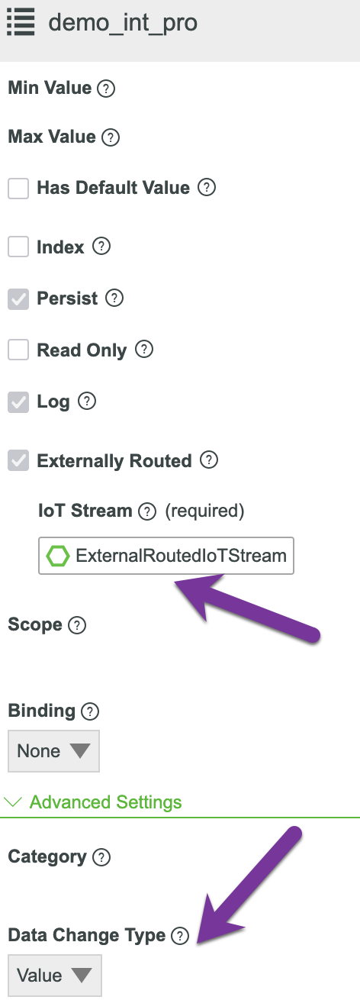
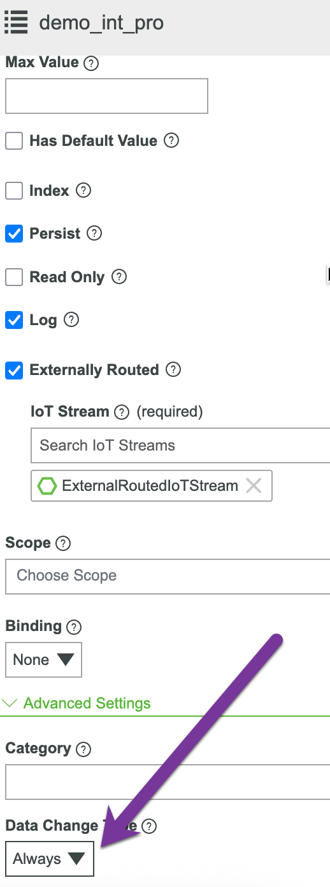
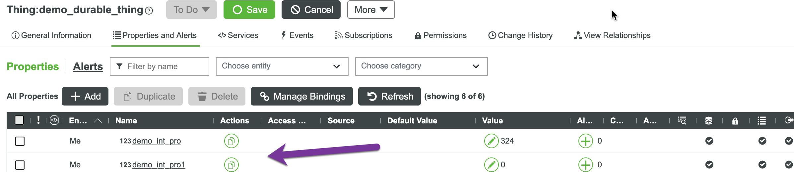

# Use Case: Routing Data to External Destinations

Most common databases, data lakes, and data warehouses in the market have direct solutions for consuming Kafka or Azure Event Hub data. We won't list them individually here—please search for relevant solutions and choose the appropriate one based on your business needs and enterprise practices.

In this use case, we use a Python consumer to retrieve data from ThingWorx and store it in PostgreSQL. The focus here is not on storing data in PostgreSQL, but rather using this use case to demonstrate several key concepts. If you are an experienced Kafka developer, you may skip this chapter.

The key topics we will discuss include:

- Demonstrating how the DataChange vs IoT Stream rules from Chapter 06 affect downstream datasets
- Showing the impact of the `SOURCE_AND_NAME` partition key strategy introduced in Chapter 02
- Observing how partitions rebalance when one or more consumers join the same consumer group

We will also briefly discuss recommendations for using different Azure Event Hub endpoints. While the code demonstrates methods for handling concepts like "Poison Detection" and DLQ (Dead Letter Queue), these are not within the scope of this chapter's discussion.

## Demo Preparation

You can prepare the environment according to the "setup" instructions in project/07-routingdata/README.md. For the PostgreSQL database, you can either use an existing one or use the Docker Compose file in the project/07-routingdata directory. If you use your own database, remember to execute "init.sql" so we can use the same schema. However, this schema is for demonstration purposes only—you can adjust it according to your business needs.

```
CREATE TABLE IF NOT EXISTS demo_table (
    id SERIAL PRIMARY KEY,
    name VARCHAR(255) NOT NULL,
    source VARCHAR(255) NOT NULL,
    value TEXT NOT NULL,
    timestamp TIMESTAMPTZ NOT NULL,
    quality VARCHAR(50) NOT NULL,
    partition VARCHAR(10) NOT NULL
);
```

In the table structure definition above, the "partition" field is typically not needed for business purposes. In this demonstration, we specifically added this column to show the effect of the "Source and Name" partition strategy, making it easier to understand.


### Consumer

`kf-consumer.py` is the consumer that consumes messages from Azure Event Hub and writes qualifying messages to the database.

#### Azure Event Hub Different Endpoints

Azure Event Hub has its own SDK that uses the AMQP protocol for communication. However, it also provides a Kafka endpoint for clients using the Kafka protocol to consume messages. If you use Azure Event Hub's native endpoint and need to support multiple clients consuming messages from the same group in the same hub, you need to set up a checkpoint store to coordinate offsets—typically an Azure Blob checkpoint store, which is quite inconvenient. Using Azure Event Hub's SDK to define your own checkpoint store is even more troublesome. If you always use a single client to consume messages from one group in a hub, then you can operate without a checkpoint store.

Fortunately, Azure Event Hub also provides a Kafka endpoint. When using the Kafka endpoint, the checkpoint store is managed behind the Kafka endpoint, so you don't need to worry about how to establish and maintain a checkpoint store.

The `.env.example` file provides the configuration information needed to use Azure Event Hub's Kafka endpoint:

```
KAFKA_BOOTSTRAP_SERVERS=your-namespace.servicebus.windows.net:9093  # EventHub Kafka endpoint
KAFKA_TOPIC=thingworx_dev101  # EventHub name to consume from
KAFKA_SASL_USERNAME=$ConnectionString  # Literal string "$ConnectionString" (escaped for docker-compose)
KAFKA_SASL_PASSWORD=Endpoint=sb://your-namespace.servicebus.windows.net/;SharedAccessKeyName=your-key-name;SharedAccessKey=your-key
```

**Caution**:

- The `KAFKA_SASL_USERNAME` here is the fixed value "$ConnectionString"
- If you configure the above settings in `.env` and use the `docker compose` command in this directory, you will see 4 warnings, which you can ignore. This is because Docker reads the ".env" file in the current directory and treats "$ConnectionString" as a variable for substitution.


### Simulator

This simple simulation tool reads the "THINGS" and "PROPERTIES" variables. For each Thing/Property combination, it reads the current value (including timestamp) once and then updates it once (including timestamp). During updates, there are 6 combinations of (timestamp, value).

#### First Test

In the first test, we use one Thing and one Property. This Property's DataChange type is set to "Value", meaning DataChange Events are triggered only when the Value differs.



Configuration in `.env`:

```
THINGWORX_URL=https://ht-thingworx-dev101.dxudemo-aks.demo.dxu.edc.devops.ptc.io/Thingworx
THINGWORX_APPKEY=0bdafcbf-927e-46e4-8413-4b676565315a
THINGS=demo_durable_thing
PROPERTIES=demo_int_pro
RECORDS_FILE="./records.md"
```

Before testing, we need to start `kf-consumer.py`:

```
{"asctime": "2025-09-19 17:43:06", "levelname": "INFO", "name": "kafka_eventhub_consumer", "message": "KAFKA PARTITIONS ASSIGNED: kf_client_c1700175 acquired 4 partitions", "taskName": null, "client_id": "kf_client_c1700175", "event": "kafka_partitions_assigned", "assigned_partitions": [0, 1, 2, 3], "current_partitions": [0, 1, 2, 3], "total_partitions": 4, "consumer_group": "$Default", "protocol": "kafka"}
```

After startup, we can see that this Hub currently has 4 partitions, and since this is the only client, it can retrieve data from all 4 partitions.

Next, we execute the simulation, which sends 6 test data points:

| ID | Current Timestamp | Current Value | New Timestamp | New Value | Note | Status |
|---|---|---|---|---|---|---|
| 1 | 2025-09-19 05:37:11.867 | 320 | 2025-09-19 05:37:12.149 | 320 | newer ts, same value | 200 |
| 2 | 2025-09-19 05:37:12.149 | 320 | 2025-09-19 05:37:12.011 | 320 | older ts, same value | 200 |
| 3 | 2025-09-19 05:37:12.149 | 320 | 2025-09-19 05:37:12.149 | 320 | same ts, same value | 200 |
| 4 | 2025-09-19 05:37:12.149 | 320 | 2025-09-19 05:37:12.149 | 304 | same ts, different value | 200 |
| 5 | 2025-09-19 05:37:12.149 | 304 | 2025-09-19 05:37:12.320 | 324 | newer ts, different value | 200 |
| 6 | 2025-09-19 05:37:12.320 | 324 | 2025-09-19 05:37:11.889 | 309 | older ts, different value | 200 |

On the database side, we can see that 4 data points were received:

| ID | Name | Source | Value | Timestamp | Quality | Partition |
|---|---|---|---|---|---|---|
| 9 | demo_int_pro | demo_durable_thing | 320 | 2025-09-19 05:37:12.011 | GOOD | 0 |
| 10 | demo_int_pro | demo_durable_thing | 304 | 2025-09-19 05:37:12.149 | GOOD | 0 |
| 11 | demo_int_pro | demo_durable_thing | 324 | 2025-09-19 05:37:12.320 | GOOD | 0 |
| 12 | demo_int_pro | demo_durable_thing | 309 | 2025-09-19 05:37:11.889 | GOOD | 0 |

As you can see, these four data points correspond to the sender's 2 cases with older timestamps, and cases where the timestamp is not older but the value has changed, following the rules we discussed earlier.

#### Second Test

Before the second test, we change the property's "Data Change Type" to "Always", so we expect to receive all changes.



Running the test again, the test data is:

| ID | Current Timestamp | Current Value | New Timestamp | New Value | Note | Status |
|---|---|---|---|---|---|---|
| 1 | 2025-09-19 05:37:12.320 | 324 | 2025-09-19 05:37:11.887 | 324 | older ts, same value | 200 |
| 2 | 2025-09-19 05:37:12.320 | 324 | 2025-09-19 05:37:12.803 | 324 | newer ts, same value | 200 |
| 3 | 2025-09-19 05:37:12.803 | 324 | 2025-09-19 05:37:12.803 | 342 | same ts, different value | 200 |
| 4 | 2025-09-19 05:37:12.803 | 342 | 2025-09-19 05:37:13.159 | 324 | newer ts, different value | 200 |
| 5 | 2025-09-19 05:37:13.159 | 324 | 2025-09-19 05:37:12.889 | 326 | older ts, different value | 200 |
| 6 | 2025-09-19 05:37:13.159 | 324 | 2025-09-19 05:37:13.159 | 324 | same ts, same value | 200 |

On the database side, observing the received data, there will be 6 records:

| ID | Name | Source | Value | Timestamp | Quality | Partition |
|---|---|---|---|---|---|---|
| 13 | demo_int_pro | demo_durable_thing | 324 | 2025-09-19 05:37:11.887 | GOOD | 0 |
| 14 | demo_int_pro | demo_durable_thing | 324 | 2025-09-19 05:37:12.803 | GOOD | 0 |
| 15 | demo_int_pro | demo_durable_thing | 342 | 2025-09-19 05:37:12.803 | GOOD | 0 |
| 16 | demo_int_pro | demo_durable_thing | 324 | 2025-09-19 05:37:13.159 | GOOD | 0 |
| 17 | demo_int_pro | demo_durable_thing | 326 | 2025-09-19 05:37:12.889 | GOOD | 0 |
| 18 | demo_int_pro | demo_durable_thing | 324 | 2025-09-19 05:37:13.159 | GOOD | 0 |

#### Third Test

In the previous two tests, you can see that "Partition" is always 0, indicating that ThingWorx sent all messages to Partition 0, while the other three partitions had no data at all. If we add an identical property (except for the name), theoretically another partition should be able to receive data.



We modify the ".env" file to include this new Property in the simulation:

```
THINGWORX_URL=https://ht-thingworx-dev101.dxudemo-aks.demo.dxu.edc.devops.ptc.io/Thingworx
THINGWORX_APPKEY=0bdafcbf-927e-46e4-8413-4b676565315a
THINGS=demo_durable_thing
PROPERTIES=demo_int_pro;demo_int_pro1
RECORDS_FILE="./records.md"
QUERY_DB=true
```

Running the simulation tool again, we won't show the test data but will directly show the messages received and written to the database:

| ID | Name | Source | Value | Timestamp | Quality | Partition |
|---|---|---|---|---|---|---|
| 25 | demo_int_pro | demo_durable_thing | 332 | 2025-09-19 05:37:13.734 | GOOD | 0 |
| 26 | demo_int_pro | demo_durable_thing | 332 | 2025-09-19 05:37:13.290 | GOOD | 0 |
| 27 | demo_int_pro | demo_durable_thing | 299 | 2025-09-19 05:37:14.030 | GOOD | 0 |
| 28 | demo_int_pro | demo_durable_thing | 293 | 2025-09-19 05:37:13.928 | GOOD | 0 |
| 29 | demo_int_pro | demo_durable_thing | 299 | 2025-09-19 05:37:14.138 | GOOD | 0 |
| 30 | demo_int_pro | demo_durable_thing | 283 | 2025-09-19 05:37:14.138 | GOOD | 0 |
| 31 | demo_int_pro1 | demo_durable_thing | 1 | 1970-01-01 00:00:00.460 | GOOD | 1 |
| 32 | demo_int_pro1 | demo_durable_thing | 1 | 1970-01-01 00:00:00.681 | GOOD | 1 |
| 33 | demo_int_pro1 | demo_durable_thing | 1 | 1970-01-01 00:00:00.681 | GOOD | 1 |
| 34 | demo_int_pro1 | demo_durable_thing | 0 | 1970-01-01 00:00:00.272 | GOOD | 1 |
| 35 | demo_int_pro1 | demo_durable_thing | 1 | 1970-01-01 00:00:00.681 | GOOD | 1 |
| 36 | demo_int_pro1 | demo_durable_thing | 1 | 1970-01-01 00:00:00.258 | GOOD | 1 |

You can see that Partition 1 also started receiving data.


#### Fourth Test

This time we duplicate the Thing directly and modify the configuration in ".env":

```
THINGWORX_URL=https://ht-thingworx-dev101.dxudemo-aks.demo.dxu.edc.devops.ptc.io/Thingworx
THINGWORX_APPKEY=0bdafcbf-927e-46e4-8413-4b676565315a
THINGS=demo_durable_thing;new_demo_thing
PROPERTIES=demo_int_pro;demo_int_pro1
RECORDS_FILE="./records.md"
QUERY_DB=true
```

This way, we have two identical Things, each with two identical Properties. With exactly 4 Partitions, we expect each Partition to receive data.

Let's show the test results directly.

| ID | Name | Source | Value | Timestamp | Quality | Partition |
|---|---|---|---|---|---|---|
| 63 | demo_int_pro | demo_durable_thing | 304 | 2025-09-19 05:37:14.319 | GOOD | 0 |
| 64 | demo_int_pro | demo_durable_thing | 312 | 2025-09-19 05:37:14.757 | GOOD | 0 |
| 65 | demo_int_pro | demo_durable_thing | 322 | 2025-09-19 05:37:14.463 | GOOD | 0 |
| 66 | demo_int_pro | demo_durable_thing | 312 | 2025-09-19 05:37:15.051 | GOOD | 0 |
| 67 | demo_int_pro | demo_durable_thing | 312 | 2025-09-19 05:37:15.051 | GOOD | 0 |
| 68 | demo_int_pro | demo_durable_thing | 307 | 2025-09-19 05:37:15.280 | GOOD | 0 |
| 69 | demo_int_pro1 | demo_durable_thing | 0 | 1970-01-01 00:00:01.770 | GOOD | 1 |
| 70 | demo_int_pro1 | demo_durable_thing | -1 | 1970-01-01 00:00:01.634 | GOOD | 1 |
| 71 | demo_int_pro1 | demo_durable_thing | 0 | 1970-01-01 00:00:01.648 | GOOD | 1 |
| 72 | demo_int_pro1 | demo_durable_thing | -1 | 1970-01-01 00:00:01.770 | GOOD | 1 |
| 73 | demo_int_pro1 | demo_durable_thing | -1 | 1970-01-01 00:00:02.245 | GOOD | 1 |
| 74 | demo_int_pro1 | demo_durable_thing | -1 | 1970-01-01 00:00:02.245 | GOOD | 1 |
| 75 | demo_int_pro | new_demo_thing | 101 | 2025-09-19 22:02:43.167 | GOOD | 1 |
| 76 | demo_int_pro | new_demo_thing | 109 | 2025-09-19 22:02:43.923 | GOOD | 1 |
| 77 | demo_int_pro | new_demo_thing | 109 | 2025-09-19 22:02:43.923 | GOOD | 1 |
| 78 | demo_int_pro | new_demo_thing | 109 | 2025-09-19 22:02:43.923 | GOOD | 1 |
| 79 | demo_int_pro | new_demo_thing | 105 | 2025-09-19 22:02:43.494 | GOOD | 1 |
| 80 | demo_int_pro | new_demo_thing | 109 | 2025-09-19 22:02:44.168 | GOOD | 1 |
| 81 | demo_int_pro1 | new_demo_thing | 202 | 2025-09-19 22:02:50.298 | GOOD | 0 |
| 82 | demo_int_pro1 | new_demo_thing | 199 | 2025-09-19 22:02:50.788 | GOOD | 0 |
| 83 | demo_int_pro1 | new_demo_thing | 199 | 2025-09-19 22:02:50.788 | GOOD | 0 |
| 84 | demo_int_pro1 | new_demo_thing | 200 | 2025-09-19 22:02:50.477 | GOOD | 0 |
| 85 | demo_int_pro1 | new_demo_thing | 199 | 2025-09-19 22:02:50.604 | GOOD | 0 |
| 86 | demo_int_pro1 | new_demo_thing | 210 | 2025-09-19 22:02:50.788 | GOOD | 0 |

Wait? We didn't see the expected use of all 4 Partitions—still only two!

Is this normal? Yes, it's normal! When determining partitions, the "Source" and "Name" combinations are not evenly distributed. Instead, a hash value is calculated based on "Source" and "Name", then modulo the total number of partitions to select a partition. Different combinations may produce the same remainder.

We can duplicate the Thing again using a new name, with the following .env configuration:

```
THINGWORX_URL=https://ht-thingworx-dev101.dxudemo-aks.demo.dxu.edc.devops.ptc.io/Thingworx
THINGWORX_APPKEY=0bdafcbf-927e-46e4-8413-4b676565315a
THINGS=demo_durable_thing;new_demo_thing1
PROPERTIES=demo_int_pro;demo_int_pro1
RECORDS_FILE="./records.md"
QUERY_DB=true
```

In this test, only the second Thing's name changes slightly, but the results show 3 partitions receiving data:

| ID | Name | Source | Value | Timestamp | Quality | Partition |
|---|---|---|---|---|---|---|
| 87 | demo_int_pro | demo_durable_thing | 307 | 2025-09-19 05:37:15.280 | GOOD | 0 |
| 88 | demo_int_pro | demo_durable_thing | 297 | 2025-09-19 05:37:15.280 | GOOD | 0 |
| 89 | demo_int_pro | demo_durable_thing | 317 | 2025-09-19 05:37:15.680 | GOOD | 0 |
| 90 | demo_int_pro | demo_durable_thing | 317 | 2025-09-19 05:37:15.561 | GOOD | 0 |
| 91 | demo_int_pro | demo_durable_thing | 317 | 2025-09-19 05:37:16.105 | GOOD | 0 |
| 92 | demo_int_pro | demo_durable_thing | 333 | 2025-09-19 05:37:15.740 | GOOD | 0 |
| 93 | demo_int_pro1 | demo_durable_thing | -1 | 1970-01-01 00:00:02.609 | GOOD | 1 |
| 94 | demo_int_pro1 | demo_durable_thing | 0 | 1970-01-01 00:00:02.300 | GOOD | 1 |
| 95 | demo_int_pro1 | demo_durable_thing | 0 | 1970-01-01 00:00:02.609 | GOOD | 1 |
| 96 | demo_int_pro1 | demo_durable_thing | 0 | 1970-01-01 00:00:02.609 | GOOD | 1 |
| 97 | demo_int_pro1 | demo_durable_thing | 0 | 1970-01-01 00:00:02.249 | GOOD | 1 |
| 98 | demo_int_pro1 | demo_durable_thing | 0 | 1970-01-01 00:00:02.771 | GOOD | 1 |
| 99 | demo_int_pro | new_demo_thing1 | 0 | 1970-01-01 00:00:00.400 | GOOD | 2 |
| 100 | demo_int_pro | new_demo_thing1 | 1 | 1970-01-01 00:00:00.769 | GOOD | 2 |
| 101 | demo_int_pro | new_demo_thing1 | 0 | 1970-01-01 00:00:00.769 | GOOD | 2 |
| 102 | demo_int_pro | new_demo_thing1 | 0 | 1970-01-01 00:00:00.509 | GOOD | 2 |
| 103 | demo_int_pro | new_demo_thing1 | 0 | 1970-01-01 00:00:00.769 | GOOD | 2 |
| 104 | demo_int_pro | new_demo_thing1 | 1 | 1970-01-01 00:00:00.384 | GOOD | 2 |
| 105 | demo_int_pro1 | new_demo_thing1 | 0 | 1970-01-01 00:00:00.000 | GOOD | 0 |
| 106 | demo_int_pro1 | new_demo_thing1 | 0 | 1970-01-01 00:00:00.000 | GOOD | 0 |
| 107 | demo_int_pro1 | new_demo_thing1 | 0 | 1970-01-01 00:00:00.328 | GOOD | 0 |
| 108 | demo_int_pro1 | new_demo_thing1 | 0 | 1970-01-01 00:00:00.109 | GOOD | 0 |
| 109 | demo_int_pro1 | new_demo_thing1 | -1 | 1970-01-01 00:00:00.147 | GOOD | 0 |
| 110 | demo_int_pro1 | new_demo_thing1 | 0 | 1970-01-01 00:00:00.747 | GOOD | 0 |


### Multiple Clients

When we started the first client, we saw the following partition assignment:

```
{"asctime": "2025-09-19 17:43:06", "levelname": "INFO", "name": "kafka_eventhub_consumer", "message": "KAFKA PARTITIONS ASSIGNED: kf_client_c1700175 acquired 4 partitions", "taskName": null, "client_id": "kf_client_c1700175", "event": "kafka_partitions_assigned", "assigned_partitions": [0, 1, 2, 3], "current_partitions": [0, 1, 2, 3], "total_partitions": 4, "consumer_group": "$Default", "protocol": "kafka"}
```

If we start a new client at this point, how will these partitions be distributed?

Let's look at the second client that just started:

```
{"asctime": "2025-09-19 18:12:31", "levelname": "INFO", "name": "kafka_eventhub_consumer", "message": "KAFKA PARTITIONS ASSIGNED: kf_client_575157ba acquired 2 partitions", "taskName": null, "client_id": "kf_client_575157ba", "event": "kafka_partitions_assigned", "assigned_partitions": [0, 1], "current_partitions": [0, 1], "total_partitions": 2, "consumer_group": "$Default", "protocol": "kafka"}
```

You can see that the newly started client acquired the rights to read from Partitions 0 and 1.

Now let's look at the first client that started earlier:

```
{"asctime": "2025-09-19 18:12:31", "levelname": "INFO", "name": "kafka_eventhub_consumer", "message": "KAFKA PARTITIONS ASSIGNED: kf_client_c1700175 acquired 2 partitions", "taskName": null, "client_id": "kf_client_c1700175", "event": "kafka_partitions_assigned", "assigned_partitions": [2, 3], "current_partitions": [2, 3], "total_partitions": 2, "consumer_group": "$Default", "protocol": "kafka"}
```

The original Partitions 0 and 1 were "stolen", leaving only 2 and 3.

If we forcibly shut down one client at this point, we will see that the remaining one acquires all partitions:

```
{"asctime": "2025-09-19 18:14:35", "levelname": "INFO", "name": "kafka_eventhub_consumer", "message": "KAFKA PARTITIONS ASSIGNED: kf_client_c1700175 acquired 4 partitions", "taskName": null, "client_id": "kf_client_c1700175", "event": "kafka_partitions_assigned", "assigned_partitions": [0, 1, 2, 3], "current_partitions": [0, 1, 2, 3], "total_partitions": 4, "consumer_group": "$Default", "protocol": "kafka"}
```

This is the client "rebalancing" process. From the above behavior, you can expect that if you start many clients but the number of partitions is limited, clients beyond the partition count will remain idle with no work to do.


## Summary

Through these simple tests, we hope to demonstrate 3 key concepts to new learners:

- Basic conditions for triggering messages: Either the timestamp is older, or the timestamp is not older but the data has changed.
- Partition Strategy assignment has many details. Here we only demonstrated one scenario: the combination of source and name is not evenly distributed across different partitions, but assigned based on hash.
- When new clients join or leave, partitions will rebalance.

