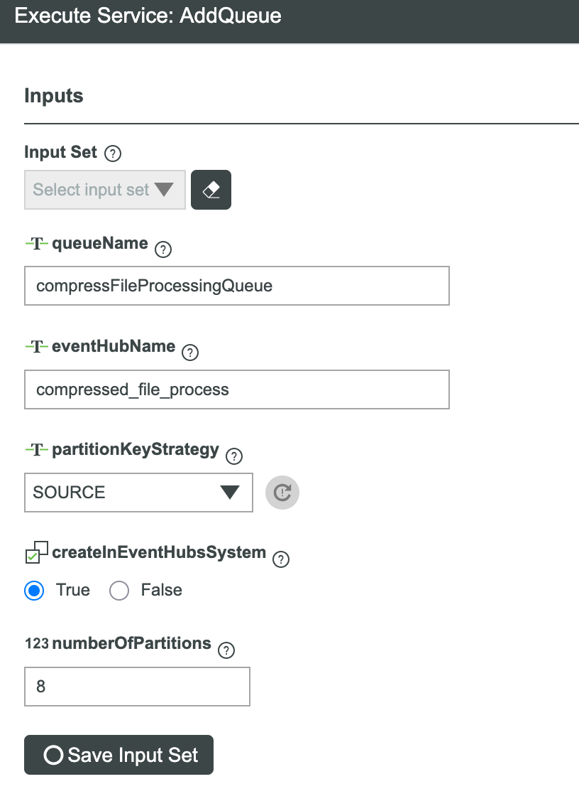
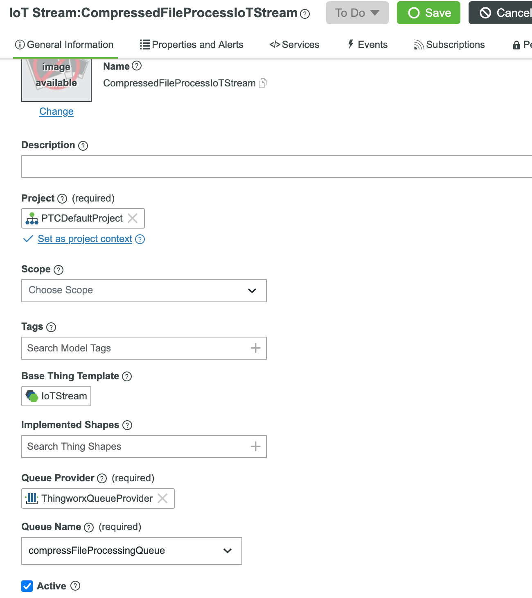
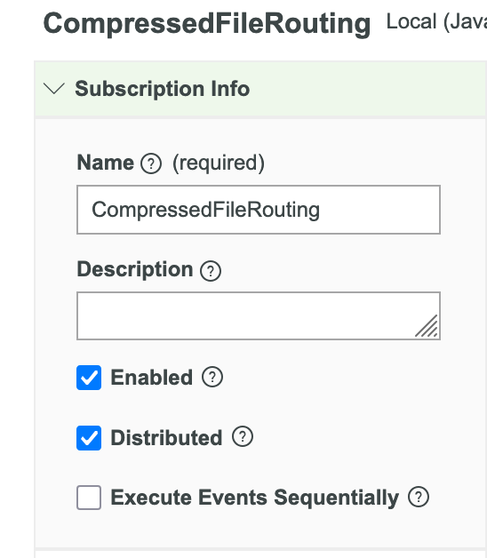
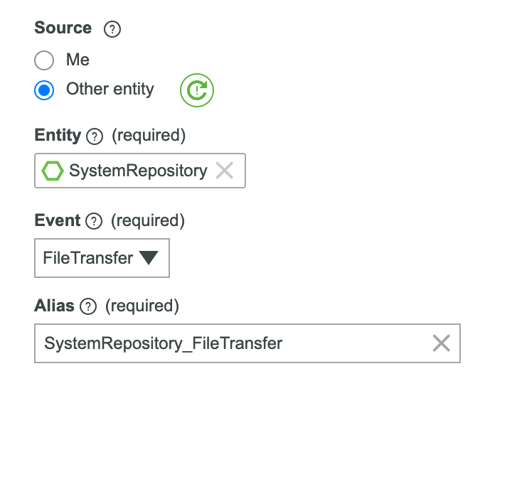
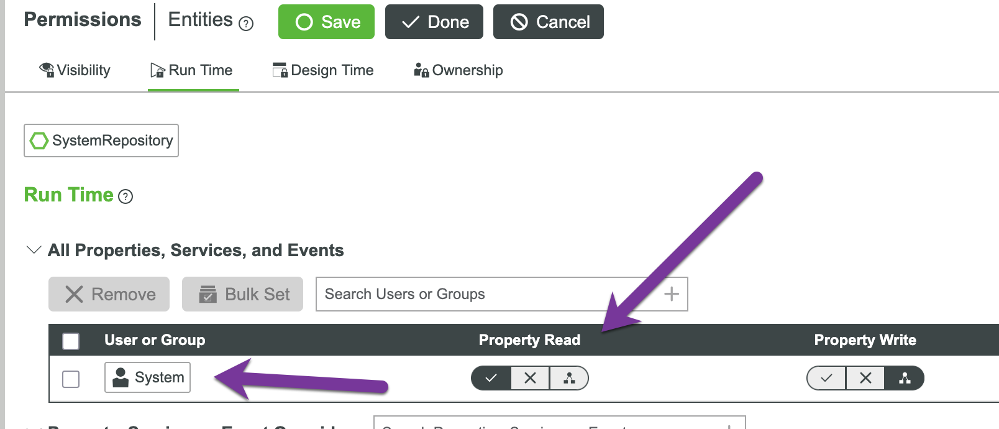
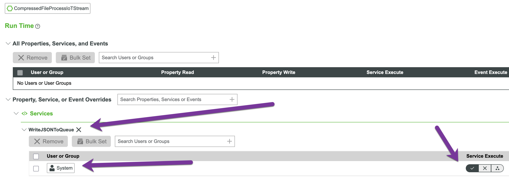
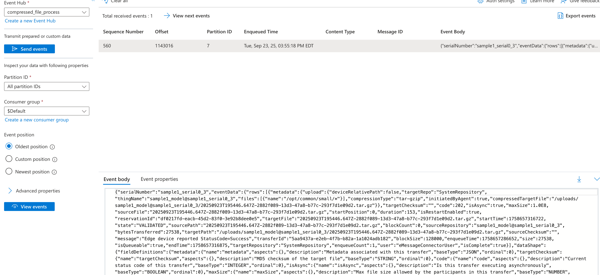
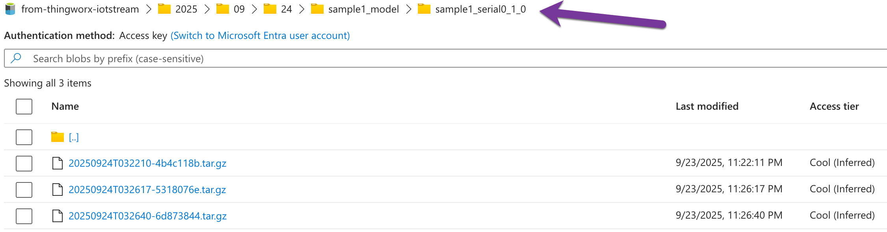
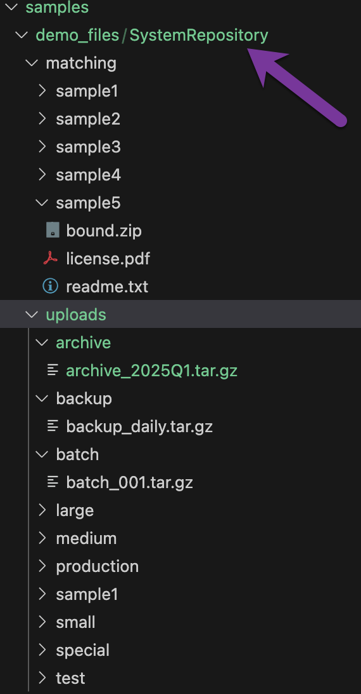

# Use Case: Processing tar.gz Files with KEDA

In many ThingWorx applications, data collected from remote assets is transmitted through file uploads. Additionally, numerous use cases require processed files to be forwarded to other destinations, such as AWS S3 or Azure Data Lake.

These use cases share common characteristics:

- **I/O-intensive operations**: High volume of file read/write operations
- **CPU-intensive processing**: Decompression and recompression of archive files require significant CPU resources
- **Pronounced peak and valley patterns**: For instance, massive file transfers at 9 AM during business hours, dropping to near-zero activity during early morning hours

## The Scalability Challenge

Customers frequently seek to handle file processing peaks and valleys through ThingWorx cluster scaling. While ThingWorx clusters can indeed scale to accommodate file transfer variations, achieving an appropriate cost-benefit balance proves challenging. The fundamental reason: each ThingWorx node must manage extensive state information while maintaining synchronization across nodes. When scaling up additional ThingWorx nodes to meet file transfer demands, the extra overhead spent on state sharing yields minimal performance benefits.

With the introduction of IoT Streams capability in ThingWorx, designing a scalable system capable of handling dramatic differences between file transfer peaks and valleys becomes remarkably straightforward. While the specific use case presented in this chapter—a simplified transformation of multiple production scenarios—may not be directly reusable, the scalability design methodology demonstrated here can be applied universally.

## Use Case Overview

The requirement in this case study: When a remote asset completes a file upload, the server will inject additional files into the compressed package based on the asset's Model Number, then upload the new compressed package to Azure Data Lake.

In this demonstration, we use the following sample data structure. When a remote asset has a Model Number of "sample1_model", the system adds the file "/matching/sample1/ProjectEntities.xml" from SystemRepository to the uploaded compressed package, and so on for other model types.

```
"matchingFiles": {
        "sample1_model": [
            {
                "repository": "SystemRepository",
                "path": "/matching/sample1/ProjectEntities.xml"
            }
        ],
        "sample2_model": [
            {
                "repository": "SystemRepository",
                "path": "/matching/sample2/ProjectEntities.twx"
            }
        ]
    },
```

## ThingWorx-Side Implementation

With IoT Streams, the ThingWorx-side implementation becomes remarkably simple. Given an existing "Queue Provider", we first need to add a new queue for this use case:



This queue is named "compressed_file_process", which will serve as the hub name in Azure EventHub or the topic name in Kafka. Next, let's create a dedicated IoT Stream: "CompressedFileProcessIoTStream":



Once the IoT Stream is created, we can subscribe to file upload events at appropriate locations. You can subscribe at different asset template levels or at the destination repository. In this example, we subscribe to file upload events from the destination repository within the created IoT Stream. Using the Axeda Device simulator, where uploaded files default to "SystemRepository", subscribing to SystemRepository's file upload events is sufficient.

We establish a new Event Subscription in the IoT Stream:



Select the event source as "FileTransfer" Event from SystemRepository.



Then, add the following basic code. Note: In production applications, you should add more protective code, such as checking whether this file event is an upload and whether the source is the expected asset.

```javascript
if(events["SystemRepository_FileTransfer"].eventData.isComplete){
    let source = events["SystemRepository_FileTransfer"].eventData.sourceRepository;

    let thing = Things[source];
    let payload={
        "modelNumber": thing.modelNumber,
        "serialNumber": thing.serialNumber,
        "name": thing.name,
        "matchingFiles": {
            "sample1_model": [
                {
                    "repository": "SystemRepository",
                    "path": "/matching/sample1/ProjectEntities.xml"
                }
            ],
            "sample2_model": [
                {
                    "repository": "SystemRepository",
                    "path": "/matching/sample2/ProjectEntities.twx"
                }
            ]
        },
        "eventData":events["SystemRepository_FileTransfer"].eventData
    };
    let message = {
        messageHeaders: undefined /* JSON */,
        messageBody: payload /* JSON [Required] */,
        name: thing.name /* STRING */,
        source: thing.name /* STRING */
    };
    me.WriteJSONToQueue(message);
}
```

In the above code, since we need to access multiple properties of "SystemRepository", we must grant the "System" user Runtime Permission to read Properties.



Additionally, since this code needs to call the "WriteJSONToQueue" service, we must also grant the "System" user Runtime Permission to execute this service.



With these preparations complete, we can trigger the simulator to start sending files. Soon, we'll see the transmitted messages in the Azure Portal.



The simulator configuration files are located in the project/08-processtargz/simulate directory. However, configuring them properly requires considerable effort, which is beyond the scope of this article. To facilitate your subsequent testing, we've also prepared a separate message sending tool to simulate different messages and demonstrate the system's scalability.

On the Azure Datalake side, the files will be organized by date, and it looks like:



## Implementation

This test and demonstration is based on an instance deployed according to https://github.com/PTCInc/twx-k8s. The Docker image and Helm chart mentioned in this example work seamlessly with `twx-k8s`. For other environments, please adjust accordingly.

### Consumer Business Logic Implementation

The business logic for this use case is relatively straightforward: receive messages from Azure EventHub, then based on the message data, decompress the asset's uploaded compressed file, inject new files, recompress, and upload to Azure Data Lake. This sample code deliberately uses an open-source library that allows configuration of different storage backends. Besides Azure EventHub, it supports AWS S3, SFTP, and more. For details, see: https://github.com/apache/opendal?tab=readme-ov-file#for-any-services

The core implementation consists of three main components:

#### Message Processing Pipeline

```python
# Main message processing flow from consumer.py
async def process_message(self, msg):
    """Process a single Kafka message"""
    try:
        # Parse message
        message_value = msg.value().decode('utf-8')
        message_data = json.loads(message_value)

        # Extract key information
        model_number = message_data.get('modelNumber')
        serial_number = message_data.get('serialNumber')
        matching_files = message_data.get('matchingFiles', {})
        event_data = message_data.get('eventData', {})

        # Process tar.gz file
        processed_file = await self.processor.process_message_files(
            message_data,
            self.repository_root
        )

        # Upload to Azure Storage
        if processed_file:
            await self.uploader.upload_processed_tar(
                processed_file,
                model_number,
                serial_number
            )

    except Exception as e:
        logger.error(f"Failed to process message: {e}")
        self.metrics.processing_errors.labels(error_type='processing').inc()
```

#### Tar.gz Processing Logic

```python
# Core processing logic from processor.py
def process_tar_gz(self, source_path: Path, matching_files: List[Dict],
                   output_path: Path) -> bool:
    """
    Extract tar.gz, inject matching files, and recompress

    This demonstrates the CPU-intensive nature of the operation:
    1. Decompress original tar.gz file
    2. Copy matching files into the extracted directory
    3. Recompress everything into a new tar.gz
    """
    temp_dir = Path(tempfile.mkdtemp())

    try:
        # Step 1: Extract original tar.gz
        with tarfile.open(source_path, 'r:gz') as tar:
            tar.extractall(temp_dir)

        # Step 2: Copy matching files
        for file_info in matching_files:
            repo = file_info.get('repository')
            file_path = file_info.get('path', '').lstrip('/')

            # Construct full source path
            src_file = self.repository_root / repo / file_path

            if src_file.exists():
                # Create destination path maintaining directory structure
                dest_file = temp_dir / Path(file_path).name
                shutil.copy2(src_file, dest_file)
                logger.info(f"Added file: {file_path}")

        # Step 3: Create new tar.gz
        with tarfile.open(output_path, 'w:gz') as tar:
            for item in temp_dir.iterdir():
                tar.add(item, arcname=item.name)

        return True

    finally:
        # Clean up temporary directory
        shutil.rmtree(temp_dir, ignore_errors=True)
```

### Metrics Design

Auto-scaling can be viewed as the system's response to different metrics. Therefore, in the business implementation logic, we must design reasonable metric collection points. Too many will impact performance, while too few will make auto-scaling more difficult.

In this example, we've designed sufficient metric collection points to support subsequent auto-scaling:

#### Metric 1: Message Processing Metrics
```python
# Counter for total messages processed
messages_processed_total = Counter(
    'messages_processed_total',
    'Total number of messages processed',
    ['status']  # status: success, failure
)
```
**Purpose**: Track the overall message processing throughput and success rate. This metric helps determine if the system is keeping up with incoming messages and identifies processing bottlenecks.

#### Metric 2: File Upload Metrics
```python
# Counter for uploaded files
files_uploaded_total = Counter(
    'files_uploaded_total',
    'Total number of files uploaded to storage',
    ['destination']  # destination: azure, s3, etc.
)
```
**Purpose**: Monitor successful file uploads to external storage. This helps identify upload failures and network issues with cloud storage providers.

#### Metric 3: Processing Duration Histogram
```python
# Histogram for processing time
processing_duration_seconds = Histogram(
    'processing_duration_seconds',
    'Time spent processing tar.gz files',
    buckets=(0.1, 0.5, 1, 2, 5, 10, 30, 60, 120)
)
```
**Purpose**: Measure the time taken to process each tar.gz file. This identifies performance degradation and helps set appropriate timeout values and scaling thresholds.

#### Metric 4: File Size Distribution
```python
# Histogram for file sizes
file_size_bytes = Histogram(
    'file_size_bytes',
    'Size of processed files in bytes',
    buckets=(1e3, 1e4, 1e5, 1e6, 1e7, 1e8)  # 1KB to 100MB
)
```
**Purpose**: Track the distribution of file sizes being processed. Larger files require more memory and CPU, affecting scaling decisions.

#### Metric 5: Kafka Consumer Lag
```python
# Gauge for consumer lag
kafka_consumer_lag = Gauge(
    'kafka_consumer_lag_total',
    'Current lag of Kafka consumer',
    ['partition', 'topic']
)
```
**Purpose**: The most critical metric for KEDA auto-scaling. When lag increases, it signals that the current processing capacity cannot keep up with incoming messages, triggering scale-up operations.

#### Metric 6: Active Processing Tasks
```python
# Gauge for concurrent processing
active_processing_tasks = Gauge(
    'active_processing_tasks',
    'Number of currently active processing tasks'
)
```
**Purpose**: Monitor the current workload on each pod. This helps determine if pods are being efficiently utilized or if they're idle.

### Building Docker Images

Since this example needs to be deployed on AKS, we need to package the business logic implementation into a Docker image. The Docker image publication location is controlled by three variables in the configuration file, which you can modify as appropriate:

```env
DOCKER_USER=xudesheng
DOCKER_TOKEN='YourToken'
IMAGE_NAME=processtargz
```

If you want to publish to a location other than docker.io, please modify lines 45-57 in `build_and_push.sh`.

## Auto-Scaling Solution Selection

When designing an auto-scaling solution for this file processing workload, three primary approaches were considered:

### Option 1: Kubernetes Horizontal Pod Autoscaler (HPA)
The native Kubernetes HPA scales based on CPU/memory metrics. While simple to implement, it lacks awareness of the actual message queue depth, leading to reactive rather than proactive scaling.

### Option 2: Azure Container Instances (ACI) with Logic Apps
Using Azure-native services to trigger container instances based on EventHub metrics. This approach works but creates vendor lock-in and doesn't integrate well with existing Kubernetes infrastructure.

### Option 3: KEDA (Kubernetes Event-Driven Autoscaling)
KEDA extends Kubernetes with event-driven scaling capabilities, making it the ideal choice for our scenario.

**KEDA's Key Characteristics:**
- **Event-driven scaling**: Scales based on external metrics like message queue length, not just CPU/memory
- **Scale-to-zero capability**: Completely removes pods during idle periods, maximizing cost efficiency
- **Native Kubernetes integration**: Works seamlessly with existing Kubernetes deployments and tooling
- **Multiple scaler support**: Supports 60+ scalers including Kafka, Azure EventHub, AWS SQS, Prometheus metrics
- **Fine-grained control**: Allows detailed configuration of scaling behavior, thresholds, and cool-down periods

We selected **Option 3 (KEDA)** because it provides the perfect balance of functionality, cost-efficiency, and integration with our existing infrastructure.

### KEDA Installation and Verification

For detailed KEDA installation instructions, please refer to `README-KEDA.md`, which is also included at the end of this document.

**Key Points for KEDA Installation and Verification:**

1. **Prerequisites Check**: Ensure your Kubernetes cluster version is 1.24 or higher. KEDA requires certain API versions that older clusters may not support.

2. **Installation Methods**: KEDA can be installed via Helm (recommended), Operator Hub, or YAML manifests. For production environments, Helm provides the best configurability.

3. **Namespace Isolation**: KEDA components are installed in the `keda` namespace by default, keeping them separate from your application workloads.

4. **Component Verification**:
   ```bash
   # Check KEDA pods are running
   kubectl get pods -n keda
   
   # Verify KEDA operator is ready
   kubectl get deployment -n keda
   
   # Check CRDs are installed
   kubectl get crd | grep keda
   ```

5. **Metrics Server Integration**: KEDA acts as a metrics server, exposing external metrics to HPA. Verify the metrics API is registered:
   ```bash
   kubectl get apiservices | grep external.metrics
   ```

### Helm Chart Implementation

To facilitate deployment, we've built a comprehensive Helm chart. The example Helm chart is located in the `project/08-processtargz/helm` directory. The `values.yaml` file defines various variables and their default values, which you can override during deployment. Key variables include:

```yaml
deployment:
  context: "twx"  # Set via --set deployment.context=VALUE
  namespace: "dev101"  # Set via --set deployment.namespace=VALUE
  name: "ht"  # Set via --set deployment.name=VALUE

replicaCount: 1

image:
  repository: xudesheng/processtargz
  pullPolicy: IfNotPresent
  tag: "latest"

kafka:
  bootstrapServers: "dxudemo.servicebus.windows.net:9093"
  topic: "compressed_file_process"
  saslUsername: "$ConnectionString"
  consumerGroup: "$Default"

azureStorage:
  accountName: "iotstreamstorage"
  container: "from-thingworx-iotstream"
  endpoint: "https://iotstreamstorage.blob.core.windows.net"
```

### Detailed Scaling Configuration

KEDA provides extensive configuration options for scaling behavior. Understanding these options is crucial for optimal performance:

#### Scale-Up Configuration

**Trigger Types and Thresholds:**
```yaml
triggers:
- type: kafka
  metadata:
    bootstrapServers: "your-eventhub.servicebus.windows.net:9093"
    topic: "compressed_file_process"
    consumerGroup: "$Default"
    lagThreshold: "10"  # Scale up when lag > 10 messages per partition
    activationLagThreshold: "5"  # Activate from 0 when lag > 5
```

**Example Scenarios:**

1. **Conservative Scaling** (for predictable workloads):
   ```yaml
   lagThreshold: "50"
   minReplicaCount: 1
   maxReplicaCount: 5
   ```
   - Maintains 1 replica minimum
   - Scales gradually as lag builds up
   - Suitable for steady workloads with occasional peaks

2. **Aggressive Scaling** (for bursty workloads):
   ```yaml
   lagThreshold: "5"
   minReplicaCount: 0
   maxReplicaCount: 20
   ```
   - Scales to zero when idle
   - Reacts quickly to any lag
   - Ideal for sporadic, high-volume bursts

3. **Partition-Aware Scaling** (for high-throughput systems):
   ```yaml
   lagThreshold: "10"
   maxReplicaCount: 8  # Match partition count
   ```
   - One replica per partition maximum
   - Ensures optimal partition distribution
   - Prevents over-scaling beyond partition count

#### Scale-Down Configuration

**Cool-Down Periods:**
```yaml
cooldownPeriod: 300  # Wait 5 minutes before scaling down
```

**Example Configurations:**

1. **Quick Scale-Down** (for development/testing):
   ```yaml
   cooldownPeriod: 30  # 30 seconds
   minReplicaCount: 0
   ```
   - Rapidly releases resources
   - Minimizes costs in non-production

2. **Stable Scale-Down** (for production):
   ```yaml
   cooldownPeriod: 600  # 10 minutes
   minReplicaCount: 2
   ```
   - Prevents thrashing
   - Maintains baseline capacity

### Pre-warming and Multi-Peak Configuration

**Pre-warming Concept:**
Pre-warming involves proactively scaling up resources before expected load increases. This eliminates the lag between load arrival and pod readiness, ensuring immediate processing capacity.

**Benefits of Pre-warming:**
- Eliminates cold-start delays during predictable peak periods
- Ensures SLA compliance during critical business hours
- Reduces message processing latency during traffic spikes
- Prevents message queue overflow during sudden load increases

**Multi-Peak Configuration Example:**
```yaml
triggers:
# Regular Kafka trigger for reactive scaling
- type: kafka
  metadata:
    lagThreshold: "10"

# Morning peak pre-warming (8:45 AM - 10:30 AM EST)
- type: cron
  metadata:
    timezone: America/New_York
    start: "45 8 * * 1-5"
    end: "30 10 * * 1-5"
    desiredReplicas: "5"

# Lunch peak pre-warming (11:45 AM - 1:30 PM EST)
- type: cron
  metadata:
    timezone: America/New_York
    start: "45 11 * * 1-5"
    end: "30 13 * * 1-5"
    desiredReplicas: "3"

# End-of-day processing (4:45 PM - 6:30 PM EST)
- type: cron
  metadata:
    timezone: America/New_York
    start: "45 16 * * 1-5"
    end: "30 18 * * 1-5"
    desiredReplicas: "4"
```

**Advanced Multi-Region Peak Configuration:**
```yaml
# Supporting global operations across time zones
triggers:
# Asia-Pacific peak (9 AM - 11 AM JST)
- type: cron
  metadata:
    timezone: Asia/Tokyo
    start: "0 9 * * 1-5"
    end: "0 11 * * 1-5"
    desiredReplicas: "6"

# Europe peak (9 AM - 11 AM CET)
- type: cron
  metadata:
    timezone: Europe/Berlin
    start: "0 9 * * 1-5"
    end: "0 11 * * 1-5"
    desiredReplicas: "8"

# Americas peak (9 AM - 11 AM EST)
- type: cron
  metadata:
    timezone: America/New_York
    start: "0 9 * * 1-5"
    end: "0 11 * * 1-5"
    desiredReplicas: "10"
```

### Helm Deployment

Deploying this Helm chart requires careful consideration of your environment-specific values:

**Basic Deployment:**
```bash
# Install with default values
helm install kafka-processor ./helm

# Install with custom namespace
helm install kafka-processor ./helm -n production
```

**Production Deployment with Custom Values:**
```bash
# Using command-line overrides
helm install kafka-processor ./helm \
  --set deployment.context=production \
  --set deployment.namespace=thingworx \
  --set deployment.name=twx-prod-01 \
  --set kafka.bootstrapServers=prod-eventhub.servicebus.windows.net:9093 \
  --set kafka.saslPassword="Endpoint=sb://..." \
  --set azureStorage.accountKey="YourStorageKey" \
  --set replicaCount=3
```

**Using External Values File:**

Create a `values-production.yaml` file:
```yaml
deployment:
  context: production
  namespace: thingworx
  name: twx-prod-01

replicaCount: 3

kafka:
  bootstrapServers: "prod-eventhub.servicebus.windows.net:9093"
  topic: "compressed_file_process"
  saslUsername: "$ConnectionString"
  saslPassword: "Endpoint=sb://prod-eventhub.servicebus.windows.net/..."

azureStorage:
  accountName: "prodstorageaccount"
  accountKey: "YourBase64StorageKey"
  container: "processed-files"
  endpoint: "https://prodstorageaccount.blob.core.windows.net"

keda:
  enabled: true
  minReplicaCount: 2
  maxReplicaCount: 20
  pollingInterval: 30
  cooldownPeriod: 300
  lagThreshold: 15

resources:
  requests:
    memory: "256Mi"
    cpu: "250m"
  limits:
    memory: "1Gi"
    cpu: "1000m"
```

Deploy with the external values file:
```bash
helm install kafka-processor ./helm -f values-production.yaml
```

**Upgrade Existing Deployment:**
```bash
# Modify configuration without downtime
helm upgrade kafka-processor ./helm \
  --set keda.maxReplicaCount=30 \
  --set keda.lagThreshold=5
```

**Multi-Environment Deployment Strategy:**
```bash
# Development environment
helm install kafka-processor-dev ./helm \
  -f values-base.yaml \
  -f values-dev.yaml \
  -n development

# Staging environment
helm install kafka-processor-staging ./helm \
  -f values-base.yaml \
  -f values-staging.yaml \
  -n staging

# Production environment
helm install kafka-processor-prod ./helm \
  -f values-base.yaml \
  -f values-prod.yaml \
  -n production
```

## Testing and Validation

### Test Data Preparation

We've prepared the following folder structure locally:



The directory structures and files in these folders can be uploaded to ThingWorx using `scripts/build-sample.py`. Additionally, we've prepared the `scripts/sample_load.json` file, which `scripts/load-generator.py` will use to generate simulation messages for testing scaling behavior under different loads.

```JSON
{
    "matchingFiles": {
        "sample1_model": [
            {
                "repository": "SystemRepository",
                "path": "/matching/sample1/ProjectEntities.xml"
            }
        ],
        "sample2_model": [
            {
                "repository": "SystemRepository",
                "path": "/matching/sample2/ProjectEntities.twx"
            }
        ],
        "sample3_model": [
            {
                "repository": "SystemRepository",
                "path": "/matching/sample3/avatar.png"
            }
        ],
        "sample4_model": [
            {
                "repository": "SystemRepository",
                "path": "/matching/sample4/config.json"
            },
            {
                "repository": "SystemRepository",
                "path": "/matching/sample4/metadata.xml"
            }
        ],
        "sample5_model": [
            {
                "repository": "SystemRepository",
                "path": "/matching/sample5/bundle.zip"
            },
            {
                "repository": "SystemRepository",
                "path": "/matching/sample5/readme.txt"
            },
            {
                "repository": "SystemRepository",
                "path": "/matching/sample5/license.pdf"
            }
        ]
    },
    "samples": [
        {
            "modelNumber": "sample1_model",
            "serialNumber": "sample1_serial0_1",
            "targetPath": "/uploads/sample1/20250923T140933.212Z-c941204d-d7d0-45ca-910e-b750c307eb8b.tar.gz",
            "targetRepository": "SystemRepository"
        },
        {
            "modelNumber": "sample2_model",
            "serialNumber": "sample2_serial_small",
            "targetPath": "/uploads/small/small.tar.gz",
            "targetRepository": "SystemRepository"
        },
        {
            "modelNumber": "sample3_model",
            "serialNumber": "sample3_serial_large",
            "targetPath": "/uploads/large/large.tar.gz",
            "targetRepository": "SystemRepository"
        },
        {
            "modelNumber": "sample4_model",
            "serialNumber": "sample4_serial_001",
            "targetPath": "/uploads/medium/test_data.tar.gz",
            "targetRepository": "SystemRepository"
        },
        {
            "modelNumber": "sample5_model",
            "serialNumber": "sample5_serial_batch",
            "targetPath": "/uploads/batch/batch_001.tar.gz",
            "targetRepository": "SystemRepository"
        },
        {
            "modelNumber": "sample1_model",
            "serialNumber": "sample1_serial_special",
            "targetPath": "/uploads/special/data_2025.tar.gz",
            "targetRepository": "SystemRepository"
        },
        {
            "modelNumber": "sample2_model",
            "serialNumber": "sample2_serial_test",
            "targetPath": "/uploads/test/test_package.tar.gz",
            "targetRepository": "SystemRepository"
        },
        {
            "modelNumber": "sample3_model",
            "serialNumber": "sample3_serial_prod",
            "targetPath": "/uploads/production/prod_20250923.tar.gz",
            "targetRepository": "SystemRepository"
        },
        {
            "modelNumber": "sample4_model",
            "serialNumber": "sample4_serial_backup",
            "targetPath": "/uploads/backup/backup_daily.tar.gz",
            "targetRepository": "SystemRepository"
        },
        {
            "modelNumber": "sample5_model",
            "serialNumber": "sample5_serial_archive",
            "targetPath": "/uploads/archive/archive_2025Q1.tar.gz",
            "targetRepository": "SystemRepository"
        }
    ],
    "testScenarios": {
        "small": {
            "description": "Small files for quick testing",
            "models": ["sample1_model", "sample2_model"],
            "rate": 120
        },
        "medium": {
            "description": "Medium load testing",
            "models": ["sample3_model", "sample4_model"],
            "rate": 60
        },
        "large": {
            "description": "Heavy load testing",
            "models": ["sample5_model"],
            "rate": 30
        },
        "mixed": {
            "description": "Mixed load with all models",
            "models": ["sample1_model", "sample2_model", "sample3_model", "sample4_model", "sample5_model"],
            "rate": 90
        }
    }
}
```

## Testing Scenarios

The comprehensive testing framework includes several scenarios designed to validate different aspects of the auto-scaling system:

### 1. Basic Functional Testing

**Objective:** Verify the system correctly processes messages and uploads files to Azure Storage.

**Test Steps:**
```bash
# Send a single test message
python scripts/load-generator.py --mode normal --rate 1 --duration 60

# Monitor processing
kubectl logs -f deployment/kafka-processor-kafka-targz-processor

# Verify file appears in Azure Storage
# Check the Azure Portal or use Azure Storage Explorer
```

**Validation Points:**
- Message successfully consumed from EventHub
- tar.gz file correctly processed with injected files
- Processed file uploaded to Azure Storage with correct path structure
- Prometheus metrics updated appropriately

### 2. Scale-to-Zero Testing

**Objective:** Confirm the system scales down to zero replicas during idle periods.

**Test Steps:**
```bash
# Ensure no messages in queue
# Wait for cooldown period (default 5 minutes)
kubectl get pods -w | grep kafka-processor

# Should see pods terminating
# Eventually: No resources found
```

**Validation:**
- All pods terminated after cooldown period
- HPA shows 0 current replicas
- No resource consumption (check `kubectl top pods`)

### 3. Load Spike Testing

**Objective:** Validate rapid scale-up in response to sudden load increases.

**Test Steps:**
```bash
# Generate sudden high load
python scripts/load-generator.py --mode peak --rate 400 --duration 300

# Monitor scaling behavior
kubectl get hpa kafka-processor-hpa -w

# Check KEDA metrics
kubectl get --raw /apis/external.metrics.k8s.io/v1beta1/namespaces/dev101/metrics/s0-kafka-compressed_file_process
```

**Expected Behavior:**
- Pods scale from 0 to multiple replicas within 30-60 seconds
- Number of replicas correlates with queue depth
- Processing rate increases proportionally with replicas

### 4. Sustained Load Testing

**Objective:** Ensure stable operation under continuous high load.

**Test Steps:**
```bash
# Generate sustained load for extended period
python scripts/load-generator.py --mode peak --rate 200 --duration 1800

# Monitor system stability
# Use Prometheus/Grafana dashboards or:
watch -n 5 'kubectl get pods | grep kafka-processor'
```

**Monitoring Points:**
- CPU and memory utilization remain within limits
- No pod restarts or OOMKilled events
- Consistent message processing rate
- Queue lag remains bounded

### 5. Multi-Peak Scenario Testing

**Objective:** Validate pre-warming and handling of multiple daily peaks.

**Test Configuration (`scripts/multi-peak-test.yaml`):
```yaml
peaks:
  - name: "morning_peak"
    start_delay: 0
    rate: 300
    duration: 600
  - name: "quiet_period"
    start_delay: 0
    rate: 10
    duration: 300
  - name: "lunch_peak"
    start_delay: 0
    rate: 250
    duration: 600
  - name: "afternoon_quiet"
    start_delay: 0
    rate: 5
    duration: 300
  - name: "evening_peak"
    start_delay: 0
    rate: 400
    duration: 900
```

**Test Execution:**
```bash
python scripts/load-generator.py --mode multi-peak --config scripts/multi-peak-test.yaml
```

**Validation:**
- Pre-warming activates before each peak
- Scaling follows the expected pattern
- System handles transitions between peaks smoothly

### 6. Observability and Monitoring

#### Application-Level Prometheus Metrics

**Prometheus Metrics Queries:**

```promql
# Current message processing rate
rate(messages_processed_total[5m])

# Average processing duration
histogram_quantile(0.95, rate(processing_duration_seconds_bucket[5m]))

# Consumer lag per partition
kafka_consumer_lag_total

# Upload success rate
rate(files_uploaded_total[5m]) / rate(messages_processed_total[5m])

# Active replicas
kube_deployment_status_replicas{deployment="kafka-processor"}
```

#### Azure EventHub External Metrics

In addition to application-level metrics, KEDA can directly access Azure EventHub metrics for scaling decisions. These external metrics provide a more comprehensive view of the message queue state:

**KEDA External Metrics Configuration:**

```yaml
# In ScaledObject configuration
triggers:
- type: azure-eventhub
  metadata:
    connectionFromEnv: EVENTHUB_CONNECTION_STRING
    eventHubName: compressed_file_process
    consumerGroup: $Default
    # Threshold for scaling - when unprocessed event count > threshold
    unprocessedEventThreshold: '10'
    # Activation threshold - scale from 0 when events > threshold
    activationUnprocessedEventThreshold: '5'
  # Optional: use blob checkpoint for accurate lag calculation
  authenticationRef:
    name: eventhub-auth-trigger
```

**Available Azure EventHub Metrics:**

1. **Unprocessed Event Count**:
   - **Metric**: `unprocessedEventCount`
   - **Purpose**: Most critical for scaling - represents messages waiting to be processed
   - **KEDA Usage**: Primary trigger for scale-up/down decisions

2. **Incoming Message Rate**:
   - **Metric**: `IncomingMessages` (from Azure Monitor)
   - **Purpose**: Track message ingestion rate from ThingWorx IoT Stream
   - **Use Case**: Predict scaling needs and identify traffic patterns

3. **Consumer Lag per Partition**:
   - **Metric**: Calculated from checkpoint blob storage
   - **Purpose**: Per-partition lag measurement for fine-grained scaling
   - **Benefit**: More accurate than simple message count for partitioned topics

4. **Connection Status**:
   - **Metric**: `ActiveConnections` (from Azure Monitor)
   - **Purpose**: Monitor EventHub connectivity health
   - **Alert Threshold**: Connections dropping to 0 indicates connectivity issues

**Azure Monitor Integration for External Metrics:**

```bash
# Query Azure EventHub metrics using Azure CLI
az monitor metrics list \
    --resource "/subscriptions/{subscription-id}/resourceGroups/{resource-group}/providers/Microsoft.EventHub/namespaces/{namespace}/eventhubs/compressed_file_process" \
    --metric "IncomingMessages,OutgoingMessages" \
    --start-time 2025-09-24T00:00:00Z \
    --end-time 2025-09-24T23:59:59Z \
    --interval PT5M

# Get consumer group lag information
az eventhubs eventhub consumer-group show \
    --resource-group {resource-group} \
    --namespace-name {namespace} \
    --eventhub-name compressed_file_process \
    --consumer-group-name '$Default'
```

**External Metrics Validation:**

```bash
# Check KEDA can access EventHub metrics
kubectl get --raw "/apis/external.metrics.k8s.io/v1beta1/namespaces/dev101/metrics/s0-kafka-compressed_file_process" | jq .

# Verify external metrics server registration
kubectl get apiservices | grep external.metrics

# Monitor KEDA's external metrics polling
kubectl logs -n keda deployment/keda-operator | grep "azure-eventhub"
```

**Enhanced Grafana Dashboard Setup:**

Create comprehensive visualizations combining both application and external metrics:

1. **Processing Overview**: Message rate, success/failure ratio, processing duration
2. **Scaling Metrics**: Current replicas, target replicas, KEDA external metrics, scale-up/down events
3. **Resource Utilization**: CPU, memory, network I/O per pod
4. **Queue Health**: Consumer lag, partition distribution, offset progress, EventHub connection status
5. **Storage Operations**: Upload rate, upload duration, failure reasons
6. **Azure EventHub Health**:
   - Incoming message rate from ThingWorx
   - Unprocessed event count per partition
   - Connection status and throttling events
   - EventHub namespace throughput utilization

**Critical Monitoring Alerts:**

```yaml
# Sample Prometheus alert rules combining internal and external metrics
groups:
- name: kafka-processor-alerts
  rules:
  # High consumer lag based on external metrics
  - alert: HighEventHubLag
    expr: keda_scaler_metrics_value{scaler="s0-kafka-compressed_file_process"} > 100
    for: 2m
    labels:
      severity: warning
    annotations:
      summary: "High EventHub consumer lag detected"
      description: "EventHub lag is {{ $value }} messages, scaling may be needed"

  # EventHub connection issues
  - alert: EventHubConnectionDown
    expr: up{job="azure-eventhub-exporter"} == 0
    for: 1m
    labels:
      severity: critical
    annotations:
      summary: "EventHub connection lost"
      description: "Cannot connect to Azure EventHub for metrics collection"

  # Processing rate falling behind ingestion rate
  - alert: ProcessingLagIncrease
    expr: increase(messages_processed_total[5m]) < increase(keda_scaler_metrics_value{scaler="s0-kafka-compressed_file_process"}[5m])
    for: 5m
    labels:
      severity: warning
    annotations:
      summary: "Processing rate falling behind message ingestion"
      description: "May need to adjust KEDA scaling thresholds or investigate processing bottlenecks"
```

This comprehensive monitoring approach combines the benefits of:
- **Application metrics**: Detailed processing performance and business logic insights
- **External EventHub metrics**: Accurate queue state and infrastructure health
- **KEDA integration**: Automated scaling based on actual message queue depth rather than just CPU/memory

### 7. Failure Recovery Testing

**Objective:** Ensure graceful handling of various failure scenarios.

**Test Scenarios:**

1. **Network Interruption to Azure Storage:**
   ```bash
   # Temporarily block Azure Storage endpoint
   kubectl exec -it <pod-name> -- iptables -A OUTPUT -d 52.239.0.0/16 -j DROP
   
   # Monitor retry behavior and metrics
   ```

2. **Pod Crashes:**
   ```bash
   # Force pod termination
   kubectl delete pod <pod-name>
   
   # Verify message reprocessing and no data loss
   ```

3. **EventHub Connection Loss:**
   ```bash
   # Modify network policies or security groups
   # Monitor reconnection behavior and queue buildup
   ```

**Expected Recovery Behavior:**
- Automatic reconnection with exponential backoff
- Messages retained in EventHub until successfully processed
- Metrics accurately reflect failures
- System returns to normal operation once issue resolved

### Validation Tools

**KEDA Validation Script (`scripts/verify-keda.sh`):**
```bash
#!/bin/bash
# Comprehensive KEDA validation

echo "Checking KEDA installation..."
kubectl get pods -n keda

echo "Checking ScaledObject status..."
kubectl get scaledobject -n dev101

echo "Checking HPA created by KEDA..."
kubectl get hpa -n dev101

echo "Checking external metrics..."
kubectl get --raw /apis/external.metrics.k8s.io/v1beta1 | jq .

echo "Current consumer lag..."
kubectl get --raw "/apis/external.metrics.k8s.io/v1beta1/namespaces/dev101/metrics/s0-kafka-compressed_file_process" | jq .
```

**Load Validation Script (`scripts/validate-scaling.py`):**
Monitors and validates scaling behavior in real-time, providing insights into:
- Time to scale up/down
- Correlation between lag and replica count
- Processing throughput at different scales
- Cost metrics based on resource usage

This comprehensive testing framework ensures the auto-scaling solution performs reliably under all expected conditions, from idle periods to peak loads, while maintaining cost efficiency and meeting performance SLAs.
