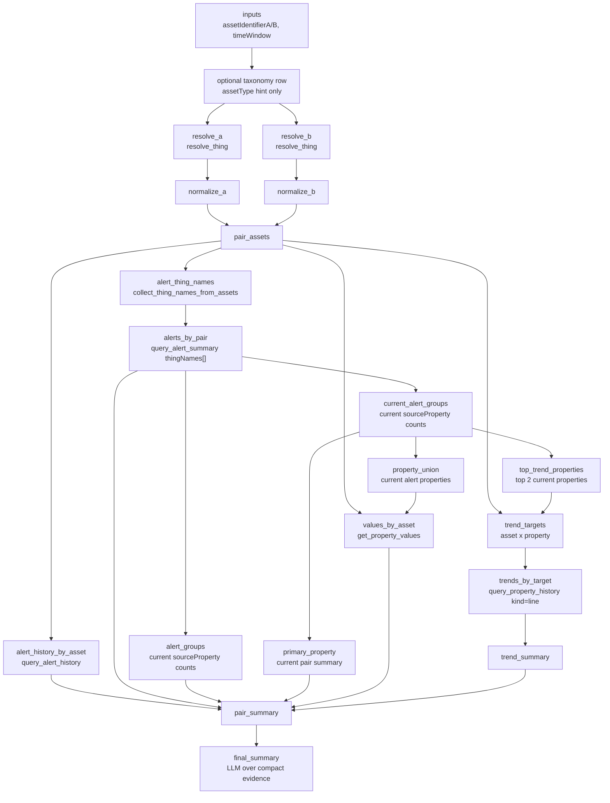

# Playbooks: from a skill to a deterministic workflow

## Why playbook comes right after the first skill

Chapter **11** built the first serious workflow from built-in tools:

```text
compare two assets
  -> resolve both asset names
  -> compare alert history
  -> compare current alert summary
  -> identify current alert-driving properties
  -> show trend charts
  -> produce an evidence-grounded health assessment
```

That is exactly the right place to introduce **skills** first. A skill lets the LLM keep control of the route while you teach it the business procedure.

But a stable multi-step route also exposes the next question:

> If the steps are now known, why should the LLM decide every step again on every run?

A **playbook** answers that question. It registers a server-side DAG. The runtime executes the route, stores compact evidence, emits task progress, and asks the LLM only for the final evidence-grounded summary.

| Layer | Who controls the route? | Best for |
| --- | --- | --- |
| Multi-turn prompts | User and LLM | Discovery and teaching |
| Skill | LLM, guided by `SKILL.md` | Flexible business procedure |
| Playbook | Runtime DAG | Repeatable business workflow |

The goal is not to replace skills. The goal is to promote a skill when the business route has become stable enough.

---

## Same story, one prompt

The Chapter **11** skill was built from multiple turns. The playbook should let the user ask the same business question directly:

```text
please compare the health status between ORD Contacting 02 and ORD Contacting 01 over the past 24 hours
```

Expected visible behavior:

- the assistant starts the registered playbook;
- both asset identifiers are resolved to canonical Thing names;
- alert history and current alert summary are collected for both assets;
- the top current alert-driving properties are selected;
- line charts are emitted for those properties on both assets when history data exists;
- the final answer ranks the assets and cites evidence.


## Reference files

The workshop reference playbook lives here:

```text
workshop/day3/playbooks/cross_asset_pair_health/playbook.json
```

For the training configuration repository, upload it as:

```text
/playbooks/cross_asset_pair_health/playbook.json
```

There is intentionally only one active playbook file per playbook directory. Development experiments can live outside the uploaded repository, but Parler should see only:

```text
playbooks/
  cross_asset_pair_health/
    playbook.json
```

Version note:

- The workshop ship baseline is **`parler-agent` 0.1.206+** / **`parler-ui-widget` 0.1.89+** (see `docs/workshop-training-plan.md` header).
- The asset-pair health playbook is the simple built-in story. More service-oriented playbooks, such as playbooks that resolve a dynamic list of Things and call App services with derived `INFOTABLE` arguments, require the 0.1.190 service-orchestration enhancements.
- When debugging a playbook, check the runtime version first. A playbook that validates on the current baseline may fail on an older AgentThing even when the JSON looks correct.

### Playbook catalog and same-id promotion

When playbooks load from `/playbooks/`, Parler injects a **playbook catalog** into the per-turn model context and advertises **`start_playbook`** with the loaded playbook ids (see **`parler`** `docs/agent/playbook-catalog-routing.md`).

If the same short id exists under both `/skills/<id>/` and `/playbooks/<id>/`, the **playbook wins** for model-facing routing: the skill is shadowed (not in the skill catalog, slash, or `get_agent_skill`). The playbook remains visible via the playbook catalog and `start_playbook`. Different ids may coexist — both can appear in the combined catalog.

For the Day 3 health exercise, keep **`asset_pair_health`** as the skill and **`cross_asset_pair_health`** as the playbook so students see both artifacts without a same-id collision.

---

## Inputs

The playbook accepts:

| Input | Required | Meaning |
| --- | --- | --- |
| `assetIdentifierA` | Yes | First asset label, display name, suffix, serial, or canonical Thing name. |
| `assetIdentifierB` | Yes | Second asset label, display name, suffix, serial, or canonical Thing name. |
| `timeWindow` | Yes | Recent relative window such as `24h`, `7d`, or `past 24 hours`. |
| `assetType` | No | Optional narrowing hint only. Do not require it for labels such as `ORD Contacting 02`. |

The important training point is the same one from the skill:

> Resolve the full asset label first. Do not split `ORD Contacting 02` into an asset type plus a suffix unless the user clearly supplied the asset type separately.

This keeps the playbook consistent with the multi-turn story. The user never had to say "asset type is Contacting"; the playbook should not require that either.

---

## DAG overview

Conceptually, the playbook executes this route:



The LLM does not improvise this sequence. It chooses to start the playbook, then the runtime follows the DAG.

---

## Node responsibilities

| Node family | Responsibility |
| --- | --- |
| `resolve_*` | Convert user-facing asset identifiers into canonical Thing names. |
| `alert_history_by_asset` | Read time-windowed alert events for both Things. |
| `alert_thing_names` | Collect canonical Thing names into the array shape expected by `query_alert_summary`. |
| `alerts_by_pair` | Read the current alert snapshot for both Things in one `query_alert_summary` call using `thingNames[]` (`parler-agent` 0.1.202+). |
| `alert_groups` | Count source properties across the current alert snapshot. |
| `current_alert_groups` | Keep the current alert grouping available to later nodes that still use the historical node name. |
| `primary_property` | Select the strongest current alert-driving property for compact pair-summary language. |
| `top_trend_properties` | Select the top two current alert-driving properties for trend charts. |
| `values_by_asset` | Read current values for bounded operational properties. |
| `trend_targets` | Build the asset x top-property target list. |
| `trends_by_target` | Call `query_property_history` with `kind: "line"` so the UI can receive charts. |
| `pair_summary` | Compact the evidence before final language generation. |
| `final_summary` | Produce the ranked assessment from playbook evidence only. |

The chart rule matters:

```json
{
  "tool": "query_property_history",
  "args": {
    "thingName": "<canonical Thing name>",
    "propertyName": "<selected top property>",
    "relativeDuration": "<timeWindow>",
    "kind": "line"
  }
}
```

Do not add aggregate-only `actions` to the chart-producing call. If a future playbook also needs aggregate statistics, make that a separate bounded call so it does not suppress chart emission.

---

## Skill versus playbook

| Question | Skill path | Playbook path |
| --- | --- | --- |
| How does the route start? | Model recognizes the skill and calls tools. | Model calls `start_playbook`. |
| Who chooses each tool call? | LLM, guided by `SKILL.md`. | Runtime DAG. |
| Can the model skip a middle step? | Yes, although the skill reduces drift. | The DAG fixes required dependencies. |
| How are charts emitted? | The skill instructs the model to call `query_property_history` with `kind: "line"`. | The playbook node hardcodes the chart-capable call shape. |
| What does the final answer see? | Tool results selected by the model. | Compact playbook evidence ledger. |

This comparison is the teaching point:

```text
skill = documented procedure for the model
playbook = executable procedure for the runtime
```

---

## Upload and refresh

Upload the day3 playbook directory into the active configuration repository:

```text
/playbooks/cross_asset_pair_health/playbook.json
```

Then call the agent refresh service:

```text
RefreshPromptContextCache
```

Screenshot placeholder:

```text
[SCREENSHOT: configuration repository showing /playbooks/cross_asset_pair_health/playbook.json]
```


Screenshot placeholder:

```text
[SCREENSHOT: RefreshPromptContextCache result]
```


After refresh, the model-facing context should advertise the playbook metadata, not the whole DAG body. The DAG body stays in the repository and is executed by the runtime.
**If the previously skill sample is still in chat history, it may be necessary to use "cut off history" feature before proceeding**.

---

## Live test script

Use one prompt:

```text
please compare the health status between ORD Contacting 02 and ORD Contacting 01 over the past 24 hours
```

> If natural-language routing does not start the playbook, use structured slash or **`start_playbook`** (the playbook catalog lists loaded ids). Stale chat history can also bias the model toward an earlier skill route — start a fresh conversation or cut off history before retesting. Same-id skill/playbook promotion is covered above; this Day 3 exercise uses different ids (`asset_pair_health` skill vs `cross_asset_pair_health` playbook).

```json
/cross_asset_pair_health {"assetIdentifierA":"ORD Contacting 02","assetIdentifierB":"ORD Contacting 01","timeWindow":"24h"}
```

Expected route:

```text
start_playbook(cross_asset_pair_health, {
  assetIdentifierA: "ORD Contacting 02",
  assetIdentifierB: "ORD Contacting 01",
  timeWindow: "24h"
})
```

Expected runtime evidence:

```text
resolve_thing("ORD Contacting 02")
resolve_thing("ORD Contacting 01")
query_alert_history(asset A, 24h)
query_alert_history(asset B, 24h)
query_alert_summary(thingNames=[asset A, asset B])
select up to two current alert-driving sourceProperty values
query_property_history(selected property 1 on asset A, kind="line")
query_property_history(selected property 1 on asset B, kind="line")
query_property_history(selected property 2 on asset A, kind="line")
query_property_history(selected property 2 on asset B, kind="line")
final_summary
```

Expected UI evidence:

- task progress while the playbook runs;
- up to four line charts: top two current alert-driving properties across both assets; fewer charts are expected when only one property is selected or history data is unavailable;
- a ranked answer with `Most urgent`, `Why`, `Likely issue driver`, `Recommended next check`, `Evidence used`, and `Limitations`.

Screenshot placeholder:

```text
[SCREENSHOT: trend charts emitted from the playbook]
```
The following screenshot was generated with Sonnet 4.6:


Screenshot placeholder:

```text
[SCREENSHOT: ranked final answer]
```

---

## What to inspect in logs
When validating a playbook run, look for:

1. The assistant starts **`cross_asset_pair_health`** instead of manually calling every tool.
2. `resolve_thing` receives full labels such as **`ORD Contacting 02`**.
3. `query_property_history` includes **`kind: "line"`**.
4. Chart emission is not suppressed by aggregate-only actions.
5. The final answer cites evidence that exists in the playbook ledger.

Useful failure signatures:

| Symptom | Likely cause |
| --- | --- |
| Playbook asks for asset type when user did not provide one | Input resolution is too strict. |
| `ORD Contacting 02` becomes `Contacting` + `02` | The route is overusing taxonomy instead of identity resolution. |
| No charts appear | History call omitted `kind: "line"` or used aggregate-only actions. |
| Only two charts appear | Usually expected when the current alert summary identifies only one top source property. |
| Final answer mentions statistics not present in evidence | Final summary prompt is too loose. |

---

## Boundaries

This playbook is not a general planner. It is a registered workflow for a specific repeatable business question.

For the workshop, keep that boundary clear:

- use a **skill** when the workflow is still being discovered or tuned;
- use a **playbook** when the workflow is stable and worth executing deterministically;
- use **extended tools** when the required app service is not in the built-in tool set.

The next chapters return to extended tools and utilization because those app services are not built into Parler. The same promotion path still applies:

```text
extended tools expose services
  -> skill teaches the workflow
  -> playbook can later make the stable route deterministic
```
