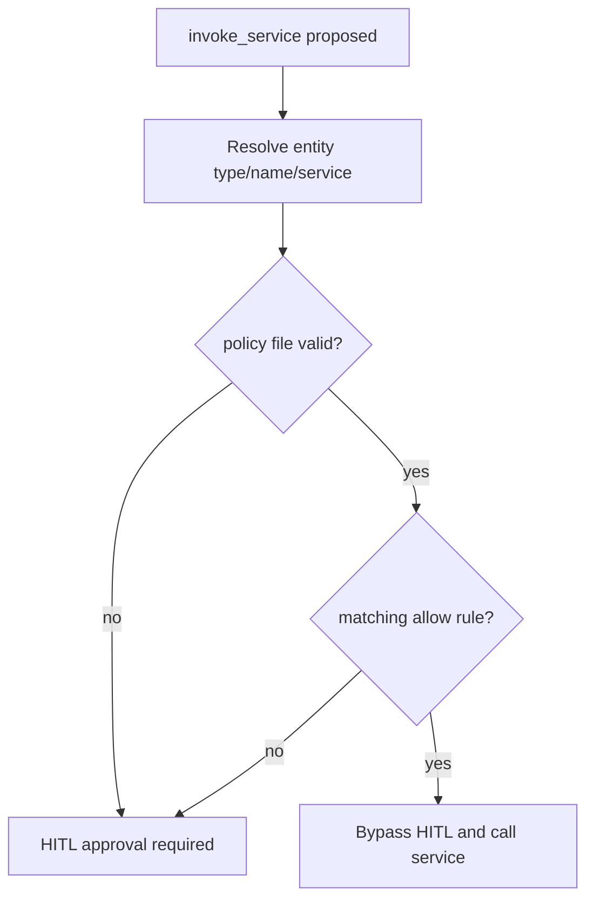

# Policies and HITL: controlling `invoke_service`

## Why this chapter exists

After students learn extended tools, they often try the generic built-in tool **`invoke_service`**. That is useful for exploration, but it also introduces the first visible governance boundary:

```text
Confirm service invocation
Approve / Cancel / Reject
```

A common question is:

> This service looks read-only. Why is Parler asking for approval?

The answer is important:

> Parler does not infer read-only safety from service names.

`GetFlattenNameDescription`, `GetDataTableEntries`, or any other `Get*` service may be harmless in one application and consequential in another. The name is not a contract. For the generic `invoke_service` tool, the default behavior is to require **Human-in-the-loop (HITL)** approval unless a policy file explicitly allows that concrete service call to bypass HITL.


---

## HITL in plain language

**HITL** means the runtime pauses before executing an action and asks a human to decide.

In Parler, this matters most for:

- generic **`invoke_service`** calls;
- property writes such as **`set_property_value`**;
- extended tools whose configuration says **`hitl: true`**.

The model can propose the action, but the runtime does not proceed until the user approves it.

This is different from a normal tool error. HITL is not saying the service is wrong. It is saying:

> The model proposed this call, and the runtime needs a human decision before executing it.

---

## Why `invoke_service` is strict by default

`invoke_service` is intentionally broad. It can call a ThingWorx service by entity type, entity name, service name, and parameters.

That broadness is useful, but it means Parler cannot safely decide from the name alone whether the service is only a read.

Examples:

| Service name | Why name alone is insufficient |
| --- | --- |
| `GetFlattenNameDescription` | It sounds read-only, but Parler does not know the implementation contract. |
| `GetDataTableEntries` | Usually read-like, but still needs an explicit allow rule if called through generic `invoke_service`. |
| `QueryDataTableEntries` | Same: common read path, but policy should say that explicitly. |
| `GetSomethingAndRefreshCache` | Starts with `Get`, but may mutate internal state. |

Training rule:

> If you want generic `invoke_service` to bypass HITL, write a policy rule. Do not rely on service-name guessing.

---

## The policy file

Path in the configuration repository:

```text
/policies/invoke_service.json
```

This file controls only the generic **`invoke_service`** tool. It does not control extended tools.

Minimal shape:

```json
{
  "version": 1,
  "rules": [
    {
      "id": "allow-common-datatable-reads",
      "priority": 100,
      "description": "Allow common DataTable read services through invoke_service.",
      "match": {
        "entityTypes": ["Thing"],
        "entityNames": ["*"],
        "serviceNames": ["GetDataTableEntries", "QueryDataTableEntries"]
      }
    }
  ]
}
```

Meaning:

- `entityTypes` matches the effective target type after Parler resolves the call.
- `entityNames` matches the concrete Thing name.
- `serviceNames` matches the concrete service name.
- `*` is a simple wildcard.
- Lower `priority` rules match first.

If the current `invoke_service` call matches one rule, Parler bypasses HITL for that call.

---

## Fail-closed behavior

The policy is **allow-only**.

| Situation | Runtime behavior |
| --- | --- |
| No `/policies/invoke_service.json` file | `invoke_service` requires HITL. |
| Invalid JSON | `invoke_service` requires HITL. |
| Unsupported `version` | `invoke_service` requires HITL. |
| Duplicate rule ids | `invoke_service` requires HITL. |
| No matching rule | `invoke_service` requires HITL. |
| Matching rule | `invoke_service` bypasses HITL for that concrete call. |

There is no deny rule and no `defaultAction`. Missing or broken policy never grants extra permission.

This is the right mental model:



---

## Extended tools are different

Extended tools are declared in:

```text
/tools/extended_tools.json
```

Each extended tool can carry its own HITL setting:

```json
{
  "name": "query_lab_readings",
  "title": "Query lab readings",
  "whenToUse": "Example: read-only query over a time window.",
  "target": {
    "entityName": "SCPA_Lab_helper",
    "serviceName": "GetReadings"
  },
  "hitl": false,
  "playbookSafe": true
}
```

The **`name`** / **`whenToUse`** fields are what the model sees. The **`target`** is what ThingWorx executes. Chapter **16** shows the full four-tool utilization manifest; this fragment illustrates **`hitl`** on a read-only extended tool using a **generic** example so pre-Ch16 chapters do not embed utilization tool names in JSON.

Important distinction:

| Path | HITL control |
| --- | --- |
| Generic `invoke_service` | `/policies/invoke_service.json` |
| Extended tool | That tool's `hitl` field |

Setting `hitl: false` on an extended tool does **not** allow the same service through generic `invoke_service`. If the model calls `invoke_service`, the policy file still decides whether HITL is required.

---

## Workshop exercise

Use the issue #3 scenario as a short live exercise.

Prompt shape:

```text
Using invoke_service, please call GetFlattenNameDescription on the thing SCPA_Demo_Agent.
```

Expected first behavior:

```text
Confirm service invocation
```


Then add a narrow policy rule:

```json
{
  "version": 1,
  "rules": [
    {
      "id": "allow-flatten-name-description",
      "priority": 100,
      "description": "Workshop demo: allow this known read-style service through invoke_service.",
      "match": {
        "entityTypes": ["Thing"],
        "entityNames": ["SCPA_Demo_Agent"],
        "serviceNames": ["GetFlattenNameDescription"]
      }
    }
  ]
}
```

Upload it to:

```text
/policies/invoke_service.json
```

Run:

```text
ValidateAgentConfigurationRepository
```

Then repeat the same prompt.

Expected second behavior:

- no approval dialog for the matched call;
- the service executes directly;
- unrelated services still require HITL.


```text
[SCREENSHOT: validation result showing invoke_service policy loaded]
```


```text
[SCREENSHOT: repeated invoke_service call bypassing HITL]
```

---

## How to choose policy rules

Use narrow rules for workshop demos.

Prefer:

```json
{
  "entityTypes": ["Thing"],
  "entityNames": ["SCPA_Utilization_helper"],
  "serviceNames": ["GetMachineListing"]
}
```

Avoid broad rules unless you are deliberately teaching why they are broad:

```json
{
  "entityTypes": ["Thing"],
  "entityNames": ["*"],
  "serviceNames": ["*"]
}
```

The second rule makes every Thing service invocation bypass HITL. That may be convenient in a throwaway lab, but it hides the concept students need to learn.

---

## What to inspect when it does not work

Checklist:

1. Is the file exactly at `/policies/invoke_service.json`?
2. Is the JSON valid?
3. Is `version` set to `1`?
4. Are `entityTypes`, `entityNames`, and `serviceNames` arrays present and non-empty?
5. Does the policy match the resolved target, not just the user's casual label?
6. Did you run `ValidateAgentConfigurationRepository`?
7. If you changed prompt-context files such as skills, playbooks, taxonomy prompt Markdown, or extended-tool registrations, did you run `RefreshPromptContextCache`? Policy edits alone do **not** require it; `/policies/invoke_service.json` is checked when the generic `invoke_service` HITL decision is made.
8. Is the call actually using generic `invoke_service`, or is it using an extended tool?

For live troubleshooting, collect logs and stream rows. In `AgentMessageStream`, inspect whether the assistant called `invoke_service` or a registered extended tool, and inspect the resolved `entityName` / `serviceName`.

---

## Product note from issue #3

The HITL card title is already tool-specific: for generic service calls it says **Confirm service invocation**. If a reject-comment placeholder still says **write**, treat that as UI copy that should be neutralized, for example:

```text
Why should this action not proceed?
```

That wording issue is separate from the policy behavior. Even after the copy is fixed, generic `invoke_service` should still require HITL unless `/policies/invoke_service.json` explicitly allows the call.

---

## Further reading

- Appendix **I** — syntax reference for extended tools and policies.
- Appendix **C** — configuration repository layout and validation behavior.
- Parler agent docs: `docs/agent/configuration-repository.md`.
