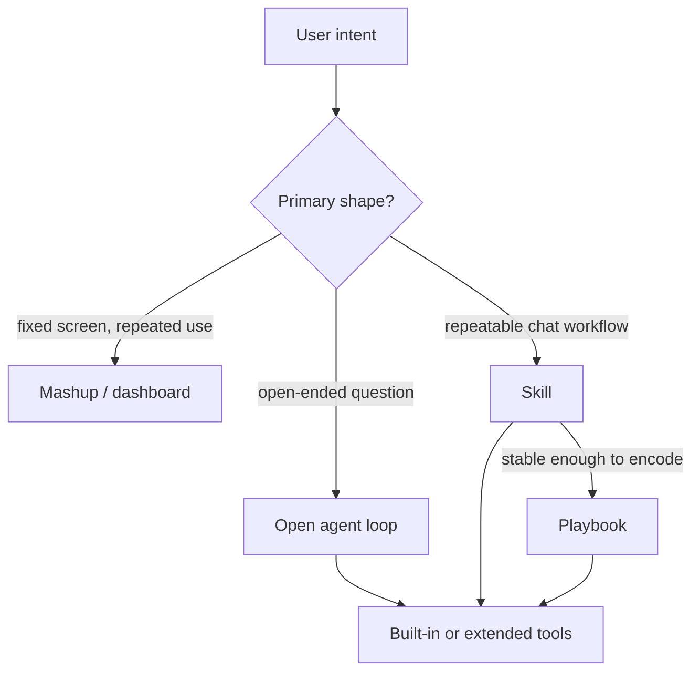

# Review: choosing the right layer

By the end of the workshop, you should be able to decide where an App-specific AI feature belongs. The usual choices are not "dashboard or agent" only. Parler gives you several layers, and each layer has a different cost model.

## 1. Mashup or dashboard

A dashboard has a high fixed build cost and very low marginal cost. It is the right layer when the App team knows the screen, the widgets, the interactions, and the refresh behavior in advance.

Use a dashboard when:

- the same users repeat the same workflow every day;
- the answer is naturally visual or interactive;
- the layout matters more than conversational flexibility;
- the data volume is large but the view shape is stable;
- users need low-latency interaction without paying an LLM cost each time.

For example, a utilization dashboard that operators check all day should normally remain a Mashup. The LLM should not re-create a fixed screen on every prompt.

## 2. Open agent loop

The open agent loop has a low setup cost and a non-zero per-question cost. It is best for long-tail questions that the
App team did not prebuild as screens.

Use the open agent loop when:

- the user is exploring;
- the question shape is not stable yet;
- the user may ask follow-up questions in unpredictable directions;
- the built-in tools already expose enough bounded evidence;
- occasional route differences between models are acceptable.

This explains the workshop "compare health status" story. One model may answer conservatively when it sees no explicit
`health` property. Another model may discover alert-history tools and build a better path. That is not a contradiction;
it is what an open agent loop does. It is flexible, but the route is model-dependent.

## 3. Skill

A skill is the first stabilization step. It keeps the conversational interface, but it tells the model how this App wants
the workflow to run.

Use a skill when:

- the App team has found a useful multi-turn route;
- the route still benefits from LLM judgment;
- the exact tools or evidence may vary by model, customer, or dataset;
- you want to teach the model the business meaning before freezing a graph.

The Day 2 asset-pair health skill comes from a repeated manual route:

1. resolve the two asset labels;
2. compare alert history;
3. compare current alert summary;
4. identify the highest alert-driving properties;
5. inspect recent trends;
6. write a grounded health comparison.

Without a skill, a model might stop at "no health property found." With a skill, the model knows that alert history,
alert summary, and trend evidence are the intended path.

## 4. Playbook

A playbook is a deterministic DAG in the chat channel. It is not a replacement for Mashup screens. It replaces the
unstable part of an open agent loop when a conversational workflow becomes stable.

Use a playbook when:

- the workflow has a known sequence or graph;
- the same evidence categories are needed every time;
- typed intermediate data should move between steps without relying on the model's memory;
- you want lower route variance and more predictable evidence compression;
- the final answer still benefits from natural-language explanation.

The playbook competes with "ask the LLM to plan every step again," not with a dashboard. A dashboard is still better for
fixed interactive screens. A playbook is better when the output is a grounded conversational diagnosis.

## 5. Tool and service design underneath

All three AI-facing layers depend on good tools. Built-ins cover common ThingWorx operations, but App-specific work often
needs extended tools that wrap services into LLM-friendly shapes.

Good tool design means:

- scalar inputs instead of arbitrary `INFOTABLE` construction;
- canonical Thing names or `THINGNAME` parameters so Parler can preflight labels;
- bounded samples, summaries, cache ids, and chart artifacts instead of raw giant tables;
- names and descriptions that describe the business question, not only the implementation service.

If the App already has a service that returns an answer-ready table or KPI, wrapping that service may be better than
forcing the LLM to reconstruct the same logic from low-level tools.

## 6. Decision table

| Situation | Best first layer |
|---|---|
| Operators need the same interactive view many times per shift | Mashup / dashboard |
| A user asks a one-off diagnostic question | Open agent loop |
| The same diagnostic route keeps working after several manual prompts | Skill |
| The route is stable and should pass typed evidence deterministically | Playbook |
| The App has a domain service with awkward inputs or too much output | Extended tool wrapper |
| The model cannot infer which property or KPI matters | Taxonomy / property role / richer descriptions |

## 7. Practical rule

Choose the channel first.

- If the user needs a screen, build a Mashup.
- If the user needs exploratory conversation, start with the agent.
- If the same conversation path repeats, write a skill.
- If the skill's route is stable, promote it to a playbook.
- If the evidence is App-specific, wrap the App service or enrich the semantic configuration.

This is why future Parler work should not default back to "reduce tool count" every time a model has a bad route. After
the current tool-surface cleanup, the bigger leverage is App semantics: property roles, KPI meanings, query routes,
LLM-friendly service wrappers, and playbooks for stable conversational workflows.
