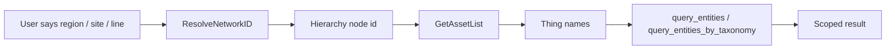

# Entity Hierarchy

This appendix explains how Parler uses a ThingWorx hierarchy when the user asks questions such as:

```text
How many stacking robots are in USA?
Compare contactors in MUC and ORD.
Show assets with issues under the AC site.
```

Hierarchy is separate from taxonomy.

| Track | Question it answers | Typical source |
|-------|---------------------|----------------|
| Taxonomy | What kind of asset is this? | `identity-types.json`, `asset-types.json`, ThingTemplate / ThingShape |
| Hierarchy | Where is this asset in the business tree? | ThingWorx Network, parent / child nodes, site / line / region model |

A common workflow is:

1. Resolve the asset type or entity type through taxonomy.
2. Resolve the hierarchy node named by the user.
3. Expand that node to a bounded list of asset Thing names.
4. Run the normal entity query inside that explicit scope.

Host Context can tell the model what the current mashup page has selected, but it does not secretly scope tools. The model still needs to pass explicit tool parameters such as `hierarchyNodeId`, `hierarchyNodeName`, or `intersectThingNames`.

---

## 1. Mental Model

Parler treats hierarchy as a resolve-and-expand problem.



The hierarchy node is not the same as an asset Thing.

- A hierarchy node is a place in the tree: region, site, line, area, cell, or another app-specific grouping.
- An asset Thing is the concrete entity that tools can inspect, count, list, or compare.
- `GetAssetList` is the bridge from a hierarchy node to concrete asset Things.

---

## 2. Five Services

On `AIAgent`, Parler exposes five hierarchy-related services that an app developer can override for the application's actual hierarchy model.

| Service | Purpose |
|---------|---------|
| `GetRootNode` | Return the root node for the effective hierarchy. |
| `GetFlattenNameDescription` | Return a flattened lookup table of hierarchy nodes. |
| `ResolveNetworkID` | Resolve a user-facing node label into a hierarchy node id. |
| `GetChildNodes` | Return direct child hierarchy nodes under a node id. |
| `GetAssetList` | Return concrete asset Things under a node id subtree. |

The default implementation is only a scaffold. A real customer app usually needs overrides because hierarchy labels, Network names, display properties, and relationship rules differ from app to app.

Chapter [9 - Hierarchy: five network services on `AgentThing`](./09-hierarchy-five-services.md) walks through an SCPA implementation example.

---

## 3. Expected Service Shapes

### `GetRootNode`

Returns zero or one row with:

| Field | Meaning |
|-------|---------|
| `id` | Stable hierarchy node id, often the node Thing name |
| `name` | Human-readable hierarchy label |

### `GetFlattenNameDescription`

Returns a bounded flattened list of hierarchy nodes. This is the material used by the default resolver.

Expected row shape:

| Field | Meaning |
|-------|---------|
| `id` | Stable hierarchy node id |
| `name` | Display label used for matching user text |

### `ResolveNetworkID(name)`

Takes a user-facing label or fragment and returns zero, one, or multiple matching hierarchy nodes.

Important behavior:

- zero rows means no visible matching hierarchy node;
- multiple rows means ambiguous hierarchy node;
- one row gives the canonical `id` and `name`;
- customer overrides may support aliases, fuzzy matching, or external master data.

### `GetChildNodes(id)`

Returns direct child hierarchy nodes under a node id. This is useful for browsing, diagnostics, and future UI / agent workflows.

### `GetAssetList(id)`

Returns the business asset Things under the node's subtree.

Expected row shape is ThingWorx `EntityList` style:

| Field | Meaning |
|-------|---------|
| `name` | Asset Thing name |
| `description` | Short display text, may be empty |

`GetAssetList` must not silently truncate. If an app has a very large hierarchy, the override should make that behavior explicit through a stable error, paging model, or a documented cap.

---

## 4. Tool Scoping

The first-party list tools support explicit scoping through hierarchy and intersection parameters.

The most common path is:

```json
{
  "thingShape": "PTCTDD.CellfabDataset.StackingRobot_TS",
  "hierarchyNodeName": "USA"
}
```

The tool resolves `hierarchyNodeName` through `ResolveNetworkID`, expands it through `GetAssetList`, and then intersects the entity query with the returned Thing names.

When the caller already has a hierarchy node id from the mashup page, use the direct-id path:

```json
{
  "thingShape": "PTCTDD.CellfabDataset.StackingRobot_TS",
  "hierarchyNodeId": "SE.CellFab.Model.Region.USA"
}
```

The tool skips `ResolveNetworkID`, calls `GetAssetList(hierarchyNodeId)`, and then intersects the entity query with the returned Thing names.

When the caller already has a concrete bounded list of Thing names, it can pass:

```json
{
  "thingShape": "PTCTDD.CellfabDataset.StackingRobot_TS",
  "intersectThingNames": [
    "SE.CellFab.Model.Workunit.ORD-StackingRobot-01",
    "SE.CellFab.Model.Workunit.ORD-StackingRobot-02"
  ]
}
```

Use `hierarchyNodeName` when the user named a region, site, line, or other hierarchy label. Use `hierarchyNodeId` when Host Context or another trusted page/service path already provides the system node id. Use `intersectThingNames` when an earlier step already produced the exact asset list.

---

## 5. Host Context Boundary

Host Context v2 uses:

```json
{
  "key": "asset_monitoring.query_scope",
  "context": {
    "page": "Asset Monitoring",
    "queryParameters": {
      "networkName": "PTCTDD.Cellfab.AssociationNetwork_NW",
      "selectedNetworkNode": "SE.CellFab.Model.Site.MUC-CellFab"
    }
  }
}
```

The agent renders this through a registered `host-contexts/*.json` template in the configuration repository (or, on **0.1.206+**, generic fallback when the key is unregistered) and inserts the result as prompt guidance.

It does not:

- inject `intersectThingNames` automatically;
- call `ResolveNetworkID` automatically;
- treat page scope as a permission boundary;
- replace user text.

If the rendered Host Context says the page is currently scoped to MUC by a system id such as `SE.CellFab.Model.Site.MUC-CellFab`, the model should call a tool with `hierarchyNodeId: "SE.CellFab.Model.Site.MUC-CellFab"`. If the user typed a label such as `MUC`, the model can use `hierarchyNodeName: "MUC"` and let the resolver map the label to a node id. Either way, the tool call must still contain the explicit parameter.

For Host Context syntax, see chapter [19 — embed Parler in a mashup](./19-embed-parler-in-mashup.md).

---

## 6. Error Semantics

Hierarchy scope must fail visibly when it was explicitly requested and cannot be resolved.

| Situation | Expected behavior |
|-----------|-------------------|
| `ResolveNetworkID` returns zero rows | Return a not-found style hierarchy error; do not silently run a global query. |
| `ResolveNetworkID` returns multiple rows | Ask for disambiguation or return an ambiguity error. |
| `GetAssetList` returns zero usable asset Things | Return an explicit scoped-empty result; do not silently run unscoped. |
| `GetAssetList` returns too many Things for the tool cap | Return a stable list-too-large error or require a narrower scope. |

This is important for trust. If the user asks for assets under a site and the site cannot be resolved, a global answer would look plausible but be wrong.

Permission and not-found cases are intentionally similar at the user level. ThingWorx visibility-aware APIs may not always let the app cleanly distinguish "does not exist" from "not visible to this user," and Parler should not leak that distinction through product behavior.

---

## 7. Truncation and Counts

Scoped entity queries are the intersection of two bounded sets:

- the query result set, such as all Stacking Robots;
- the hierarchy expand set, such as all asset Things under USA.

Useful result metadata includes:

| Field | Meaning |
|-------|---------|
| `preIntersectMatchCount` | Count before hierarchy intersection |
| `intersectedRowCount` | Count after hierarchy intersection |
| `queryHasMore` | Query side may have more rows behind the returned page |
| `expandHasMore` | Hierarchy expand side may have more rows behind the returned page |
| `hasMore` | `queryHasMore OR expandHasMore` |

For training, the practical rule is simple: if either side says there is more data, do not overstate completeness.

---

## 8. Developer Checklist

When enabling hierarchy for a new app:

| Check | Done when |
|-------|-----------|
| Root node | `GetRootNode` returns the intended root for the app context. |
| Flattened nodes | `GetFlattenNameDescription` returns visible labels users actually say. |
| Resolver | `ResolveNetworkID("USA")` / site / line labels return the expected node. |
| Child browsing | `GetChildNodes(id)` returns direct children only. |
| Asset expansion | `GetAssetList(id)` returns concrete asset Thing names under the subtree. |
| Tool scope | Prompts using a typed region/site label produce `hierarchyNodeName`; prompts using page-selected node ids produce `hierarchyNodeId`; exact bounded lists use `intersectThingNames`. |
| Host Context | Page-selected hierarchy is rendered as guidance, not hidden server injection. |

---

## 9. Common Mistakes

- Treating an asset type such as "Stacking Robot" as a hierarchy node.
- Treating a hierarchy node such as "USA" as an asset Thing.
- Returning child nodes from `GetAssetList`; that service should return asset Things.
- Returning asset Things from `GetChildNodes`; that service should return hierarchy nodes.
- Letting a failed hierarchy resolve fall back to a global unscoped query.
- Expecting Host Context to auto-scope tools without explicit tool arguments.
- Silently truncating `GetAssetList` without telling the agent.

---

## 10. Relationship to Other Chapters

- Chapter [7](./07-taxonomy-identity-types.md) and [8](./08-taxonomy-asset-types.md): how the agent understands asset identity and type.
- Chapter [9](./09-hierarchy-five-services.md): how to implement the five hierarchy services in SCPA.
- Chapter [10](./10-built-in-tools-alerts.md): examples of scoped and unscoped built-in tools.
- Chapter [19](./19-embed-parler-in-mashup.md): embed Parler in a mashup and send current page context to the agent (Host Context).
