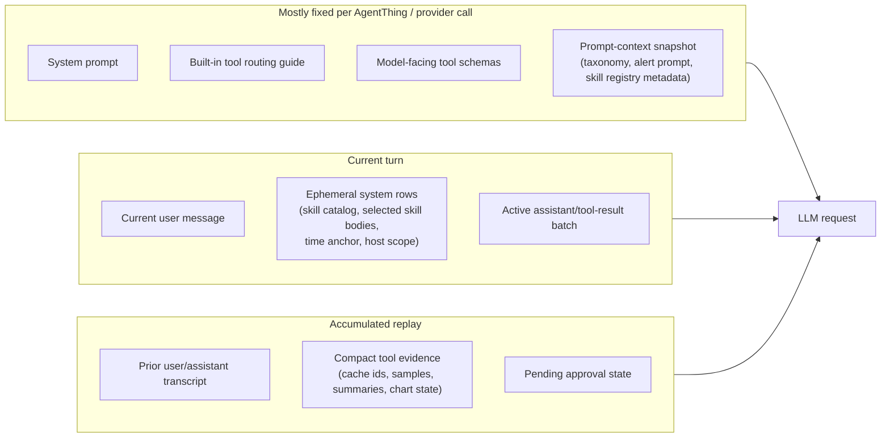
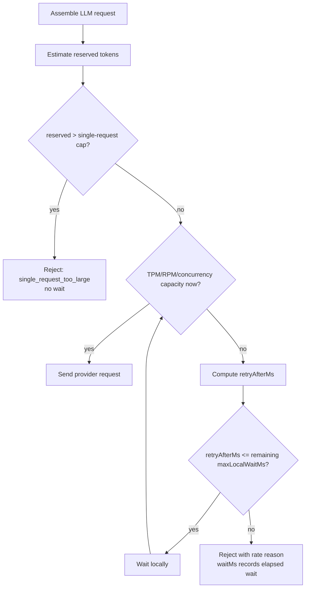
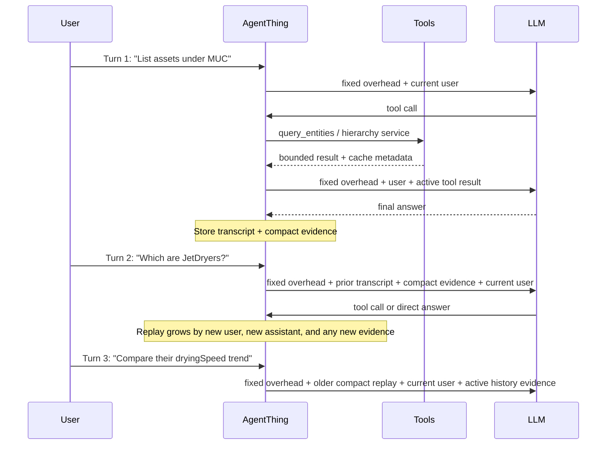
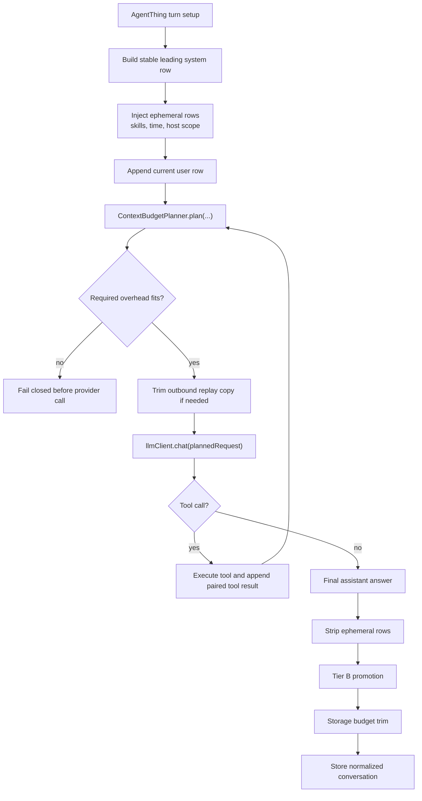
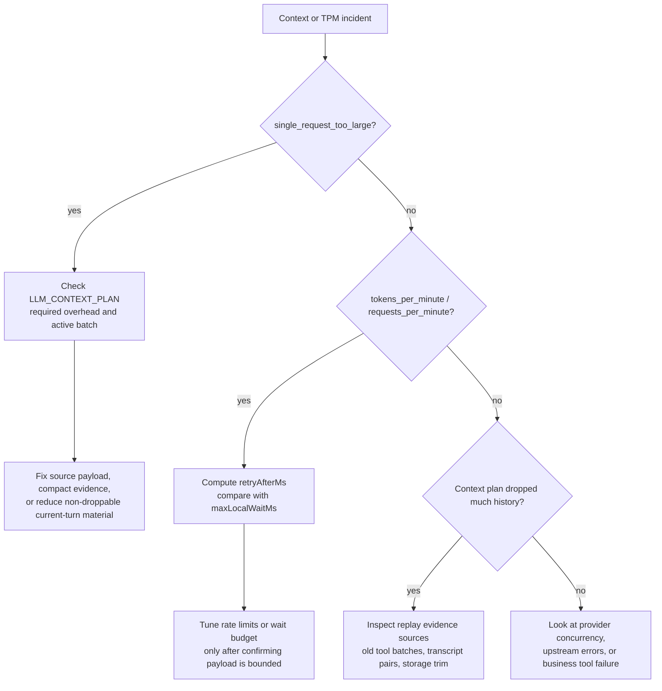

# Appendix: Context and compaction

This appendix is for internal Parler developers. It explains what enters the LLM context, why the same
conversation behaves differently under different TPM settings, how multi-turn replay grows, how local rate-control
decides whether to wait, and where Parler compacts or trims context.

The central model is simple:

```text
one LLM request = fixed overhead + current-turn overhead + replay/history
```

TPM does not change where context comes from. TPM changes whether the estimated request can be admitted now, after a
local wait, or not at all.

## Context sources

Parler has several context lanes. Some are effectively fixed for a deployed AgentThing. Others are dynamic and grow as
the conversation proceeds.



| Source | Fixed or dynamic | Notes |
|--------|------------------|-------|
| Agent system prompt | Fixed until configuration changes | First and most important system row. Per-call overrides replace only the first segment. |
| Built-in tool routing guide | Fixed when enabled | Helps the model choose bounded tools instead of generic service calls. |
| Model-facing tool definitions | Fixed for a given runtime snapshot | Includes built-ins, optional playbook tool, and extended tools not marked executor-only. After the 23-tool freeze, treat this as planned overhead, not the first lever for future TPM issues. |
| Prompt-context snapshot | Mostly fixed | Includes stable runtime material such as taxonomy markdown, GenericThing template catalog, alert prompt, and skill registry metadata. It changes when the AgentThing refreshes configuration. |
| Current user message | Dynamic per turn | Never dropped by planner trimming. A very large prompt can consume the request by itself. |
| Ephemeral system rows | Dynamic per turn | Includes time anchor, host-scope metadata, skill catalog, and selected `/Skill` bodies. These are stripped before conversation storage. |
| Active tool-call batch | Dynamic inside a turn | The current assistant tool call and matching tool results must stay paired and contiguous for the next LLM call. |
| Prior transcript | Grows by turn | Old user/final assistant messages are retained until storage or planner budgets force older pairs out. |
| Tool evidence replay | Grows with tool use | Healthy tools store cache ids, samples, row counts, compact chart state, and summaries. Large raw payloads are the main danger. |
| UI data and audit streams | Usually outside LLM context | Full tables, chart payloads, FileRepository exports, application logs, and AgentMessageStream audit rows should not automatically re-enter the model. |

## TPM changes the failure mode

The same request can be fine with a high-TPM provider and fail with a low-TPM provider. The context components are the
same; the admission budget is different.

For each provider call, Parler estimates the token reservation before sending the HTTP request:

```text
estimated input tokens = estimate(assembled request)
reserved tokens = ceil((estimated input tokens + optional output reserve) * estimateSafetyMultiplier)
```

Whether the output reserve is included depends on the provider's `tokenReserveStrategy`. The safety multiplier defaults
to a conservative value so local admission does not routinely undercount provider-side tokenization.

The provider gate then checks four local constraints:

| Constraint | Typical rejection reason | What it means |
|------------|--------------------------|---------------|
| Single-request cap | `single_request_too_large` | The request is larger than the configured per-request maximum. Waiting cannot fix this request. |
| TPM bucket | `tokens_per_minute` | The request can fit in principle, but the provider bucket needs time to refill. |
| RPM bucket | `requests_per_minute` | Request count capacity is temporarily exhausted. |
| Concurrency | `concurrency` | Too many in-flight calls are using the same provider. |

The single-request cap is checked first. If `maxSingleRequestTokens` is zero, the effective single-request cap is usually
the TPM limit when TPM enforcement is enabled. With a 50,000 TPM provider, a request reserving 72,754 tokens cannot be
fixed by waiting; it is rejected immediately as `single_request_too_large`.

## Wait calculation

For TPM admission, the provider has a token bucket:

```text
bucket capacity = tokensPerMinuteLimit
refill rate = tokensPerMinuteLimit / 60000 tokens per millisecond
```

If a request needs more tokens than the bucket currently has, Parler computes the deficit and the earliest local retry
time.

```text
deficit = reservedTokens - currentTokenBucket
retryAfterMs = ceil(deficit / (tokensPerMinuteLimit / 60000))
```

Example with a 50,000 TPM provider:

```text
refill rate = 50000 / 60000 = 0.833 tokens/ms
current bucket = 20000 tokens
reserved request = 35000 tokens
deficit = 15000 tokens
retryAfterMs ~= 15000 / 0.833 = 18000 ms
```

If `retryAfterMs` fits within the provider's `maxLocalWaitMs`, Parler waits and then sends the request. If the required
wait exceeds the local wait budget, Parler rejects locally. The UI may receive a live `rate_control.status` event while
the request is waiting and a matching resumed event after admission or rejection.



## Multi-turn growth

A conversation does not replay only the latest question. Each LLM call includes enough previous transcript and evidence
for the model to answer follow-ups.



Healthy growth is sublinear with respect to raw data size. For example, a table query can cache tens of thousands of
rows but replay only a cache id, row count, column metadata, and a small sample. A chart can persist enough state to
restore the full series in the UI without re-sending every point back through the LLM.

Unhealthy growth happens when a tool returns raw pages directly into the model loop. If a model fetches three pages of a
cached result and each page contributes tens of thousands of characters, the replay can jump from a few thousand
characters to nearly a hundred thousand characters before the next provider call. At low TPM, that can turn into a
`single_request_too_large` rejection.

## Compaction methods

Parler compaction is deterministic. It does not ask another LLM to summarize history in the background.

| Method | When it runs | What it does |
|--------|--------------|--------------|
| Tier A matrix sealing | After completed tabular tool-result batches | Converts bulky tabular evidence into compact, replayable matrix metadata where possible. |
| Tier 0 cohort merge | Around compatible evidence groups | Merges related compact evidence when semantics allow it. |
| Tier B replay promotion | After a successful turn, before storage | Promotes old tool evidence into compact replay form. It is shrink-only and skips unsafe pending-approval states. |
| Entity metadata summary | When entity metadata evidence is stamped for replay | Keeps schema-relevant facts without replaying giant entity JSON. |
| Planner drop-only trimming | Immediately before every provider call | Builds an outbound request copy, drops old evidence first, then old transcript pairs if needed. It does not mutate stored conversation state. |
| Storage budget trimming | After a successful turn, before `_conversations.put` | Mutates the stored normalized conversation only when storage budget requires it. |
| Compact evidence rehydrate | On reload/replay | Restores accepted compact evidence as assistant prose or structured compact state, not as raw orphaned tool rows. |

The most important execution point is the planner, because it runs right before every provider call:



Planner budgeting is based on character budgets plus provider token limits. Conceptually:

```text
effectiveRequestCapChars =
  min(providerInputTokenLimit * 3.5,
      llmContextMaxChars,
      providerRateSingleRequestInputCapChars)

historyBudgetChars =
  effectiveRequestCapChars
  - stableSystemChars
  - toolSchemaChars
  - ephemeralSystemChars
  - currentUserChars
  - activeBatchReserveChars
```

If `historyBudgetChars` is positive, Parler keeps as much old replay as fits. If it is negative, Parler clamps retained
history to zero and asks whether the required overhead still fits. If the required overhead alone exceeds the cap, Parler
fails before calling the provider.

## What compaction preserves

Compaction is not allowed to break provider protocol rules or business semantics.

- The stable system row is never dropped.
- The current user message is never dropped.
- The active assistant tool-call batch and its matching tool results are kept together and in order, or the whole batch
  is excluded where the protocol allows exclusion.
- Tool results are never left orphaned without their assistant tool-call row.
- Pending human-in-the-loop approval state defers storage normalization that could make approval replay ambiguous.
- Compact evidence must preserve enough facts for follow-up prompts to remain grounded.

These constraints explain why compaction sometimes appears conservative. A smaller request is useless if it violates the
LLM provider's tool-call transcript rules or changes the meaning of a pending workflow.

## When compact cannot save the turn

Compaction is essential, but it is not magic. The request can still fail in several cases.

1. **Fixed overhead alone is too large.** If system prompt, tool schemas, prompt-context snapshot, ephemeral rows, current
   user text, and the active batch exceed the effective cap, there is no old history left to drop.
2. **The request exceeds the single-request cap.** `single_request_too_large` means waiting will not help this assembled
   request. The next fix is to reduce non-droppable input or change the tool/data path.
3. **The active tool result is huge.** The current tool result must often be shown to the model in the next round before
   post-turn compaction can run. Tools must therefore emit bounded evidence at source.
4. **The user prompt or selected skill body is huge.** Current-turn content is not trimmed as casually as old history.
5. **Provider capacity is temporarily exhausted.** For `tokens_per_minute`, `requests_per_minute`, or `concurrency`,
   compaction can reduce the requested reservation, but it cannot create capacity instantly if the configured local wait
   budget is too small.
6. **A loop keeps generating new large evidence.** If the model repeatedly asks for raw pages, every new page becomes
   current-turn evidence until the loop stops or the tool refuses that access pattern.
7. **The tool bypasses the cache-and-sample contract.** Large tables, long histories, and broad entity sets must return
   cache ids, samples, summaries, or chart state. Returning raw data directly to the LLM reintroduces the original
   context problem.
8. **The user asks for full raw data in prose.** The product should steer to export, table UI, chart UI, or a bounded
   summary instead of trying to fit the full dataset into an answer.

## Reading the logs

When diagnosing context or TPM failures, start with these log families:

| Log marker | What to inspect |
|------------|-----------------|
| `LLM_CONTEXT_PLAN` | `stableChars`, `toolSchemaChars`, `ephemeralChars`, `currentUserChars`, `activeBatchReserveChars`, `transcriptChars`, `evidenceRawChars`, `evidenceChars`, dropped counts, configured and effective caps. |
| `LLM_CONTEXT_PLAN_FAIL` | Whether the failure was required overhead or inability to fit after trimming. |
| `LLM_USAGE` | Prompt token usage plus replay size fields such as raw replay, compact replay, and compaction ratio. |
| `LLM_RATE_ADMISSION` | Whether the provider gate waited and how many tokens were reserved. |
| `LLM_RATE_REJECTION` | `single_request_too_large` versus waitable TPM/RPM/concurrency causes. |
| `CONVERSATIONS_STORAGE_TRIM` | Whether stored replay was trimmed after the turn. |

Use the markers in this order:



The practical rule for future incidents is: first identify whether the failing bytes are fixed overhead, current-turn
payload, active tool evidence, or old replay. Only old replay is easy for compaction to remove. Current-turn and active
tool evidence must be bounded by tool design.
