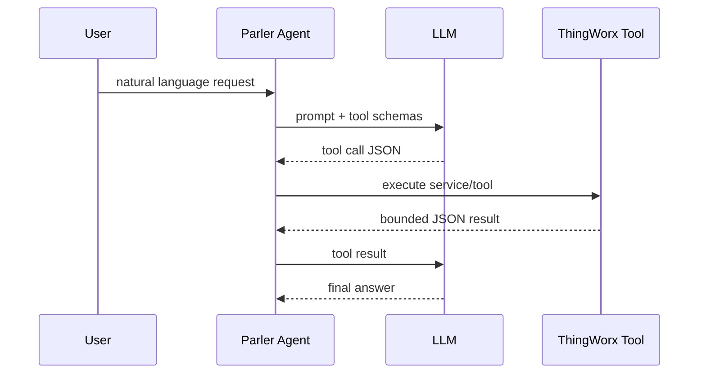
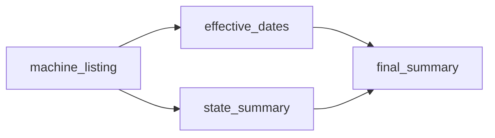

# Appendix: AI agent concepts

This appendix gives ThingWorx developers the vocabulary used in the workshop. It is intentionally short; the goal is to
make later chapters readable, not to teach machine learning theory.

## LLM

A **large language model** produces text and tool calls from the context it receives. It does not read ThingWorx by
itself. Parler gives it bounded tool definitions and then executes approved tool calls on the ThingWorx server.

## Prompt and context

The **prompt** is the full request sent to the model. In Parler, it includes:

- system instructions;
- model-facing tool schemas;
- selected repository configuration such as taxonomy and skill catalog metadata;
- current user message;
- replayed conversation history and compact evidence.

The model does not see every row in a large ThingWorx table. Good tools return bounded samples, summaries, cache ids, or
charts.

## Tool, tool call, and tool result

A **tool** is a callable operation exposed to the model. A **tool call** is the model's request to run that operation. A
**tool result** is the JSON returned to the model after Parler executes the call.

## Tool schema

A **tool schema** is the argument contract the model sees. If a schema asks the model to build a complex `INFOTABLE`, the
model will often fail. Prefer scalar arguments, canonical Thing names, enums, bounded arrays, and clear date ranges.

## Model-facing vs executor-only

**Model-facing** tools are advertised to the LLM. **Executor-only** tools can still run for compatibility, replay,
orchestration, or internal flows, but the LLM does not see them by default.

At the current workshop baseline, Parler intentionally keeps legacy discovery names out of the default model-facing
surface. The exact version changes over time, but the design point is stable: old names may remain executable for
compatibility, replay, or orchestration while the model sees the smaller, current tool surface.

## Evidence

**Evidence** is data returned by tools: rows, counts, cache ids, chart payloads, summaries, and diagnostics. A trustworthy
answer should be grounded in evidence, not in memory or plausible prose.

## Cache id

A **cache id** is an opaque handle for a server-side tabular result. It lets later tools transform, summarize, chart, or
page the same data without replaying the full table into the model context.

## Skill

A **skill** is repository-backed Markdown guidance. It tells the model when and how to use existing tools for a business
task. The model still chooses each tool call.

## Playbook and DAG

A **playbook** is a registered workflow where the runtime executes a directed acyclic graph.

A **DAG** is a graph of steps where edges point from prerequisites to dependent steps and no step can loop back to itself.

In a playbook, Parler can pass typed evidence from node to node. The LLM mainly writes the final explanation.

For a longer comparison with industry *planner* / agent terminology (and why skills resemble planners more than
playbooks do), see [Appendix N: Playbooks, skills, and planners](./N-playbook-planner-and-skill.md).

## HITL

**Human-in-the-loop** means a user must approve a potentially sensitive or mutating action before Parler executes it.
Read-only workshop tools normally avoid HITL unless a policy or service shape requires it.

## Context compacting

**Compacting** keeps conversation replay useful without sending raw payloads back to the model. It cannot fix a huge
current prompt or a huge active tool result; tools must bound their evidence at source.

## TPM and rate limits

**TPM** means tokens per minute. A provider can reject or delay a request when the estimated token reservation is too
large. Waiting can help a temporary TPM shortage. Waiting cannot help `single_request_too_large`.
