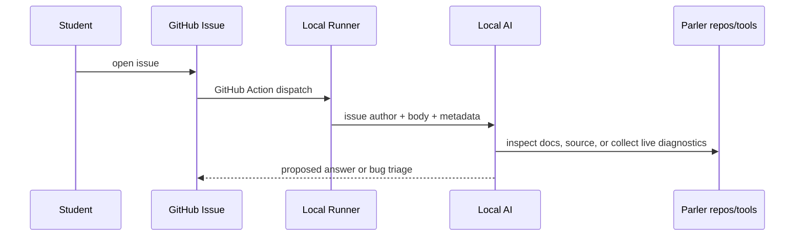

# Appendix: Workshop support workflow

The workshop will use a separate `parler-workshop` repository for participant issues, examples, and support automation.

## Repository purpose

`parler-workshop` should hold:

- starter files;
- exercise checklists;
- participant issues;
- links to the current `ParlerGuidance` book;
- GitHub Actions that route issues to local AI support.

## Issue-driven support

Planned support loop:



## Runtime diagnostics

When a student reports a live chat problem, support may use the Parler collection tool to fetch:

- ApplicationLog rows;
- AgentMessageStream rows;
- AgentThing runtime/configuration snapshot.

Maintainer note: the collection command is `parler-collect-live`, documented in the **parler** monorepo under
`docs/agent/collection-tool.md` and `docs/agent/live-diagnostics.md`.

The student may provide:

```text
DEV_SERVER=...
DEV_KEY=...
```

Do not commit these values. Treat them as sensitive internal diagnostics inputs.

## Expected outcomes

| Issue type | AI support action |
|------------|-------------------|
| workshop material confusion | inspect `ParlerGuidance` and answer |
| Parler behavior question | inspect `parler` source and docs |
| live prompt failure | collect logs/stream/status, then analyze |
| confirmed product bug | create or update a `parler` implementation task |

## Instructor rule

The AI answer is a support accelerator, not a substitute for instructor judgment. If the diagnosis implies a product bug
or a risky workaround, review it before asking students to change their environment.
