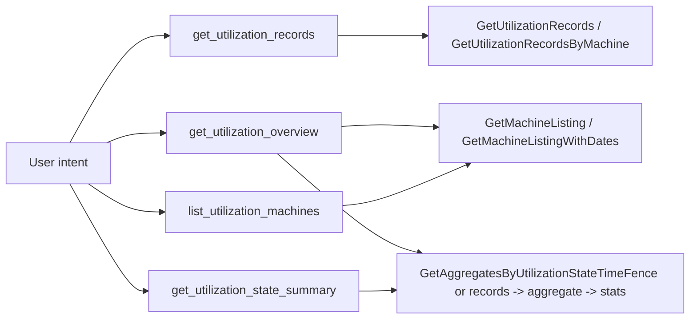

# Utilization LLM-friendly tools — maintainer implementation notes

> **Upload target:** Chapter **16** owns the **final four-tool** `extended_tools.json` narrative and manifest. Canonical JSON lives in the **`parler`** tree at **`dev_data/scpa_utilization/tools/extended_tools.json`**. This appendix is **maintainer-only** — helper-service rationale, parameter contracts, and Composer JavaScript sketches. Do not treat it as a second upload snippet.

This appendix complements the Chapter **16** design discussion with concrete wrapper-service implementation notes for maintainers.

The context is the SCPA utilization application. The existing application surface has seven ThingWorx services. That is a reasonable mashup/service-composition surface, but it is not the best surface for an LLM. A more LLM-friendly design exposes business operations with simple scalar inputs and answer-ready results.

The recommendation for the workshop is:

- Prefer **four** LLM-facing tools for teaching and production clarity (Chapter **16** manifest).
- Keep the original seven application services as internal implementation details.

The JavaScript snippets below are **maintainer Composer sketches**. They follow ThingWorx JavaScript conventions and the SCPA service names used in the workshop. Validate each service in Composer before registering tools from the Chapter **16** manifest.

## Design rule

Do not expose a mashup-oriented service shape just because it exists.

Expose a tool only when the model can fill its inputs naturally:

- `DATETIME` range: `StartDate` + `EndDate`
- optional shift: `ShiftID`
- one machine: `Machine` as `THINGNAME`
- booleans and numeric limits
- strings with small documented enums

Avoid asking the model to construct these inputs:

- `INFOTABLE` selection tables
- `RootEntityList`
- aggregate tables
- intermediate records tables
- empty arrays that mean either "all" or "none"

When a lower-level application service needs an `INFOTABLE`, build that table inside the wrapper service or call the existing helper service that already builds it.

## Existing seven-service inventory

| Existing service | Current role |
| --- | --- |
| `GetMachineListing` | List utilization-capable machines. |
| `GetMachineListingWithDates` | List utilization-capable machines plus effective start/end dates for a time window. |
| `GetUtilizationRecords` | Raw utilization records for all utilization-capable machines in a time window. |
| `GetUtilizationRecordsByMachine` | Raw utilization records for one machine in a time window. |
| `GetAggregatesByUtilizationState` | Aggregate an input utilization-record table by utilization state. |
| `GetStatsForAggregateData` | Compute headline statistics from an aggregate table. |
| `GetAggregatesByUtilizationStateTimeFence` | Aggregate utilization by state directly from a time window. |

The four-tool design groups these services by user intent:



## Recommended four-tool surface

Use the existing helper Thing `SCPA_Utilization_helper`. Do **not** create a second Thing only for the LLM-facing wrapper surface. Register the four tools from the Chapter **16** manifest (or the canonical **`parler`** `dev_data/scpa_utilization/tools/extended_tools.json` copy) through `/tools/extended_tools.json`.

### 1. `list_utilization_machines`

Use when the user asks which machines are available for utilization reporting, or asks for machine coverage before a utilization analysis.

Suggested ThingWorx service:

```text
Thing: SCPA_Utilization_helper
Service: ListUtilizationMachines
Result baseType: JSON
```

Input parameters:

| Name | Base type | Required | Notes |
| --- | --- | --- | --- |
| `StartDate` | `DATETIME` | no | Include only when `IncludeEffectiveDates=true`; paired with `EndDate`. |
| `EndDate` | `DATETIME` | no | Include only when `IncludeEffectiveDates=true`; paired with `StartDate`. |
| `ShiftID` | `STRING` | no | Optional concrete shift scope. Empty string, `All`, `any`, or `*` means no shift filter. |
| `IncludeEffectiveDates` | `BOOLEAN` | no | When true, use the date-aware listing route. |
| `MaxItems` | `INTEGER` | no | Bounded display limit. Wrapper clamps it. |

Result contract:

```json
{
  "status": "success",
  "machineCount": 172,
  "returnedRows": 50,
  "truncated": true,
  "includeEffectiveDates": true,
  "rows": [
    {
      "machineName": "SE.CellFab.Model.Workunit.ORD-JetDryer-01",
      "displayName": "ORD JetDryer 01",
      "description": "Buerkle Jet Drying Tunnel Aachen 01 Workunit",
      "effectiveStartDate": "2026-06-01T00:00:00.000Z",
      "effectiveEndDate": null
    }
  ]
}
```

### 2. `get_utilization_records`

Use when the user asks for raw utilization events.

Suggested ThingWorx service:

```text
Thing: SCPA_Utilization_helper
Service: GetUtilizationRecords
Result baseType: JSON
```

Input parameters:

| Name | Base type | Required | Notes |
| --- | --- | --- | --- |
| `StartDate` | `DATETIME` | yes | Natural-time resolver can map `relativeDuration` / `calendarPhrase` to this pair. |
| `EndDate` | `DATETIME` | yes | End of the closed-open query window. |
| `ShiftID` | `STRING` | no | Optional concrete shift scope. Empty string, `All`, `any`, or `*` means no shift filter. |
| `Machine` | `THINGNAME` | no | Empty means all machines; when present, query one canonical machine. |
| `Limit` | `INTEGER` | no | Page size; wrapper clamps it. |
| `Offset` | `INTEGER` | no | Zero-based offset. |

Result contract:

```json
{
  "status": "success",
  "scope": "machine",
  "machine": "SE.CellFab.Model.Workunit.ORD-JetDryer-01",
  "startDate": "2026-06-29T00:00:00.000Z",
  "endDate": "2026-06-30T00:00:00.000Z",
  "totalRows": 85,
  "returnedRows": 50,
  "hasMore": true,
  "rows": [
    {
      "equipmentId": "SE.CellFab.Model.Workunit.ORD-JetDryer-01",
      "equipmentDescription": "Buerkle Jet Drying Tunnel Aachen 01 Workunit",
      "eventStart": "2026-06-29T13:20:10.000Z",
      "utilizationState": "Running",
      "reasonGroup": "Running",
      "reason": "Good Production",
      "shiftId": "A",
      "durationSeconds": 69.74
    }
  ]
}
```

### 3. `get_utilization_state_summary`

Use when the user asks for utilization grouped by state, percentage of time by state, counts, min/max/average duration, uptime/downtime by state, or similar aggregate questions.

Suggested ThingWorx service:

```text
Thing: SCPA_Utilization_helper
Service: GetUtilizationStateSummary
Result baseType: JSON
```

Input parameters:

| Name | Base type | Required | Notes |
| --- | --- | --- | --- |
| `StartDate` | `DATETIME` | yes | Start of query window. |
| `EndDate` | `DATETIME` | yes | End of query window. |
| `ShiftID` | `STRING` | no | Optional concrete shift scope. Empty string, `All`, `any`, or `*` means no shift filter. |
| `Machine` | `THINGNAME` | no | Empty means all machines; present means one machine. |
| `IncludeStats` | `BOOLEAN` | no | Include one-row overall statistics when available. |

Result contract:

```json
{
  "status": "success",
  "scope": "all",
  "startDate": "2026-06-29T00:00:00.000Z",
  "endDate": "2026-06-30T00:00:00.000Z",
  "rows": [
    {
      "utilizationState": "Running",
      "percentage": 36.21,
      "count": 472,
      "sumDurationSeconds": 312841.27,
      "sumDurationMinutes": 5214.02,
      "sumDurationHours": 86.90,
      "minDurationSeconds": 47.28,
      "maxDurationSeconds": 9516.71,
      "averageDurationSeconds": 662.80
    }
  ],
  "stats": {
    "utilizationPercent": 72.44,
    "uptimeSeconds": 312841.27,
    "downtimeSeconds": 119041.18,
    "totalTimeSeconds": 431882.45,
    "eventCount": 836
  }
}
```

### 4. `get_utilization_overview`

Use when the user asks for a broad overview and may need machine coverage plus state summary in one answer.

Suggested ThingWorx service:

```text
Thing: SCPA_Utilization_helper
Service: GetUtilizationOverview
Result baseType: JSON
```

Input parameters:

| Name | Base type | Required | Notes |
| --- | --- | --- | --- |
| `StartDate` | `DATETIME` | yes | Start of overview window. |
| `EndDate` | `DATETIME` | yes | End of overview window. |
| `ShiftID` | `STRING` | no | Optional concrete shift scope. Empty string, `All`, `any`, or `*` means no shift filter. |
| `Machine` | `THINGNAME` | no | Optional one-machine overview. Empty means all. |
| `IncludeMachineCoverage` | `BOOLEAN` | no | Include machine list summary. |
| `IncludeEffectiveDates` | `BOOLEAN` | no | Include date-aware machine listing. |
| `IncludeStateSummary` | `BOOLEAN` | no | Include state aggregate summary. |
| `MaxMachines` | `INTEGER` | no | Clamp machine rows in response. |

Result contract:

```json
{
  "status": "success",
  "scope": "all",
  "startDate": "2026-06-29T00:00:00.000Z",
  "endDate": "2026-06-30T00:00:00.000Z",
  "machineCoverage": {
    "included": true,
    "machineCount": 172,
    "returnedRows": 50,
    "truncated": true,
    "rows": []
  },
  "stateSummary": {
    "included": true,
    "rows": []
  },
  "stats": {},
  "evidenceGaps": []
}
```

## `extended_tools.json` registration

Do **not** duplicate the final manifest here. Copy the four-tool JSON from Chapter **16** or from **`parler`** `dev_data/scpa_utilization/tools/extended_tools.json`, then upload it to `/tools/extended_tools.json` on your configuration repository.

## JavaScript maintainer sketches

The snippets below were written from ThingWorx JavaScript DSL notes (for example `conflu` project `docs/dsl/javascript-conventions.md`, `infotable-idioms.md`, `data-store-query-construction.md`, `query-grammar.md`).

They follow these ThingWorx JavaScript conventions:

- service calls use one JSON object argument: `Things["X"].Service({ Param: value })`;
- no `return`; ThingWorx returns the variable named `result`;
- `result` is an implicit ThingWorx service return variable; if you want an explicit local declaration for lint/readability, declare `let result;` once before `try/catch`, then assign `result = ...` in each branch;
- create InfoTables with `DataShapes["..."].CreateValues()` when a table is needed;
- iterate InfoTables with `for (var i = 0; i < table.rows.length; i++)`;
- prefer structured JSON status over silent `null`.

Assumed helper Thing:

```text
SCPA_Utilization_helper
```

Assumed existing helpers/managers:

```text
PTCSC.UtilizationTWImpl.Manager
PTCSC.UtilizationUI.Manager
```

### Shared local helpers

ThingWorx service code does not share local functions across services unless you put them into a Script Function Library or another helper service. For a first prototype, copy the small helpers you need into each service body.

```javascript
function clampInt(value, fallback, min, max) {
    var n = parseInt(value, 10);
    if (isNaN(n)) {
        n = fallback;
    }
    if (n < min) {
        n = min;
    }
    if (n > max) {
        n = max;
    }
    return n;
}

function iso(value) {
    if (value === undefined || value === null || value === "") {
        return null;
    }
    try {
        return value.toISOString();
    } catch (e) {
        return "" + value;
    }
}

function rowValue(row, names, fallback) {
    for (var i = 0; i < names.length; i++) {
        var n = names[i];
        if (row[n] !== undefined && row[n] !== null) {
            return row[n];
        }
    }
    return fallback;
}

function normalizeShiftId(value) {
    var s = value ? ("" + value).trim() : "";
    var lower = s.toLowerCase();
    if (s === "" || lower === "all" || lower === "any" || s === "*") {
        return "";
    }
    return s;
}
```

### Service sketch: `ListUtilizationMachines`

Parameters:

```text
StartDate: DATETIME optional
EndDate: DATETIME optional
ShiftID: STRING optional
IncludeEffectiveDates: BOOLEAN optional
MaxItems: INTEGER optional
```

Code sketch:

```javascript
var maxItems = clampInt(MaxItems, 50, 1, 500);
var includeDatesRequested = IncludeEffectiveDates === true;
var hasDateWindow = hasValue(StartDate) && hasValue(EndDate);
var includeDates = includeDatesRequested && hasDateWindow;
var rows = [];
var evidenceGaps = [];
var machines;
var shiftId = normalizeShiftId(ShiftID);
var dateAwareRows = -1;
var fallbackUsed = false;
let result;

try {
    if (includeDatesRequested && !hasDateWindow) {
        evidenceGaps.push({
            code: "EFFECTIVE_DATES_REQUIRE_START_END",
            message: "IncludeEffectiveDates was requested without both StartDate and EndDate; returned the base utilization machine listing instead."
        });
    }

    if (includeDates) {
        machines = me.GetMachineListingWithDates({
            StartDate: StartDate,
            EndDate: EndDate,
            ShiftID: shiftId
        });
        dateAwareRows = machines && machines.rows ? machines.rows.length : 0;

        if (dateAwareRows === 0) {
            var baseMachines = me.GetMachineListing({
                UsesSelection: false
            });
            var baseRows = baseMachines && baseMachines.rows ? baseMachines.rows.length : 0;
            if (baseRows > 0) {
                machines = baseMachines;
                includeDates = false;
                fallbackUsed = true;
                evidenceGaps.push({
                    code: "DATE_AWARE_LISTING_EMPTY_BASE_LISTING_USED",
                    message: "The date-aware machine listing returned no rows, but the base utilization machine listing returned machines. Rows are listed without effective date fields."
                });
            }
        }
    } else {
        machines = me.GetMachineListing({
            UsesSelection: false
        });
    }

    var total = machines && machines.rows ? machines.rows.length : 0;
    var returned = Math.min(total, maxItems);

    for (var i = 0; i < returned; i++) {
        var r = machines.rows[i];
        rows.push({
            machineName: rowValue(r, ["name", "Name", "Machine", "ThingName"], ""),
            displayName: rowValue(r, ["displayName", "DisplayName", "Name", "name", "EquipmentID"], ""),
            description: rowValue(r, ["description", "Description", "EquipmentDesc"], ""),
            effectiveStartDate: iso(rowValue(r, ["EffectiveStartDate", "effectiveStartDate", "StartDate"], null)),
            effectiveEndDate: iso(rowValue(r, ["EffectiveEndDate", "effectiveEndDate", "EndDate"], null))
        });
    }

    result = {
        status: "success",
        machineCount: total,
        returnedRows: returned,
        truncated: total > returned,
        includeEffectiveDates: includeDates,
        includeEffectiveDatesRequested: includeDatesRequested,
        dateAwareReturnedRows: dateAwareRows,
        fallbackUsed: fallbackUsed,
        rows: rows,
        evidenceGaps: evidenceGaps
    };
} catch (e) {
    result = {
        status: "error",
        code: "LIST_UTILIZATION_MACHINES_FAILED",
        message: "" + e,
        rows: []
    };
}

function hasValue(value) {
    return value !== undefined && value !== null && value !== "";
}
```

### Service sketch: `GetUtilizationRecords`

Parameters:

```text
StartDate: DATETIME required
EndDate: DATETIME required
ShiftID: STRING optional
Machine: THINGNAME optional
Limit: INTEGER optional
Offset: INTEGER optional
```

Code sketch:

```javascript
var limit = clampInt(Limit, 50, 1, 200);
var offset = clampInt(Offset, 0, 0, 1000000);
var machine = Machine ? ("" + Machine).trim() : "";
var shiftId = normalizeShiftId(ShiftID);
var rows = [];
let result;

try {
    var records;
    if (machine !== "") {
        records = me.GetUtilizationRecordsByMachine({
            StartDate: StartDate,
            EndDate: EndDate,
            ShiftID: shiftId,
            Machine: machine
        });
    } else {
        records = Things["PTCSC.UtilizationTWImpl.Manager"].GetUtilizationRecords({
            StartDate: StartDate,
            EndDate: EndDate,
            ShiftID: shiftId
        });
    }

    var total = records && records.rows ? records.rows.length : 0;
    var end = Math.min(total, offset + limit);
    for (var i = offset; i < end; i++) {
        var r = records.rows[i];
        rows.push({
            equipmentId: rowValue(r, ["EquipmentID", "equipmentId", "Machine", "name"], ""),
            equipmentDescription: rowValue(r, ["EquipmentDesc", "equipmentDescription", "description"], ""),
            eventStart: iso(rowValue(r, ["EventStart", "eventStart", "timestamp"], null)),
            utilizationState: rowValue(r, ["UtilizationState", "utilizationState"], ""),
            reasonGroup: rowValue(r, ["ReasonGroup", "reasonGroup"], ""),
            reason: rowValue(r, ["Reason", "reason"], ""),
            shiftId: rowValue(r, ["ShiftID", "shiftId"], ""),
            durationSeconds: rowValue(r, ["Duration", "duration", "DurationSeconds"], null)
        });
    }

    result = {
        status: "success",
        scope: machine !== "" ? "machine" : "all",
        machine: machine !== "" ? machine : null,
        startDate: iso(StartDate),
        endDate: iso(EndDate),
        totalRows: total,
        returnedRows: rows.length,
        offset: offset,
        limit: limit,
        hasMore: end < total,
        rows: rows
    };
} catch (e) {
    result = {
        status: "error",
        code: "GET_UTILIZATION_RECORDS_FAILED",
        message: "" + e,
        rows: []
    };
}
```

### Service sketch: `GetUtilizationStateSummary`

Parameters:

```text
StartDate: DATETIME required
EndDate: DATETIME required
ShiftID: STRING optional
Machine: THINGNAME optional
IncludeStats: BOOLEAN optional
```

Code sketch:

```javascript
var machine = Machine ? ("" + Machine).trim() : "";
var shiftId = normalizeShiftId(ShiftID);
var includeStats = IncludeStats !== false;
var rows = [];
var stats = {};
var evidenceGaps = [];
let result;

try {
    var aggregate;

    if (machine !== "") {
        var records = me.GetUtilizationRecordsByMachine({
            StartDate: StartDate,
            EndDate: EndDate,
            ShiftID: shiftId,
            Machine: machine
        });
        aggregate = me.GetAggregatesByUtilizationState({
            UtilizationRecords: records
        });
    } else {
        aggregate = Things["PTCSC.UtilizationUI.Manager"].GetAggregatesByUtilizationStateTimeFence({
            StartDate: StartDate,
            EndDate: EndDate,
            ShiftID: shiftId
        });
    }

    if (aggregate && aggregate.rows) {
        for (var i = 0; i < aggregate.rows.length; i++) {
            var r = aggregate.rows[i];
            rows.push({
                utilizationState: rowValue(r, ["UtilizationState", "utilizationState"], ""),
                percentage: rowValue(r, ["Percentage", "percentage"], null),
                count: rowValue(r, ["COUNT_Duration", "count", "Count"], null),
                sumDurationSeconds: rowValue(r, ["SUM_Duration", "sumDurationSeconds"], null),
                sumDurationMinutes: rowValue(r, ["SUM_Duration_Minutes", "sumDurationMinutes"], null),
                sumDurationHours: rowValue(r, ["SUM_Duration_Hours", "sumDurationHours"], null),
                minDurationSeconds: rowValue(r, ["MIN_Duration", "minDurationSeconds"], null),
                maxDurationSeconds: rowValue(r, ["MAX_Duration", "maxDurationSeconds"], null),
                averageDurationSeconds: rowValue(r, ["AVERAGE_Duration", "averageDurationSeconds"], null)
            });
        }
    }

    if (includeStats && aggregate && aggregate.rows && aggregate.rows.length > 0) {
        try {
            var statsTable = me.GetStatsForAggregateData({
                AggregatedByUtilizationStateData: aggregate
            });
            if (statsTable && statsTable.rows && statsTable.rows.length > 0) {
                var s = statsTable.rows[0];
                stats = {
                    utilizationPercent: rowValue(s, ["UtilizationPercent"], null),
                    uptimeSeconds: rowValue(s, ["UptimeSec"], null),
                    downtimeSeconds: rowValue(s, ["DowntimeSec"], null),
                    totalTimeSeconds: rowValue(s, ["TotalTimeSec"], null),
                    eventCount: rowValue(s, ["EventCount"], null)
                };
            }
        } catch (statsError) {
            evidenceGaps.push("Stats route failed: " + statsError);
        }
    }

    result = {
        status: rows.length > 0 ? "success" : "empty",
        code: rows.length > 0 ? null : "NO_UTILIZATION_AGGREGATES",
        scope: machine !== "" ? "machine" : "all",
        machine: machine !== "" ? machine : null,
        startDate: iso(StartDate),
        endDate: iso(EndDate),
        rows: rows,
        stats: stats,
        evidenceGaps: evidenceGaps
    };
} catch (e) {
    result = {
        status: "error",
        code: "GET_UTILIZATION_STATE_SUMMARY_FAILED",
        message: "" + e,
        rows: [],
        stats: {}
    };
}
```

### Service sketch: `GetUtilizationOverview`

Parameters:

```text
StartDate: DATETIME required
EndDate: DATETIME required
ShiftID: STRING optional
Machine: THINGNAME optional
IncludeMachineCoverage: BOOLEAN optional
IncludeEffectiveDates: BOOLEAN optional
IncludeStateSummary: BOOLEAN optional
MaxMachines: INTEGER optional
```

Code sketch:

```javascript
var includeCoverage = IncludeMachineCoverage !== false;
var includeDates = IncludeEffectiveDates === true;
var includeSummary = IncludeStateSummary !== false;
var maxMachines = clampInt(MaxMachines, 50, 1, 500);
var machine = Machine ? ("" + Machine).trim() : "";
var shiftId = normalizeShiftId(ShiftID);
var evidenceGaps = [];
var machineCoverage = { included: false };
var stateSummary = { included: false };
var stats = {};
let result;

try {
    if (includeCoverage && machine === "") {
        try {
            machineCoverage = me.ListUtilizationMachines({
                StartDate: StartDate,
                EndDate: EndDate,
                ShiftID: shiftId,
                IncludeEffectiveDates: includeDates,
                MaxItems: maxMachines
            });
            machineCoverage.included = true;
        } catch (coverageError) {
            evidenceGaps.push("Machine coverage failed: " + coverageError);
            machineCoverage = { included: false };
        }
    }

    if (includeSummary) {
        try {
            var summary = me.GetUtilizationStateSummary({
                StartDate: StartDate,
                EndDate: EndDate,
                ShiftID: shiftId,
                Machine: machine,
                IncludeStats: true
            });
            stateSummary = {
                included: true,
                status: summary.status,
                rows: summary.rows || []
            };
            stats = summary.stats || {};
            if (summary.evidenceGaps && summary.evidenceGaps.length) {
                for (var i = 0; i < summary.evidenceGaps.length; i++) {
                    evidenceGaps.push(summary.evidenceGaps[i]);
                }
            }
        } catch (summaryError) {
            evidenceGaps.push("State summary failed: " + summaryError);
            stateSummary = { included: false };
        }
    }

    result = {
        status: evidenceGaps.length === 0 ? "success" : "partial",
        scope: machine !== "" ? "machine" : "all",
        machine: machine !== "" ? machine : null,
        startDate: iso(StartDate),
        endDate: iso(EndDate),
        machineCoverage: machineCoverage,
        stateSummary: stateSummary,
        stats: stats,
        evidenceGaps: evidenceGaps
    };
} catch (e) {
    result = {
        status: "error",
        code: "GET_UTILIZATION_OVERVIEW_FAILED",
        message: "" + e,
        evidenceGaps: evidenceGaps
    };
}
```

## Notes for live validation

Before registering tools from the Chapter **16** manifest, validate each wrapper service directly in Composer:

1. Test `ListUtilizationMachines` with and without `IncludeEffectiveDates`.
2. Test `GetUtilizationRecords` for all machines and for one machine.
3. Test `GetUtilizationStateSummary` for all machines and one machine.
4. Test `GetUtilizationOverview` with all booleans true, then with only state summary.
5. Confirm that `StartDate` / `EndDate` are declared as `DATETIME`, and `Machine` is declared as `THINGNAME`.
6. Confirm the returned JSON property names match the contracts in this appendix.

After Composer validation, upload the Chapter **16** four-tool `extended_tools.json`, refresh the AgentThing configuration, and ask Parler simple prompts such as:

```text
Which machines are available for utilization reporting?

Show utilization by state for the past 24 hours.

Show raw utilization records for ORD JetDryer 01 in the past 24 hours.

Give me a utilization overview for the past 24 hours.
```

The expected model behavior is simple: it should select one of the four tools directly, not discover seven internal services and build an `INFOTABLE` pipeline in chat.
