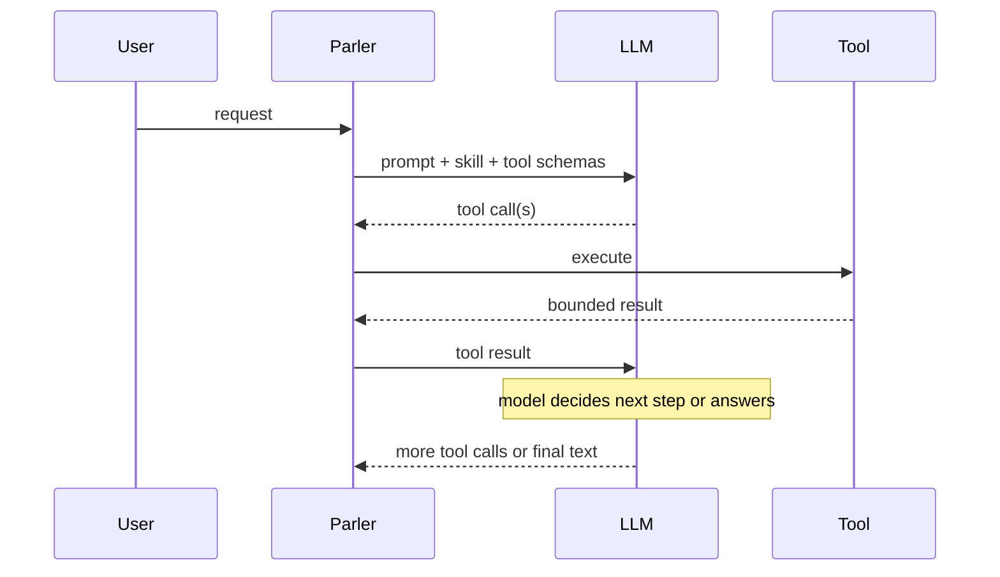

# Appendix: Playbooks, skills, and planners

This appendix is for readers who have met **skills** (Chapter 11) and **playbooks** (Chapter 12) and now hear industry
language such as *agent*, *planner*, *workflow*, or *LangGraph*. It explains how those terms map to Parler — and why
**skills often sound like planners**, while **playbooks do not**.

It is conceptual, not a syntax reference. For playbook JSON fields, see [Appendix J](./J-skills-evidence-playbooks.md).
For short vocabulary, see [Appendix G](./G-ai-agent-concepts.md). Normative runtime detail lives in the **parler**
monorepo: `docs/agent/playbook-engine.md`.

Workshop baseline: **`parler-agent` 0.1.209+** (optional-branch **`merge_row_sets`** and **`fan_out` `itemVar`** primitive wrapping from 0.1.209; service-orchestration derive ops from 0.1.190; nested tool-output evidence projection from 0.1.208).

---

## 1. Three different meanings of “planner”

In blog posts and product pages, *planner* is overloaded. For Parler discussions, separate these:

| Meaning | What it is | Closest Parler shape |
| --- | --- | --- |
| **LLM agent loop** | The model repeatedly chooses the next tool call from prose + prior results (ReAct-style). | **Skill** (and the default open chat loop) |
| **Declared workflow engine** | A fixed graph or state machine runs steps; the model may only summarize at the end. | **Playbook** |
| **Classical AI planner** | Symbolic search over explicit actions, preconditions, and goals (STRIPS, PDDL). | **Neither** — Parler does not expose this |

When workshop issue **#35** asks how to turn a skill into a playbook, the hard part is usually **service orchestration**
(resolve identifiers, optional branches, nested payloads, stringify, call an app service) — not “install a classical
planner.”

---

## 2. Parler’s three workflow shapes

Parler deliberately offers three layers (see Chapter 12 and [Review: choosing the right layer](./18-review.md)):

| Shape | Who decides the next step? | What the LLM does | Best for |
| --- | --- | --- | --- |
| **Tool** | The tool implementation | Usually sees only the final bounded result | One atomic business capability |
| **Skill** | **The LLM**, guided by `SKILL.md` | Chooses tools turn by turn; may parallelize calls in one assistant message | Flexible routes still being discovered |
| **Playbook** | **The runtime DAG** | Starts the run (or slash/`start_playbook`); writes the **final** summary from compact evidence | Stable, repeatable multi-step workflows |

Design rule from the agent extension:

```text
Runtime controls step execution.
LLM controls language and limited interpretation over compact evidence.
```

A playbook is **not** a planner in the LLM-agent sense: it does **not** synthesize a new plan at runtime from
preconditions and effects. It executes a **registered** graph loaded from the configuration repository.

---

## 3. Why skills feel like “planners”

If you read modern agent material (ReAct, tool-calling chatbots, LangChain agents), the loop looks like this:



That is essentially what a **skill** instructs the model to do: *resolve equipment, then read UID, then …* with the model
still picking each next call.

So:

- **Skill ≈ soft, LLM-driven opportunistic planning** (walk the route as you go).
- **Playbook ≈ hard, pre-registered workflow execution** (walk the route the author already drew).

Skills are **not** textbook classical planners either: there is no explicit STRIPS state space, no guaranteed replan
search, and no formal optimality. They are **practical agent loops** with ThingWorx tools and repository guidance.

---

## 4. Playbook vs mainstream LLM agents — gaps that remain by design

After the shipped **service-orchestration** engine wave (`playbook-34-35`, baseline 0.1.190+), nested tool-output
evidence projection (0.1.208), and workshop orchestration gap closure (0.1.209 — **`merge_row_sets`**, **`fan_out`
`itemVar`**), a playbook can express the full **#34 / #35-style** orchestration class: resolve Things, read scalars from
tool envelopes, optional filter branches with row merge, build nested objects, stringify JSON, call a final service, and
produce a grounded `llm_summary`.

Even then, playbooks **do not** converge to LangGraph-style agents or durable workflow engines. Main intentional gaps:

| Capability | Typical LLM agent / “planner” stack | Parler playbook (V1) |
| --- | --- | --- |
| **Dynamic replanning** | Change next step when a tool fails or data is empty | Static DAG; only **predeclared** `condition` branches and derive ops |
| **Durable execution** | Checkpoints, resume after hours/days (Temporal, LangGraph persistence) | **Current turn only** — disconnect or JVM restart **abandons** the run |
| **Cross-turn memory inside the workflow** | Agent state carries forward | No playbook memory across runs (e.g. “reuse UID from earlier in the chat”) |
| **Parallel tool execution in one “step”** | Frameworks often allow parallel calls | `fan_out.maxConcurrency` must be **1** (sequential fan-out) |
| **Arbitrary code in the graph** | Sandboxed Python, expressions, plugins | **Allowlisted** derive ops only; no arbitrary JavaScript in the DAG |
| **Mid-run inference of optional inputs** | Model notices “user mentioned a shift” | Optional filters need **`inputSchema` / start inputs** declared up front |
| **HITL pause and resume inside the same run** | First-class in several frameworks | Read-only orchestration is mature; **write / approval** paths need explicit playbook-HITL design (see **parler** `playbook-builtin-capability-expansion` topics) |
| **Compensation / saga retries** | Workflow engines | Fail-fast; guards via `condition` or app services |

Closing workshop **#35** as a **customer KPI playbook** is therefore a **separate** effort from closing **engine** gaps:
extended tools, policies, and live DEV belong to the application team. The engine topic only ensures the **orchestration
class** is expressible without a wrapper whose *only* job is missing primitives.

---

## 5. Where playbooks still win

For **known, repeated** business flows, playbooks trade flexibility for control:

| Benefit | Why it matters |
| --- | --- |
| **Few LLM rounds** | Often one internal `llm_summary` instead of many tool-planning turns (see rate-control baselines in **parler** `docs/operations/rate-control-baselines.md`) |
| **Visible progress** | `task.state` frames in the UI during the run |
| **Auditability** | Same graph, compact evidence ledger, deterministic step order |
| **ThingWorx-native tools** | Same executors, HITL, and extended tools as chat — not a separate integration stack |

Promotion path taught in the workshop:

```text
explore in open chat
  -> stabilize as skill
  -> when the route stops changing, encode as playbook
```

---

## 6. One picture

```text
                    flexibility / adaptive routing
                                    ^
                                    |
              Skill + open agent loop (LLM chooses each step)
                                    |
         +--------------------------+---------------------------+
         |                          |                           |
    LangGraph                   Playbook                    Wrapper tool
  (dynamic graph +          (static registered DAG)      (one call, black box)
   checkpointing)                     |
         |                          |
         +--------------------------+---------------------------+
                                    |
                                    v
              repeatability / fewer LLM calls / platform control
```

Service-orchestration engine work moves the **playbook** column **up** (more graphs expressible without app wrappers).
It does **not** move playbooks to the top-left into full LLM planners.

---

## 7. Suggested reading (external, short)

Roughly **30–60 minutes** to align vocabulary with industry material:

| Order | Resource | Takeaway |
| --- | --- | --- |
| 1 | [Anthropic — Building effective agents](https://www.anthropic.com/engineering/building-effective-agents) | **Workflow vs agent** — maps cleanly to playbook vs skill |
| 2 | [ReAct paper](https://arxiv.org/abs/2210.03629) | Reason + act loop — maps to **skill** execution |
| 3 | [LangGraph — concepts](https://langchain-ai.github.io/langgraph/concepts/) | Dynamic graphs and **checkpoints** — contrast with Parler’s static DAG and no resume |
| 4 | [Temporal — Workflows](https://docs.temporal.io/workflows) | **Durable** orchestration — contrast with current-turn playbooks |

Classical planning (optional background only):

- Russell & Norvig, *Artificial Intelligence: A Modern Approach* — Planning chapter (STRIPS).
- [planning.wiki](https://planning.wiki/) — PDDL intuition in minutes.

---

## 8. Parler normative pointers

| Topic | **parler** path |
| --- | --- |
| Playbook engine scope and V1 boundaries | `docs/agent/playbook-engine.md` (§1 positioning, §2.3 out of scope) |
| Service-orchestration derive ops (#34 / #35) | `docs/agent/playbook-34-35.md` |
| Roadmap beyond vertical slices | `docs/future/29-playbook-engine-enhancement.md` |
| Workshop gap closure (shipped 0.1.209) | `docs/agent/playbook-engine-workshop-gaps.md` |
| Skill vs playbook vs tool in one page | Chapter [12](./12-playbooks.md), [18](./18-review.md) |

---

## 9. Workshop issue #35 — how to think about it

Issue [#35](https://github.com/xudesheng/parler-workshop/issues/35) (*How do I effectively turn a skill into a playbook?*)
is a **requirements source** for engine and training material:

- The **KPI Values Retrieval** skill is a **stress specimen** for multi-branch service orchestration.
- Delivering a **customer-ready KPI playbook** on a collaborator’s AgentThing is **application work** (tools, policies,
  live validation) — not the same as shipping an engine primitive in **parler**.

Use #35 to ask: *“What orchestration primitive is still missing from the engine?”* — not: *“Is the KPI playbook product
done?”*
