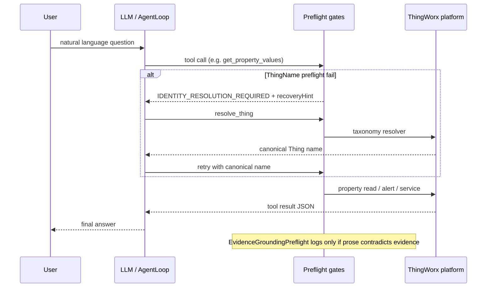

# Appendix: Preflight gates

This appendix explains **preflight** in Parler: cheap, deterministic runtime checks that run **before** (or at the
boundary of) expensive or risky work — especially platform tool calls and final-answer grounding audits.

It is for workshop instructors, customer architects, and anyone presenting how Parler keeps agents **safe**,
**recoverable**, and **token-efficient**. For taxonomy and `THINGNAME` authoring, see [Appendix H](./H-taxonomy-json-syntax.md)
and [Appendix I](./I-extended-tools-and-policies.md). For evidence rules in skills, see Chapter **15** and
[Appendix J](./J-skills-evidence-playbooks.md). For vocabulary, see [Appendix G](./G-ai-agent-concepts.md).
For **time bounds** (`startDate`/`endDate`, natural phrases), see §11 below and **`parler/docs/agent/time-interpretation.md`** — related to preflight but **not** a fifth unified family.

Normative ThingName envelopes live in the **parler** monorepo: `CONTRACTS/TAXONOMY_RESOLVER.md` §7. Deeper design notes:
`docs/agent/evidence-grounded.md`, `docs/agent/multi-chart-and-thrashing-safeguards.md`, and the archived
`thingname-preflight-coverage` topic.

Workshop baseline: **`parler-agent` 0.1.209+** (`ScalarThingnamePreflight`, `EvidenceGroundingPreflight`).

---

## 1. What is preflight?

**Preflight** = a **cheap, deterministic check** that runs immediately **before** a risky or expensive step.

If the check fails, the runtime **stops early** and returns a **structured, actionable result** instead of proceeding
blindly.

```text
User intent  →  LLM plans tool call  →  PREFLIGHT  →  (pass) real platform work
                                           ↓ fail
                                    structured error + recovery hint
```

**Not preflight:** the LLM reasoning itself, playbook DAG planning, or post-hoc log analysis after damage is done.

**Is preflight:** argument validation, visibility gates, policy blocks, and “does this final answer contradict server
evidence?” detectors that run **before or at the boundary of** tool execution.

---

## 2. Why agents need preflight (workshop learner story)

**Without ThingName preflight**

```text
User:  "currentDraw for ORD Contacting 01"
LLM:   get_property_values({ thingName: "ORD Contacting 01", ... })
Tool:  ENTITY_NOT_FOUND — Thing not found
Model: falls back to Spotlight search, wrong path, wasted tokens
```

**With ThingName preflight**

```text
LLM:   get_property_values({ thingName: "ORD Contacting 01", ... })
Gate:  IDENTITY_RESOLUTION_REQUIRED + recoveryHint: resolve_thing
LLM:   resolve_thing({ text: "ORD Contacting 01" })
       → SE.CellFab.Model.Workunit.ORD-Contacting-01
LLM:   get_property_values({ thingName: "SE.CellFab....", ... })
       → success
```

Taxonomy was loaded and `resolve_thing` worked — but the **business tool** still needed a **canonical Thing name**.
Preflight bridges that gap **without auto-rewriting** the model’s arguments (auditability).

---

## 3. Parler preflight map

Parler uses **four preflight families**. They share “check first, execute second,” but target different risks:

| Family | Primary Java | When it runs | Changes user-visible answer? |
| --- | --- | --- | --- |
| **A. ThingName / `THINGNAME` scalar gate** | `ScalarThingnamePreflight` | Before built-in + extended tool platform calls | No — returns tool JSON error |
| **B. Protected-value gate** | `ProtectedValuePolicy` | Before HITL / `set_property_value` on PASSWORD props | No — blocks with error JSON |
| **C. Evidence-grounding detect** | `EvidenceGroundingPreflight` | After successful final assistant text | No — **logs only** (Phase 3b) |
| **D. Repeat-call / thrashing guard** | tool dispatcher + rate state | Before 3rd identical tool call | No — synthetic “blocked” envelope |

**Related (not Families A–D):** **time bounds** — literal defense and natural-time resolution for `DATETIME` parameters
(§11). There is no `ScalarDatetimePreflight` parallel to `ScalarThingnamePreflight`.

Normative contract for **A** is `CONTRACTS/TAXONOMY_RESOLVER.md` §7 in the **parler** repo.

---

## 4. Family A: ThingName preflight (core)

**Central type:** `ScalarThingnamePreflight.gateApplicationThing(parameterName, rawThingName)`

**Gate logic (simplified)**

1. Missing / blank → `THINGNAME_VALUE_REQUIRED`
2. Non-blank but not a **visible** Thing for the current security principal → `IDENTITY_RESOLUTION_REQUIRED`
3. Success → canonical `Thing.getName()` used for all downstream platform calls

**Recovery hint (conditional)**  
When v3 `identity-types.json` is loaded, errors may include:

```json
"recoveryHint": { "tool": "resolve_thing", "argument": "text" }
```

When taxonomy is not configured, the message tells the operator to configure identity rules or supply an exact Thing
name — **no false promise** that `resolve_thing` can help.

**Design choice (v1):** preflight does **not** silently rewrite LLM arguments. The model sees the resolver result and
retries explicitly.

---

## 5. Family A: which tools are covered?

### Built-in tools (first-party)

| Tool | Parameter | Notes |
| --- | --- | --- |
| `get_property_values` | `thingName` | Property reads |
| `query_property_history` | `thingName` | Trends / history (incl. numeric aliases) |
| `query_alert_summary` | `thingName` or `thingNames[]` | Multi-Thing partial success when some names resolve |
| `query_alert_history` | `thingName` | Before time-window work |
| `acknowledge_alerts` | `thingName` | **No AlertFunctions side effects** until gate passes |
| `set_property_value` | `thingName` / `thing_name` | Pre-HITL **and** pre-execution |
| `invoke_service` | `entityName` when target is **Thing** | Non-Thing entity paths unchanged |
| `discover_thing_members` | `thingName` | Before facet enumeration |
| `discover_properties` / `discover_services` / `get_service_definition` | `entityName` on Thing paths | Legacy discovery delegates |
| `build_history_overlay_chart` | `series[].thingName` | Chart builders |
| `build_multi_series_history_chart` | `series[].thingName` | Chart builders |
| `build_period_over_period_chart` | `thingName`, `periods[].thingName` | Chart builders |

### Extended + playbook tools

| Path | Mechanism |
| --- | --- |
| Configuration-repository extended tools | `ExtendedToolThingnamePreflight.checkJsonArgs` — scans `ServiceDefinition` for `THINGNAME` parameters |
| Playbook `tool_call` nodes | Same extended-tool preflight in `AgentThing` before `processServiceRequestDirect` |

### Explicitly **not** ThingName-preflight tools

`resolve_thing`, `resolve_asset_type`, `query_entities_by_taxonomy`, `spotlight_search`, cache/chart id tools —
different semantics (resolver, parent entity, fuzzy search, no Thing instance).

---

## 6. Family A: error envelope

**Blank parameter**

```json
{
  "status": "error",
  "code": "THINGNAME_VALUE_REQUIRED",
  "parameterName": "thingName",
  "expectedBaseType": "THINGNAME",
  "message": "..."
}
```

**Display label instead of canonical name**

```json
{
  "status": "error",
  "code": "IDENTITY_RESOLUTION_REQUIRED",
  "parameterName": "thingName",
  "expectedBaseType": "THINGNAME",
  "suppliedValue": "ORD Contacting 01",
  "message": "...",
  "recoveryHint": { "tool": "resolve_thing", "argument": "text" }
}
```

**Why structured JSON matters:** the LLM can tool-call `resolve_thing` in the **next** turn without guessing. Humans
and eval harnesses can assert stable `code` values (see [Appendix L](./L-agent-eval-methodology.md)).

---

## 7. Family B: protected-value preflight

**Risk:** model requests `set_property_value` on a **PASSWORD** property → secret exposure in chat, approval UI, or logs.

**Gate:** `ProtectedValuePolicy.setPropertyValuePreflightBlockedJson`  
Runs on the **gated** arguments (after ThingName preflight) before HITL approval flow continues.

**Outcome:** block with dedicated error JSON; normal HITL flow never starts for PASSWORD targets.

**Related (not always called “preflight”):** redaction of sensitive keys in approval previews, masking PASSWORD cells in
custom-tool results. See Chapter **14** for HITL boundaries.

---

## 8. Family C: evidence-grounding detect (overview)

**Different timing:** runs **after** tools finish and the LLM returns a **SUCCESS** final answer — not before platform
calls.

**Problem class:** the tool chain succeeded, but final prose **re-writes** what the server already proved — a
**grounding** failure, not a tool failure.

| Layer | Class | Role today |
| --- | --- | --- |
| Prompt | `Recent Tool Evidence` rule | Tells the model what structural facts mean |
| Phase 3a | `EvidenceAnswerGroundingGuards` | Deterministic phrase checks vs. `AgentTaskState` |
| Phase 3b | `EvidenceGroundingPreflight` | **Detect + log only** — no wire/UI rewrite |

**Six guard ids (stable for logs / eval correlation)**

`empty_success_vs_missing_target` · `sample_only_overclaim` · `cache_miss_vs_cached_data_prose` ·
`missing_live_cache_paging` · `error_rewrite` · `protected_solicitation`

**Roadmap:** `evidence_grounding.yaml` eval suite is the next gate; automatic answer correction is **not** shipped.

---

## 9. Family C: worked example (`empty_success_vs_missing_target`)

**User question**

> List rows in DataTable `MyProductionEvents`.

**What actually happened (tool layer — success)**

```text
invoke_service → MyProductionEvents.GetDataTableEntries
Tool JSON:  status=success, rowCount=0, totalCount=0
```

The DataTable **exists** and answered; it is simply **empty** for the query.

**What the task-state ledger recorded (`AgentTaskEvidence`)**

| Field | Value |
| --- | --- |
| `status` | `ok` |
| `rowCount` | `0` |
| `errorCode` | *(none)* |
| `sampleOnly` | `false` |

**What the model said (grounding failure)**

> The DataTable **does not exist**. Please check the name spelling.

The model upgraded “successful empty result” into “missing entity” — the classic failure that motivated evidence
grounding.

**What Phase 3b does (shipped behavior)**

1. `AgentLoop` completes with turn status **SUCCESS**.
2. `EvidenceGroundingPreflight.detectOnSuccessfulAssistant(...)` runs **before** `AgentToolContext.clear()`.
3. Guard `empty_success_vs_missing_target` fires (prose matches “does not exist” / “wrong name” patterns while evidence
   is semantic empty-success).
4. One **Application Log INFO** line — example shape:

```text
[SCPA_Agent_Sonnet] evidence-grounding preflight hit: logLabel=ParlerStreamToRemoteThing
  requestId=… conversationId=… turnStatus=SUCCESS
  guardIds=[empty_success_vs_missing_target] evidenceRows=3 evidenceStatusSummary=ok=2,error=0,other=1
```

5. **User still sees the wrong sentence** — v1 is observability only, not auto-correction.

**Correct answer shape (what grounding expects)**

> `MyProductionEvents` was found. The query returned **0 rows** in the requested scope.  
> *(Optional)* Here is the empty table frame / evidence id from the tool result.

**Contrast with ThingName preflight:** ThingName gates block **before** the platform call. Evidence grounding audits
**after** the call, when the model ignores structured evidence anyway.

---

## 10. Family D: thrashing / repeat-call guard

From **multi-chart-and-thrashing-safeguards** in the **parler** repo: when the model repeats the **same tool + same
arguments** and gets the **same result** (including preflight errors), the dispatcher **blocks before the 3rd identical
call**.

```text
Call 1: get_property_values(bad label) → IDENTITY_RESOLUTION_REQUIRED  (recorded)
Call 2: same → same error                                              (recorded)
Call 3: blocked synthetically — no platform work, no repeated preflight cost
```

**Why this is preflight-like:** the check runs **before dispatch**, preventing runaway loops that once hit provider
`single_request_too_large` caps.

**Important:** `resolve_thing` rounds **count toward** the iteration budget — no special exemption.

---

## 11. Related: time bounds (not a unified preflight family)

Parler **does** validate and normalize **time** arguments before many platform calls — but the logic is **split across
paths**, not centralized like ThingName preflight. Teach this as **adjacent guardrails**, not as “Family E.”

### 11.1 How it differs from ThingName preflight

| | **ThingName (Family A)** | **Time bounds (related)** |
| --- | --- | --- |
| Unified gate | `ScalarThingnamePreflight` | **No** single `ScalarDatetimePreflight` |
| Normative contract | `CONTRACTS/TAXONOMY_RESOLVER.md` §7 | `parler/docs/agent/time-interpretation.md` |
| Typical failure | Display label ≠ visible Thing | `today` / `30m` in a raw `DATETIME` slot; bad ISO; mixed phrase + explicit bounds |
| Recovery | `recoveryHint` → `resolve_thing` | Retry with **ISO-8601** or curated **`calendarPhrase`** / **`relativeDuration`** — no `resolve_datetime` tool |
| Silent rewrite | v1 does **not** rewrite Thing args | Built-ins / extended **pair** paths **may** resolve natural phrases **into** `startDate`/`endDate` before the platform call |

### 11.2 Three implementation paths

| Path | Primary Java | When | Recognized inputs |
| --- | --- | --- | --- |
| **Curated built-ins** | `BuiltInToolNaturalTimeWindow`, `ExplicitIsoTimeBounds` | Before `query_alert_history`, `query_property_history`, `query_stream_data`, … | `calendarPhrase`, `relativeDuration`, explicit `startTime`/`endTime` (ISO); mutual-exclusion rules |
| **`invoke_service`** | `InvokeServiceDatetimeLiteralDefense` | Before Joda parse on `DATETIME` params | Rejects informal literals in `startDate`/`endDate`/`startTime`/`endTime` slots → `UNSUPPORTED_RELATIVE_LITERAL` |
| **Extended / playbook extended tools** | `CustomToolDateTimePairResolver` via `CustomToolHarvester` | When service declares **both** sides of a `DATETIME` pair | `startDate`+`endDate` or `startTime`+`endTime`; may augment LLM schema with synthetic natural-time fields |

**Pair detection is conservative:** both parameters must be `BaseTypes.DATETIME`. A lone `startDate` gets **literal
defense only**, not full natural-time pair augmentation.

### 11.3 Example: wrong literal in a `DATETIME` slot

**Model calls** `invoke_service` with:

```json
{ "entityName": "MyUtilizationHelper", "serviceName": "GetUtilizationRecords",
  "parameters": { "startDate": "last 7 days", "endDate": "today" } }
```

**Runtime (before platform invoke):** `InvokeServiceDatetimeLiteralDefense` rejects `last 7 days` / `today` in raw
`DATETIME` slots → structured error `UNSUPPORTED_RELATIVE_LITERAL` with `rejectionReason`.

**Expected repair:** use ISO instants in `startDate`/`endDate`, **or** (on a curated built-in / augmented extended
tool) put the phrase in `relativeDuration` / `calendarPhrase` instead of the `DATETIME` fields.

### 11.4 Example: natural phrase on a curated built-in

**Model calls** `query_property_history` with `relativeDuration: "24h"` and no explicit `startTime`/`endTime`.

**Runtime:** `BuiltInToolNaturalTimeWindow` resolves a closed-open window ending at `nowUtc`, then the executor calls
the platform with concrete bounds. Errors use `BuiltInToolTimeErrorJson` (e.g. `TIME_PHRASE_VS_EXPLICIT_BOUND_CONFLICT` if
the model also supplied half an ISO pair).

### 11.5 Playbook note

Playbooks may normalize time in-DAG via derive op `resolve_time_window_for_playbook` — that is **workflow plumbing**,
not the same as per-tool-parameter preflight at the `AgentThing` dispatch boundary.

---

## 12. End-to-end flow



---

## 13. Benefits

| Benefit | Mechanism |
| --- | --- |
| **Safer writes** | `acknowledge_alerts` / `set_property_value` never hit platform on bad Thing names |
| **Recoverable UX for models** | `IDENTITY_RESOLUTION_REQUIRED` + `recoveryHint` steers to `resolve_thing` |
| **Consistent errors** | One envelope across built-ins, extended tools, playbooks |
| **Security preserved** | Visibility-aware `EntityUtilities.findEntity` — no bypass for hidden Things |
| **Lower token burn** | Fail before Spotlight tangents; thrashing guard stops identical retries |
| **Auditability** | No silent argument rewrite in v1 — model must retry with canonical name |
| **Observability** | Evidence preflight logs `guardIds` for operator correlation |
| **Teachable failures** | Workshop learners see *why* display labels fail and *how* taxonomy fixes it |

**What preflight does not replace:** taxonomy configuration, skill/playbook authoring, or LLM routing quality.

---

## 14. Preflight vs. nearby concepts

| Concept | Preflight? | Difference |
| --- | --- | --- |
| `resolve_thing` | No — it **is** the recovery tool | Actively resolves identity; preflight only **detects** need |
| Playbook `normalize_resolved_thing` | No — in-DAG derive | Runs **inside** playbook after `resolve_thing` tool_call |
| Skill normalized matching | No — LLM + taxonomy listing | Fuzzy match in conversation; stricter for slash JSON |
| HITL approval | Partially related | Confirms **intention** before write; ThingName gate runs **before** HITL |
| `ValidateAgentConfigurationRepository` | No — deploy-time | Validates repo files at rest, not per tool call |
| Time bounds / `DATETIME` | **Related, not A–D** | Split across `BuiltInToolNaturalTimeWindow`, `InvokeServiceDatetimeLiteralDefense`, `CustomToolDateTimePairResolver`; see §11 |

---

## 15. Workshop demo prompts

**ThingName preflight success path**

1. Ask: `What is currentDraw for ORD Contacting 01?`
2. Show tool error `IDENTITY_RESOLUTION_REQUIRED` (if model skips resolver).
3. Show `resolve_thing` → canonical name → successful `get_property_values`.

**Slash vs. skill (identifier strictness)**

- Slash: `/cross_asset_pair_health {"assetIdentifierB":"AC JetDryer 01",...}` → playbook `resolve_thing` with `equals`
  identity rules.
- Skill NL: may tolerate spacing via normalized candidate matching — teach the two paths separately.

**Evidence grounding (log correlation)**

- Query empty DataTable with success → if model says “table does not exist”, search Application Log for
  `evidence-grounding preflight hit`.

**Time bounds (informal literal rejection)**

- `invoke_service` with `startDate: "today"` → show `UNSUPPORTED_RELATIVE_LITERAL`.
- `query_property_history` with `relativeDuration: "24h"` → show resolved ISO window in tool result metadata.

---

## 16. Parler monorepo references

| Topic | Location |
| --- | --- |
| Normative ThingName contract | `parler/CONTRACTS/TAXONOMY_RESOLVER.md` §7 |
| Design history | `parler/docs/archived/.../thingname-preflight-coverage.md` |
| Evidence grounding | `parler/docs/agent/evidence-grounded.md` |
| Thrashing safeguards | `parler/docs/agent/multi-chart-and-thrashing-safeguards.md` |
| Time interpretation | `parler/docs/agent/time-interpretation.md` |
| Java entry points | `ScalarThingnamePreflight.java`, `ExtendedToolThingnamePreflight.java`, `EvidenceGroundingPreflight.java`, `BuiltInToolNaturalTimeWindow.java`, `InvokeServiceDatetimeLiteralDefense.java`, `CustomToolDateTimePairResolver.java` |
