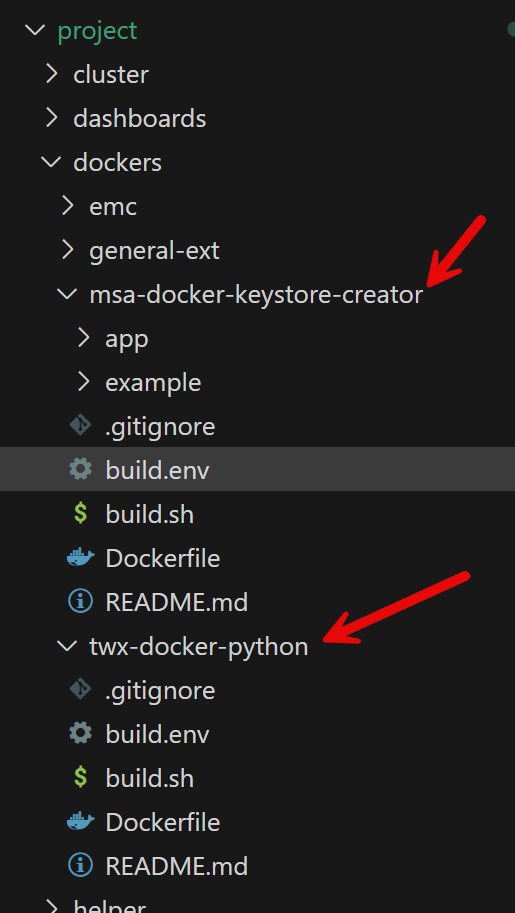
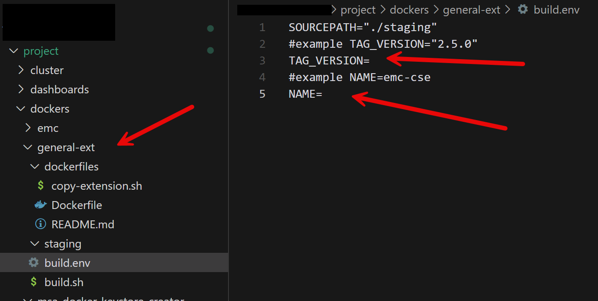
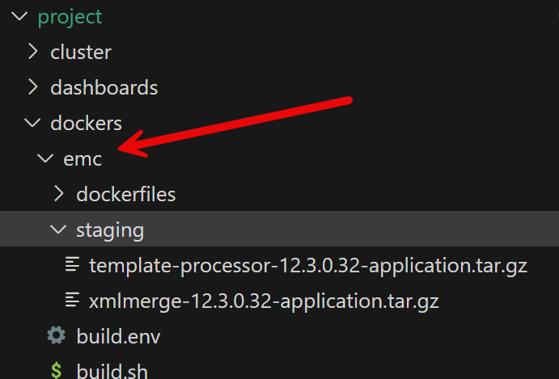

# Docker Image and Container Registry


## Load OS variables every time when you open a new console

### Using Environment Variables in Kubernetes
During the entire serials, it is assumed that you are under the working directory in the console. Please ensure to load the OS variables from the **.env** file every time.

On Linux/Mac:

```shell
. ./helper/load-envfile.sh
```
To validate:

```Shell
# Verify environment variables are set
printenv | grep -E 'RESOURCE_GROUP|LOCATION|VNET_NAME'
```


On Windows Powershell:

```Powershell
helper\Load-EnvFile.ps1
```

To validate:

```Powershell
# Verify environment variables are set
Get-ChildItem Env: | Where-Object { $_.Name -match 'RESOURCE_GROUP|LOCATION|VNET_NAME' }
```


### Make sure you have authenticated with Azure:

On Linux/Mac:

```shell
# Authenticate with Azure using tenant ID
az login --tenant ${TENANT_ID}
```

On Powershell:

```Powershell
# Authenticate with Azure using tenant ID
az login --tenant $env:TENANT_ID
```


Verify on Linux/Mac/Powershell:

```shell
az account show
```


## Docker Image and Container Registry

**Docker Images**: Docker images are lightweight, standalone, and executable packages that bundle your application code with its runtime, system tools, libraries, and configurations. In the Kubernetes ecosystem, these images serve as blueprints for containers. Every container deployed in a Kubernetes cluster is instantiated from a Docker image, ensuring consistency, portability, and ease of scaling across different environments (development, testing, and production).

**Container Registry**: A container registry is a centralized repository that stores and manages Docker images. It facilitates the efficient distribution, version control, and secure access to container images. By using a container registry, teams can seamlessly share and deploy application images to container orchestration platforms like Kubernetes, ensuring secure and consistent deployments.

**Azure Container Registry (ACR)**: In this series, we are using Azure Container Registry—a managed, private Docker registry service provided by Microsoft Azure. ACR offers a secure, scalable, and reliable environment for storing and managing Docker images. It integrates tightly with Azure services, such as Azure Kubernetes Service (AKS), streamlining the workflow of building, testing, and deploying containerized applications in the cloud.

Common uses of container registries include:

- **Image Storage**: For storing Docker container images securely
- **Version Control**: For managing different versions of container images
- **Access Control**: For managing access to container images through authentication and authorization
- **Integration**: For seamless integration with container orchestration platforms like Kubernetes

## Creating a Container Registry in Azure

To create a container registry in Azure, you can use Azure Container Registry (ACR), which provides secure, private Docker registry hosting.

The container registry on Azure has 3 sku: basic, standard, premium. Since we want to use the same container registry as the helm-chart repositroy, it needs `standard` sku at least.

On Linux/Mac:

```Shell
az acr create -g $RESOURCE_GROUP -n $ACR_NAME --sku Standard -l $LOCATION
```

On Powershell:

```Powershell
az acr create -g $env:RESOURCE_GROUP -n $env:ACR_NAME --sku Standard -l $env:LOCATION
```

The output looks like:


You can now go to Azure portal and search the ACR_NAME:


The `dxudemocr.azurecr.io` will be used in the entire serials as the container registry **login server** name.


## Managing Docker Images

### What docker images are needed

In this project, there are four key categories of Docker images that you need to build:

1. **PTC Products Docker Images**  
   These images run the core PTC products (such as the Thingworx platform and Connection Server).  
   - **Acquisition:** PTC does not provide pre-built Docker images. Instead, the Dockerfiles for these products are available on the PTC product download web pages.
   - **Action Required:** Follow the official guidance provided on these pages to build the Docker images from the supplied Dockerfiles.

2. **Additional Tools for Keystore Creation and Python Script Execution**  
   These tools provide essential functionalities like creating keystores for certificates and executing necessary Python scripts.  
   - **Tools Included:**  
     - `msa-tools-keystore-creator` for keystore and certificate creation.
     - `twx-docker-python` for executing Python scripts.
   - **Acquisition:** The Dockerfiles for these utilities are provided as part of this package.
   - **Action Required:** Build these Docker images locally from the supplied Dockerfiles.

3. **Docker Images for Extensions**  
   Extensions are an important part of building a Thingworx solution, and they can originate from PTC, customers, or third parties.  
   - **Purpose:** Packaging extensions as Docker images makes them easier to manage and deploy.
   - **Action Required:** Create Docker images for each extension following a general build process. This approach simplifies the integration, version control, and deployment of these components.

4. **Special Case – eMessage Connector**  
   Some PTC products may not provide their Dockerfiles directly via the download pages.  
   - **Example:** The eMessage Connector falls into this category.
   - **Acquisition:** The Dockerfile for the eMessage Connector, which is required for this series, is shared directly with you.
   - **Action Required:** Use the provided Dockerfile to build the Docker image for the eMessage Connector.

By correctly building and managing these four types of Docker images, you will ensure consistency, easy scaling, and streamlined operations throughout your containerized environment.

### Downloading and Building PTC Product Docker Images

Please go to PTC product download page and download different dockerfiles:


The above example shows the link to the thingworx platform dockerfile, Security Tool, Ignite docker file.

| Repository Name                      | Product              | Note      |      |
| ------------------------------------ | -------------------- | --------- | ---- |
| thingworx/cxserver-twx               | connection server    | 9.3.0.4   |      |
| thingworx/ignite-twx                 | Ignite               | 3.22.1    |      |
| thingworx/postgresql-init-twx        | Thingworx Foundation | 9.7.0     |      |
| thingworx/platform-postgres          | Thingworx Foundation | 9.7.0     |      |
| thingworx/security-tool              | Security Tool        | 1.5.2.149 |      |

How to build the above docker images will be out of the scope of this document. You need to tag each image and push all of them to the container registry you just created above.

For example, you may build a docker image for thingworx/security-tool:1.5.2.149, what you need to do:
```Shell
az acr login -n $ACR_NAME
docker image tag thingworx/security-tool:1.5.2.149 $ACR_NAME.azurecr.io/thingworx/security-tool:1.5.2.149
docker push $ACR_NAME.azurecr.io/thingworx/security-tool:1.5.2.149
```


### Build keystore-creator and twx-python images

| Repository Name                      | Product         | Note    |      |
| ------------------------------------ | --------------- | ------- | ---- |
| thingworx/msa-tools-keystore-creator | Keystore tool   | 3d8db0e |      |
| thingworx/twx-docker-python          | twx-python tool | 1.0.0   |      |




Go to `msa-docker-keystore-creator` folder, and run: `build.sh`

It will create a docker image with tag: `thingworx/msa-tools-keystore-creator:3d8db0e`, then please tag it and push it to your container registry:

```Shell
docker image tag thingworx/msa-tools-keystore-creator:3d8db0e $ACR_NAME.azurecr.io/thingworx/msa-tools-keystore-creator:3d8db0e
docker push $ACR_NAME.azurecr.io/thingworx/msa-tools-keystore-creator:3d8db0e
```

Go to `twx-docker-python` folder, and run: `build.sh`

It will create a docker image with tag: `thingworx/twx-docker-python:1.0.0`, then please tag it and push it to your container registry:

```shell
docker image tag thingworx/twx-docker-python:1.0.0 $ACR_NAME.azurecr.io/thingworx/twx-docker-python:1.0.0
docker push $ACR_NAME.azurecr.io/thingworx/twx-docker-python:1.0.0
```


### Build Docker Image for extensions

The following extensions need docker images:

| Repository Name   | Product                                      | Note  |      |
| ----------------- | -------------------------------------------- | ----- | ---- |
| thingworx/emc-ace | Axeda compatability package extension: `ace` | 6.2.3 |      |
| thingworx/emc-cse | Axeda compatability package extension: `cse` | 2.5.0 |      |
| thingworx/emc-rae | Axeda compatability package extension: `rae` | 3.5.0 |      |
| thingworx/emc-scm | Software content manager                     | 9.7.0 |      |
| thingworx/emc-tuc | Thingworx Utility Core                       | 9.7.0 |      |



Using `scm` as an example: 

1. go to the `dockers` folder under the `project` folder.

2. copy the `general-ext` folder to a new folder: `emc-scm`

   ```
   cp -r general-ext emc-scm
   ```

3. go to the new `emc-scm` folder

4. update the `build.env` file:

   1. the `TAG_VERSION` should be the version of the extension, here it is: `9.7.0`
   2. the name should be `thingworx/emc-scm`. (you can give arbitrary name and version, but you need to ensure to use them correctly later  on in the deployment file)

5. copy the extension (`.zip`) to the staging folder

6. execute the `build.sh` file, you will get a docker image with tag: `thingworx/emc-scm:9.7.0`

7. tag it:

   ```
   docker image tag thingworx/emc-scm:9.7.0 $ACR_NAME.azurecr.io/thingworx/emc-scm:9.7.0
   ```

8. push it to the CR:

   ```
   docker push $ACR_NAME.azurecr.io/thingworx/emc-scm:9.7.0
   ```

Please repeat the above steps for all extensions.


### Build docker image for eMessageConnector



1. Download eMessageConnector from PTC product download website

   1. put it in the staging folder

   2. update the `APP_ARCHIVE` value to match the real file name.

   3. update the `APP_VERSION`

2. Download amazon corretto JDK 21

   1. put it in the staging folder

   2. update `JAVA_ARCHIVE` to match the file name.

3. execute the `build.sh` command and it will generate an image with tag: `thingworx/emc-twx:2.6.0.5`

4. tag it: 

   ```Shell
   docker image tag thingworx/emc-twx:2.6.0.5 $ACR_NAME.azurecr.io/thingworx/emc-twx:2.6.0.5
   ```

5. push it to CR:

   ```Shell
   docker push $ACR_NAME.azurecr.io/thingworx/emc-twx:2.6.0.5
   ```

   


## Check available docker image in a container registry 

You can use the utility in the helper folder: `helper/export_image_tags.sh` to export all repositories and tags from a container registry.

On Linux/Mac

```shell
helper/export_image_tags.sh $ACR_NAME
```

On Powershell:

```Powershell
helper\Export-ImageTags.ps1 $env:ACR_NAME
```

The above command will export a text file: `repository_tags.txt`


## Copy all docker images (PTC internal)

If you have access to my test docker registry, you can use the following command to copy all docker images mentioned above. :)

Move image with tag based on the file: `selected_tags.txt`

On Linux/Mac:

```shell
helper/move-selected-tags.sh templates/selected_tags.txt
```

On Powershell:

```Powershell
helper\Move-Selected-Tags.ps1 templates\selected_tags.txt
```