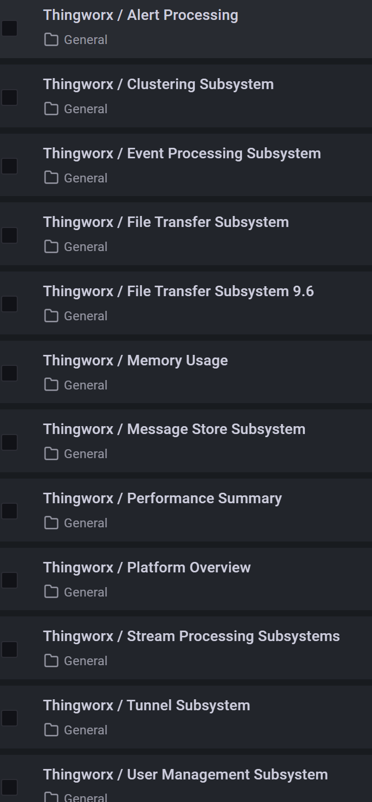

# Monitoring Stack


## Load OS variables every time when you open a new console

### Using Environment Variables in Kubernetes

During the entire serials, it is assumed that you are under the working directory in the console. Please ensure to load the OS variables from the **.env** file every time.

On Linux/Mac:

```shell
. ./helper/load-envfile.sh
```

On Windows Powershell:

```Powershell
helper\Load-EnvFile.ps1
```


## Introduction to the Monitoring Stack

A Monitoring Stack is essential for observing and managing the health and performance of your applications and infrastructure. It provides insights into system performance, resource utilization, and application behavior, enabling proactive issue resolution and optimization.

You need to add the **Prometheus Community Charts** to your local helm repository:

```Shell
helm repo add prometheus-community https://prometheus-community.github.io/helm-charts

helm repo update
```


## Installing Required Custom Resource Definitions (CRDs)

Custom Resource Definitions (CRDs) extend Kubernetes capabilities by allowing you to define custom resources. To set up a monitoring stack, you need to install the necessary CRDs:

1. **Install CRDs**:
   - Use the following command to apply CRDs for your monitoring stack:
     ```bash
     kubectl apply --server-side -f https://raw.githubusercontent.com/prometheus-operator/prometheus-operator/v0.55.0/example/prometheus-operator-crd/monitoring.coreos.com_alertmanagerconfigs.yaml
     kubectl apply --server-side -f https://raw.githubusercontent.com/prometheus-operator/prometheus-operator/v0.55.0/example/prometheus-operator-crd/monitoring.coreos.com_alertmanagers.yaml
     kubectl apply --server-side -f https://raw.githubusercontent.com/prometheus-operator/prometheus-operator/v0.55.0/example/prometheus-operator-crd/monitoring.coreos.com_podmonitors.yaml
     kubectl apply --server-side -f https://raw.githubusercontent.com/prometheus-operator/prometheus-operator/v0.55.0/example/prometheus-operator-crd/monitoring.coreos.com_probes.yaml
     kubectl apply --server-side -f https://raw.githubusercontent.com/prometheus-operator/prometheus-operator/v0.55.0/example/prometheus-operator-crd/monitoring.coreos.com_prometheuses.yaml
     kubectl apply --server-side -f https://raw.githubusercontent.com/prometheus-operator/prometheus-operator/v0.55.0/example/prometheus-operator-crd/monitoring.coreos.com_prometheusrules.yaml
     kubectl apply --server-side -f https://raw.githubusercontent.com/prometheus-operator/prometheus-operator/v0.55.0/example/prometheus-operator-crd/monitoring.coreos.com_servicemonitors.yaml
     kubectl apply --server-side -f https://raw.githubusercontent.com/prometheus-operator/prometheus-operator/v0.55.0/example/prometheus-operator-crd/monitoring.coreos.com_thanosrulers.yaml
     ```
   
   

## Installing a Monitoring Stack using Helm

Helm is a package manager for Kubernetes that simplifies the deployment of applications. Follow these steps to install a monitoring stack using Helm:

1. **Add Helm Repository**:
   - Add the Helm repository containing the monitoring stack charts:
     ```bash
     helm repo add prometheus-community https://prometheus-community.github.io/helm-charts
     helm repo update
     ```

2. **Prepare values.yaml file**

   Copy the `stable-prometheus-operator-values.yaml` file from the templates folder to the cluster subfolder and modify the `adminPassword: thingworx` to what you need.

   On Linux/Mac:

   ```
   envsubst < templates/prometheus-operator-values.tpl.yaml > cluster/prometheus-operator-values.yaml
   ```

   

   

3. **Install the Monitoring Stack**:

   - Use Helm to install the monitoring stack:
     
     On Linux/Mac:
     
     ```bash
     helm upgrade --install stable-prometheus-operator \
         -f cluster/prometheus-operator-values.yaml \
         prometheus-community/kube-prometheus-stack \
         --version 34.10.0 \
         --namespace monitoring \
         --create-namespace
     ```
     
     On Powershell:
     ```Powershell
     helm upgrade --install stable-prometheus-operator `
         -f cluster/prometheus-operator-values.yaml `
         prometheus-community/kube-prometheus-stack `
         --version 34.10.0 `
         --namespace monitoring `
         --create-namespace
     ```
   
   4. Check the pods deployment status:
   
      ```
      kubectl get pods -n monitoring
      ```
   
      
   
   5. Validate the installation of `Prometheus`
   
      ```Shell
      kubectl port-forward --namespace=monitoring svc/stable-prometheus-operator-prometheus 9090:9090
      ```
   
      
   
      You can access the **Prometheus** user interface at: **http://localhost:9090/**
   
      
   
      Press **CtrolC** to stop the port forward
   
   
   
   4. Validate the installation of `Grafana`
   
      ```Shell
      kubectl port-forward --namespace=monitoring svc/stable-prometheus-operator-grafana 8080:80
      ```
   
      
   
      You can access the interface at: http://localhost:8080/ ; the default credential is: **admin/thingworx**
   
      
   
   

## Load additional dashboards

There are about 15 dashboards in the `dashboards` folder, you can load all of them into the monitoring stack.

On Linux/Mac:

```Shell
helper/label-dashboards.sh ./dashboards/
```

On Powershell:

```Powershell
helper\Label-Dashboards.sh .\dashboards\
```

You will see new loaded dashboards in Grafana:


